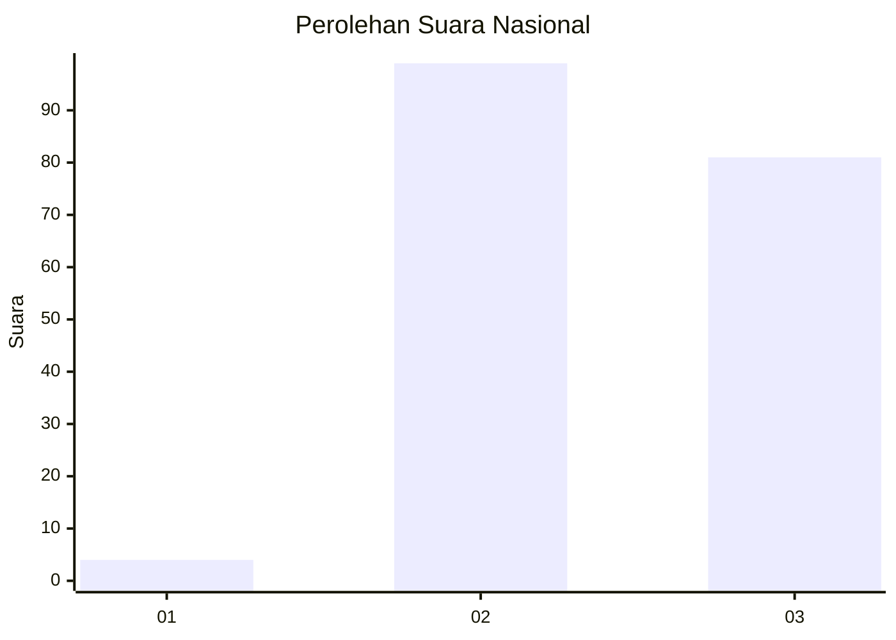
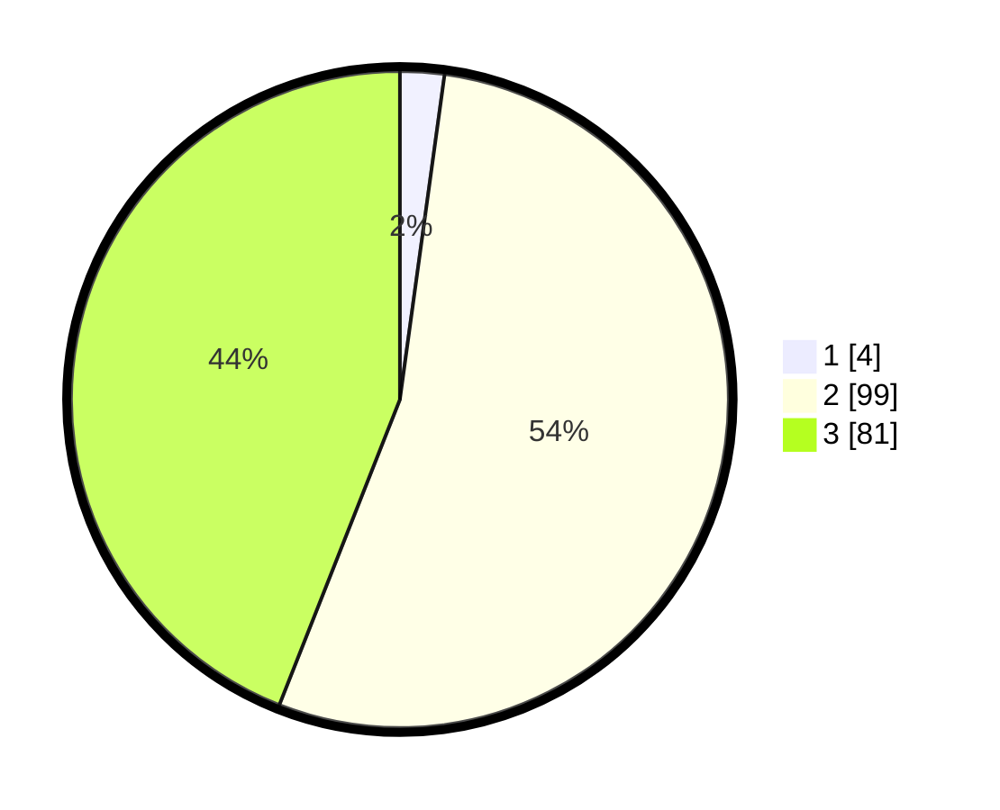

# Hasil

## Grafik

## Tabel

| No. | Nama Paslon    | Suara | Suara (raw) | Persentase |
|:--- |:-------------- | -----:| -----------:| ----------:|
| 1   | ANIES MUHAIMIN | 4     | [4][p-1]    | 2,17       |
| 2   | PRABOWO GIBRAN | 99    | [99][p-2]   | 53,80      |
| 3   | GANJAR MAHFUD  | 81    | [81][p-3]   | 44,02      |

[p-1]: https://github.com/gigit-pemilu/pemilu-2024/blob/main/pilpres/hitung-suara/sub/51-bali/sub/08-buleleng/sub/02-seririt/sub/2021-umeanyar/sub/003-tps/sub/paslon-1.txt
[p-2]: https://github.com/gigit-pemilu/pemilu-2024/blob/main/pilpres/hitung-suara/sub/51-bali/sub/08-buleleng/sub/02-seririt/sub/2021-umeanyar/sub/003-tps/sub/paslon-2.txt
[p-3]: https://github.com/gigit-pemilu/pemilu-2024/blob/main/pilpres/hitung-suara/sub/51-bali/sub/08-buleleng/sub/02-seririt/sub/2021-umeanyar/sub/003-tps/sub/paslon-3.txt

## Foto C Plano

https://sirekap-obj-formc.kpu.go.id/3dbb/pemilu/ppwp/51/08/02/20/21/5108022021003-20240214-140959--ef7b2409-64d3-4ba5-9a4f-687d4643d12d.jpg

https://sirekap-obj-formc.kpu.go.id/3dbb/pemilu/ppwp/51/08/02/20/21/5108022021003-20240214-141008--0a3fda55-c771-4d2f-92ca-906b5e995d46.jpg

https://sirekap-obj-formc.kpu.go.id/3dbb/pemilu/ppwp/51/08/02/20/21/5108022021003-20240214-224656--4fbd4eeb-1822-4794-b706-5c597bc62457.jpg

## Metadata

| Key        | Value               |
| ---------- | ------------------- |
| Time Stamp | 2024-02-15 00:41:44 |

