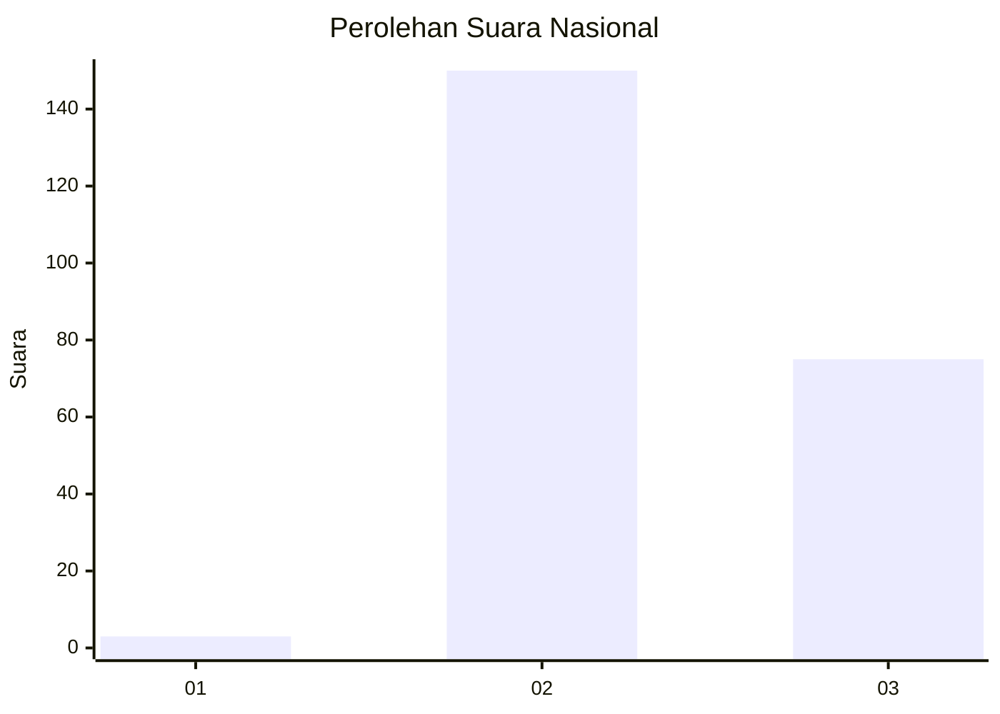
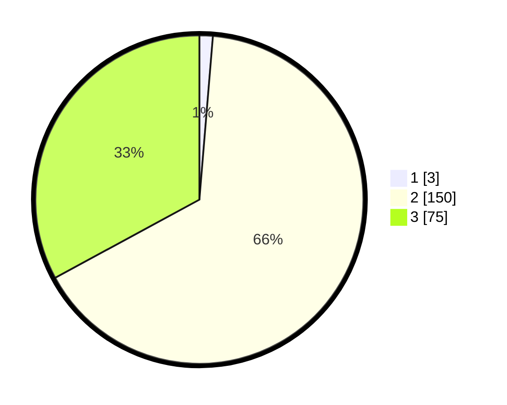

# Hasil

## Grafik

## Tabel

| No. | Nama Paslon    | Suara | Suara (raw) | Persentase |
|:--- |:-------------- | -----:| -----------:| ----------:|
| 1   | ANIES MUHAIMIN | 3     | [3][p-1]    | 1,32       |
| 2   | PRABOWO GIBRAN | 150   | [150][p-2]  | 65,79      |
| 3   | GANJAR MAHFUD  | 75    | [75][p-3]   | 32,89      |

[p-1]: https://github.com/gigit-pemilu/pemilu-2024/blob/main/pilpres/hitung-suara/sub/51-bali/sub/08-buleleng/sub/02-seririt/sub/2021-umeanyar/sub/004-tps/sub/paslon-1.txt
[p-2]: https://github.com/gigit-pemilu/pemilu-2024/blob/main/pilpres/hitung-suara/sub/51-bali/sub/08-buleleng/sub/02-seririt/sub/2021-umeanyar/sub/004-tps/sub/paslon-2.txt
[p-3]: https://github.com/gigit-pemilu/pemilu-2024/blob/main/pilpres/hitung-suara/sub/51-bali/sub/08-buleleng/sub/02-seririt/sub/2021-umeanyar/sub/004-tps/sub/paslon-3.txt

## Foto C Plano

https://sirekap-obj-formc.kpu.go.id/9cc8/pemilu/ppwp/51/08/02/20/21/5108022021004-20240214-234055--c6785c7d-ce02-4855-b1c5-f57cf5e3e218.jpg

https://sirekap-obj-formc.kpu.go.id/9cc8/pemilu/ppwp/51/08/02/20/21/5108022021004-20240214-234213--347a336e-0ea3-437a-a350-27be175bb959.jpg

https://sirekap-obj-formc.kpu.go.id/9cc8/pemilu/ppwp/51/08/02/20/21/5108022021004-20240214-234302--6131f8e4-7aff-49e3-9120-f60553cb9096.jpg

## Metadata

| Key        | Value               |
| ---------- | ------------------- |
| Time Stamp | 2024-02-16 21:01:00 |

