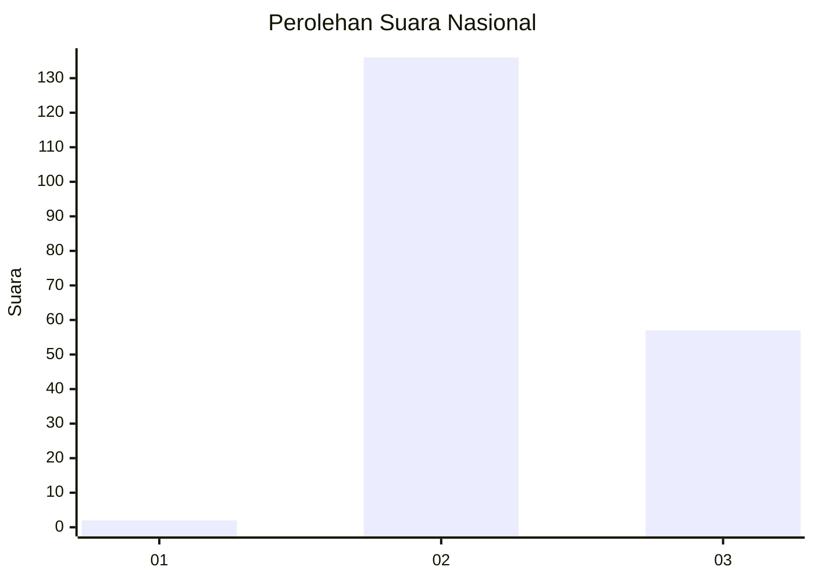

# Hasil

## Grafik

## Tabel

| No. | Nama Paslon    | Suara | Suara (raw) | Persentase |
|:--- |:-------------- | -----:| -----------:| ----------:|
| 1   | ANIES MUHAIMIN | 2     | [2][p-1]    | 1,03       |
| 2   | PRABOWO GIBRAN | 136   | [136][p-2]  | 69,74      |
| 3   | GANJAR MAHFUD  | 57    | [57][p-3]   | 29,23      |

[p-1]: https://github.com/gigit-pemilu/pemilu-2024/blob/main/pilpres/hitung-suara/sub/51-bali/sub/08-buleleng/sub/02-seririt/sub/2021-umeanyar/sub/005-tps/sub/paslon-1.txt
[p-2]: https://github.com/gigit-pemilu/pemilu-2024/blob/main/pilpres/hitung-suara/sub/51-bali/sub/08-buleleng/sub/02-seririt/sub/2021-umeanyar/sub/005-tps/sub/paslon-2.txt
[p-3]: https://github.com/gigit-pemilu/pemilu-2024/blob/main/pilpres/hitung-suara/sub/51-bali/sub/08-buleleng/sub/02-seririt/sub/2021-umeanyar/sub/005-tps/sub/paslon-3.txt

## Foto C Plano

https://sirekap-obj-formc.kpu.go.id/5aad/pemilu/ppwp/51/08/02/20/21/5108022021005-20240214-225604--c134f36c-edb1-4fea-afe6-1b936c777ac4.jpg

https://sirekap-obj-formc.kpu.go.id/5aad/pemilu/ppwp/51/08/02/20/21/5108022021005-20240214-230050--32f1d189-f54b-47bf-b550-4c9535074109.jpg

https://sirekap-obj-formc.kpu.go.id/5aad/pemilu/ppwp/51/08/02/20/21/5108022021005-20240214-225735--7814c72d-2531-4e24-97f3-33afec7557d3.jpg

## Metadata

| Key        | Value               |
| ---------- | ------------------- |
| Time Stamp | 2024-02-24 22:31:28 |

