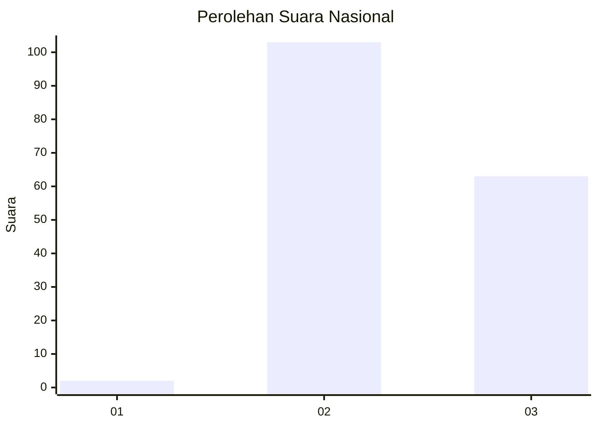
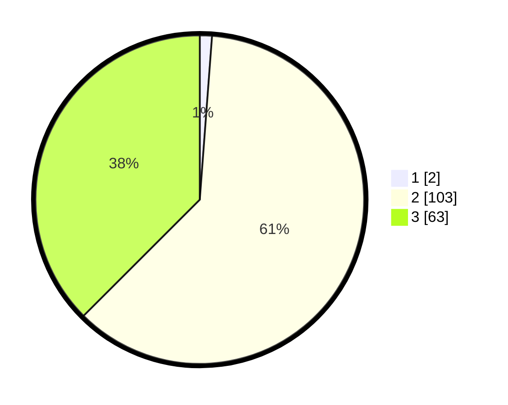

# Hasil

## Grafik

## Tabel

| No. | Nama Paslon    | Suara | Suara (raw) | Persentase |
|:--- |:-------------- | -----:| -----------:| ----------:|
| 1   | ANIES MUHAIMIN | 2     | [2][p-1]    | 1,19       |
| 2   | PRABOWO GIBRAN | 103   | [103][p-2]  | 61,31      |
| 3   | GANJAR MAHFUD  | 63    | [63][p-3]   | 37,50      |

[p-1]: https://github.com/gigit-pemilu/pemilu-2024/blob/main/pilpres/hitung-suara/sub/51-bali/sub/08-buleleng/sub/03-busungbiu/sub/2001-sepang/sub/001-tps/sub/paslon-1.txt
[p-2]: https://github.com/gigit-pemilu/pemilu-2024/blob/main/pilpres/hitung-suara/sub/51-bali/sub/08-buleleng/sub/03-busungbiu/sub/2001-sepang/sub/001-tps/sub/paslon-2.txt
[p-3]: https://github.com/gigit-pemilu/pemilu-2024/blob/main/pilpres/hitung-suara/sub/51-bali/sub/08-buleleng/sub/03-busungbiu/sub/2001-sepang/sub/001-tps/sub/paslon-3.txt

## Foto C Plano

https://sirekap-obj-formc.kpu.go.id/8905/pemilu/ppwp/51/08/03/20/01/5108032001001-20240214-210122--a1757612-6ec5-4374-b15c-2058ae27c8b9.jpg

https://sirekap-obj-formc.kpu.go.id/8905/pemilu/ppwp/51/08/03/20/01/5108032001001-20240214-210316--b3116d4e-7964-4b20-a4f1-a53e9cf9a925.jpg

https://sirekap-obj-formc.kpu.go.id/8905/pemilu/ppwp/51/08/03/20/01/5108032001001-20240214-210500--e37747b4-5ee8-4e5a-a607-83907042027b.jpg

## Metadata

| Key        | Value               |
| ---------- | ------------------- |
| Time Stamp | 2024-02-24 22:31:28 |

