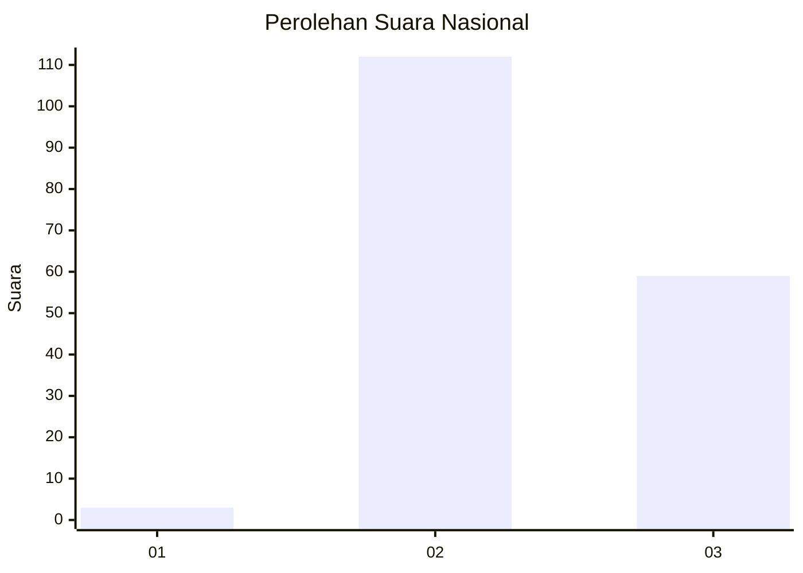
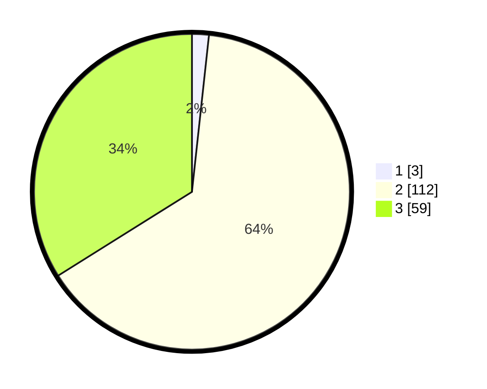

# Hasil

## Grafik

## Tabel

| No. | Nama Paslon    | Suara | Suara (raw) | Persentase |
|:--- |:-------------- | -----:| -----------:| ----------:|
| 1   | ANIES MUHAIMIN | 3     | [3][p-1]    | 1,72       |
| 2   | PRABOWO GIBRAN | 112   | [112][p-2]  | 64,37      |
| 3   | GANJAR MAHFUD  | 59    | [59][p-3]   | 33,91      |

[p-1]: https://github.com/gigit-pemilu/pemilu-2024/blob/main/pilpres/hitung-suara/sub/51-bali/sub/08-buleleng/sub/03-busungbiu/sub/2001-sepang/sub/003-tps/sub/paslon-1.txt
[p-2]: https://github.com/gigit-pemilu/pemilu-2024/blob/main/pilpres/hitung-suara/sub/51-bali/sub/08-buleleng/sub/03-busungbiu/sub/2001-sepang/sub/003-tps/sub/paslon-2.txt
[p-3]: https://github.com/gigit-pemilu/pemilu-2024/blob/main/pilpres/hitung-suara/sub/51-bali/sub/08-buleleng/sub/03-busungbiu/sub/2001-sepang/sub/003-tps/sub/paslon-3.txt

## Foto C Plano

https://sirekap-obj-formc.kpu.go.id/5172/pemilu/ppwp/51/08/03/20/01/5108032001003-20240215-000519--8db69085-b75b-4988-8bc5-b52ac0f688e3.jpg

https://sirekap-obj-formc.kpu.go.id/5172/pemilu/ppwp/51/08/03/20/01/5108032001003-20240215-000713--4ac3f8c2-16e1-47e4-9962-94ce3e896521.jpg

https://sirekap-obj-formc.kpu.go.id/5172/pemilu/ppwp/51/08/03/20/01/5108032001003-20240215-000846--1b7f8b83-10de-4285-86cf-954745f1a3e7.jpg

## Metadata

| Key        | Value               |
| ---------- | ------------------- |
| Time Stamp | 2024-02-24 22:31:28 |

## DATA PEMILIH TETAP

Jumlah pemilih dalam DPT: **269**.
 * L: **134**.
 * P: **135**.

## DATA PENGGUNA HAK PILIH

Jumlah pengguna hak pilih dalam DPT: **176**.
 * L: **91**.
 * P: **85**.

Jumlah pengguna hak pilih dalam DPTb: **0**.
 * L: **0**.
 * P: **0**.

Jumlah pengguna hak pilih dalam DPK: **0**.
 * L: **0**.
 * P: **0**.

Jumlah pengguna hak pilih: **176**.
 * L: **91**.
 * P: **85**.

## JUMLAH SUARA SAH DAN TIDAK SAH

JUMLAH SELURUH SUARA SAH: **174**.

JUMLAH SUARA TIDAK SAH: **2**.

JUMLAH SELURUH SUARA SAH DAN SUARA TIDAK SAH: **176**.

