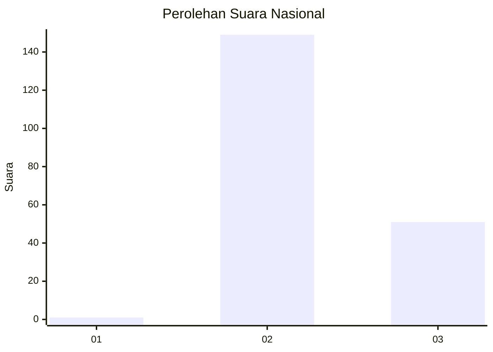
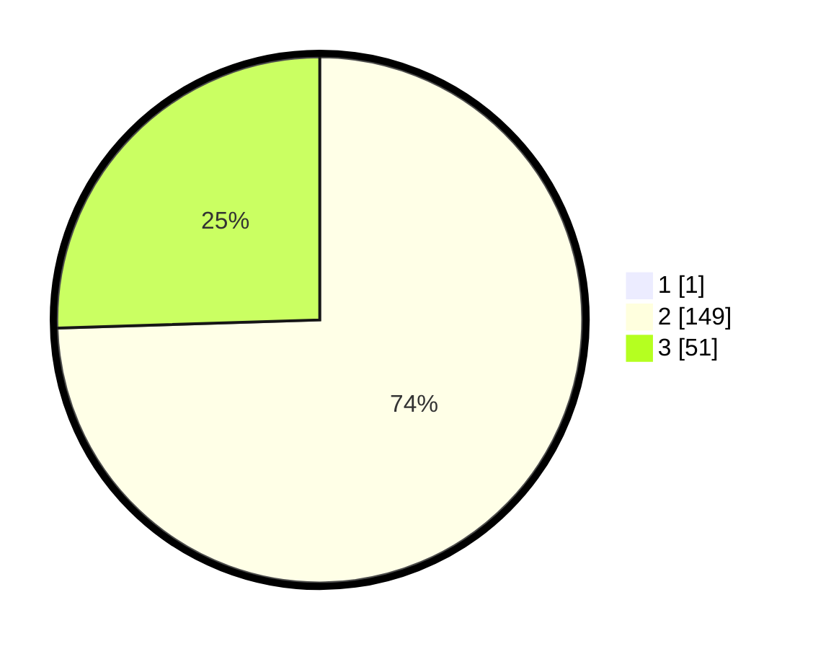

# Hasil

## Grafik

## Tabel

| No. | Nama Paslon    | Suara | Suara (raw) | Persentase |
|:--- |:-------------- | -----:| -----------:| ----------:|
| 1   | ANIES MUHAIMIN | 1     | [1][p-1]    | 0,50       |
| 2   | PRABOWO GIBRAN | 149   | [149][p-2]  | 74,13      |
| 3   | GANJAR MAHFUD  | 51    | [51][p-3]   | 25,37      |

[p-1]: https://github.com/gigit-pemilu/pemilu-2024/blob/main/pilpres/hitung-suara/sub/51-bali/sub/08-buleleng/sub/03-busungbiu/sub/2001-sepang/sub/005-tps/sub/paslon-1.txt
[p-2]: https://github.com/gigit-pemilu/pemilu-2024/blob/main/pilpres/hitung-suara/sub/51-bali/sub/08-buleleng/sub/03-busungbiu/sub/2001-sepang/sub/005-tps/sub/paslon-2.txt
[p-3]: https://github.com/gigit-pemilu/pemilu-2024/blob/main/pilpres/hitung-suara/sub/51-bali/sub/08-buleleng/sub/03-busungbiu/sub/2001-sepang/sub/005-tps/sub/paslon-3.txt

## Foto C Plano

https://sirekap-obj-formc.kpu.go.id/01be/pemilu/ppwp/51/08/03/20/01/5108032001005-20240214-204219--968d648a-e3e1-4bda-a5ac-b387306a0fbb.jpg

https://sirekap-obj-formc.kpu.go.id/01be/pemilu/ppwp/51/08/03/20/01/5108032001005-20240214-204323--33155c2a-2b71-41e9-a28c-5861ed21f500.jpg

https://sirekap-obj-formc.kpu.go.id/01be/pemilu/ppwp/51/08/03/20/01/5108032001005-20240214-204425--37154890-8bf0-43b3-a5d9-a90630fd5267.jpg

## Metadata

| Key        | Value               |
| ---------- | ------------------- |
| Time Stamp | 2024-02-24 22:31:28 |

