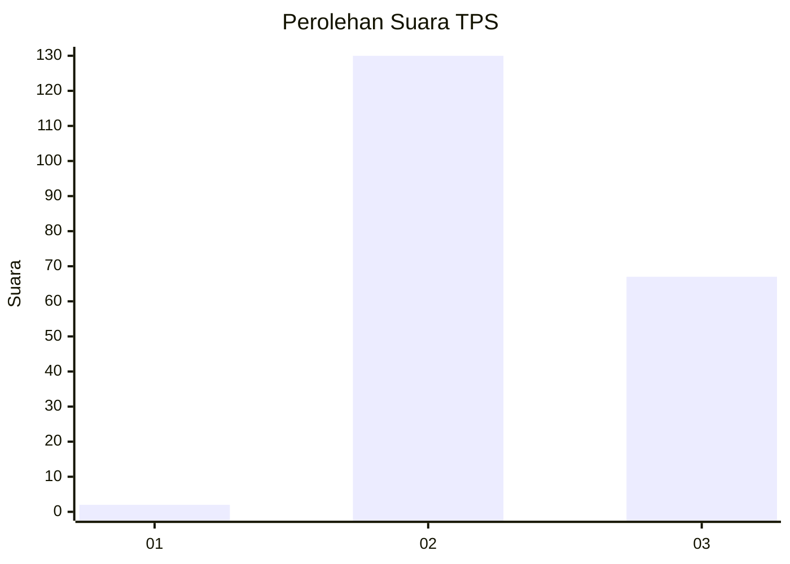
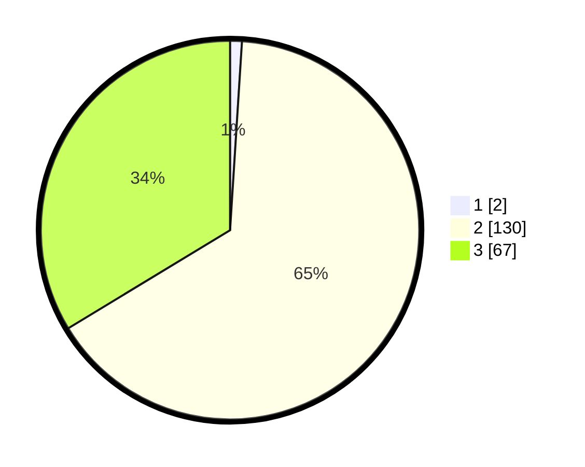

# Hasil

## Grafik

## Tabel

| No. | Nama Paslon    | Suara | Suara (raw) | Persentase |
|:--- |:-------------- | -----:| -----------:| ----------:|
| 1   | ANIES MUHAIMIN | 2     | [2][p-1]    | 1,01       |
| 2   | PRABOWO GIBRAN | 130   | [130][p-2]  | 65,33      |
| 3   | GANJAR MAHFUD  | 67    | [67][p-3]   | 33,67      |

[p-1]: https://github.com/gigit-pemilu/pemilu-2024-51-bali/blob/main/pilpres/hitung-suara/sub/51-bali/sub/08-buleleng/sub/03-busungbiu/sub/2001-sepang/sub/006-tps/sub/paslon-1.txt
[p-2]: https://github.com/gigit-pemilu/pemilu-2024-51-bali/blob/main/pilpres/hitung-suara/sub/51-bali/sub/08-buleleng/sub/03-busungbiu/sub/2001-sepang/sub/006-tps/sub/paslon-2.txt
[p-3]: https://github.com/gigit-pemilu/pemilu-2024-51-bali/blob/main/pilpres/hitung-suara/sub/51-bali/sub/08-buleleng/sub/03-busungbiu/sub/2001-sepang/sub/006-tps/sub/paslon-3.txt

## Foto C Plano

https://sirekap-obj-formc.kpu.go.id/9a85/pemilu/ppwp/51/08/03/20/01/5108032001006-20240215-083146--7ca2f102-2718-4e75-9890-dfb67b553364.jpg

https://sirekap-obj-formc.kpu.go.id/9a85/pemilu/ppwp/51/08/03/20/01/5108032001006-20240215-083227--c899d510-0295-450a-89c8-9ad18852f890.jpg

https://sirekap-obj-formc.kpu.go.id/9a85/pemilu/ppwp/51/08/03/20/01/5108032001006-20240215-083243--4ee9868d-2212-4f71-8d1b-5a43ab546053.jpg

## Metadata

| Key        | Value               |
| ---------- | ------------------- |
| Time Stamp | 2024-02-24 22:31:28 |

