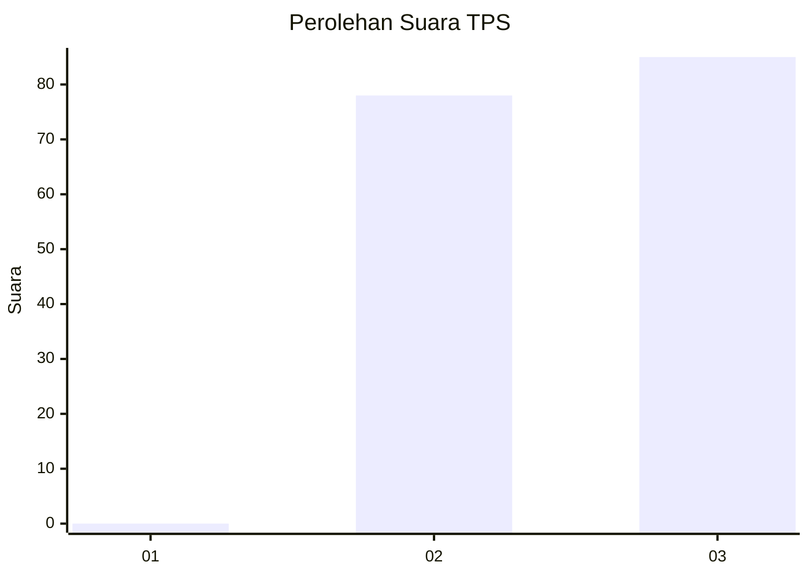
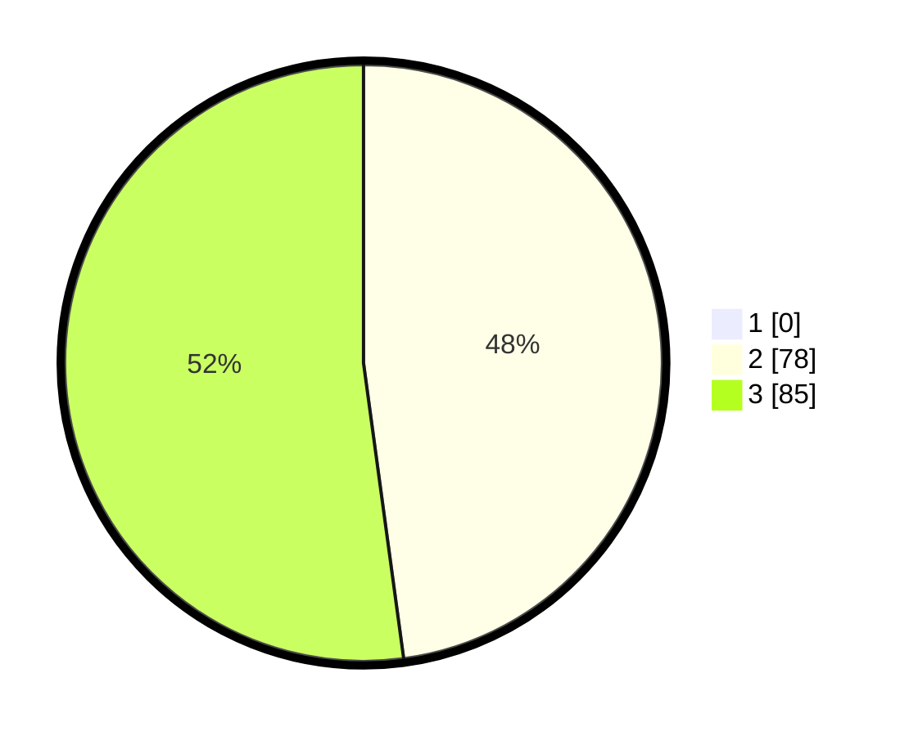

# Hasil

## Grafik

## Tabel

| No. | Nama Paslon    | Suara | Suara (raw) | Persentase |
|:--- |:-------------- | -----:| -----------:| ----------:|
| 1   | ANIES MUHAIMIN | 0     | [0][p-1]    | 0,00       |
| 2   | PRABOWO GIBRAN | 78    | [78][p-2]   | 47,85      |
| 3   | GANJAR MAHFUD  | 85    | [85][p-3]   | 52,15      |

[p-1]: https://github.com/gigit-pemilu/pemilu-2024-51-bali/blob/main/pilpres/hitung-suara/sub/51-bali/sub/08-buleleng/sub/03-busungbiu/sub/2001-sepang/sub/007-tps/sub/paslon-1.txt
[p-2]: https://github.com/gigit-pemilu/pemilu-2024-51-bali/blob/main/pilpres/hitung-suara/sub/51-bali/sub/08-buleleng/sub/03-busungbiu/sub/2001-sepang/sub/007-tps/sub/paslon-2.txt
[p-3]: https://github.com/gigit-pemilu/pemilu-2024-51-bali/blob/main/pilpres/hitung-suara/sub/51-bali/sub/08-buleleng/sub/03-busungbiu/sub/2001-sepang/sub/007-tps/sub/paslon-3.txt

## Foto C Plano

https://sirekap-obj-formc.kpu.go.id/3594/pemilu/ppwp/51/08/03/20/01/5108032001007-20240214-204345--b2eea050-0fa2-4bcf-af7a-9852ca5b59ed.jpg

https://sirekap-obj-formc.kpu.go.id/3594/pemilu/ppwp/51/08/03/20/01/5108032001007-20240214-204456--6e7d7108-51da-42ac-9d55-3638de2271c1.jpg

https://sirekap-obj-formc.kpu.go.id/3594/pemilu/ppwp/51/08/03/20/01/5108032001007-20240214-204629--17f439d4-560d-49f0-88f2-4957e83b31cf.jpg

## Metadata

| Key        | Value               |
| ---------- | ------------------- |
| Time Stamp | 2024-02-24 22:31:28 |

