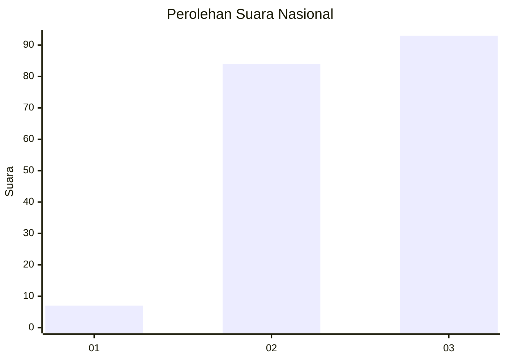
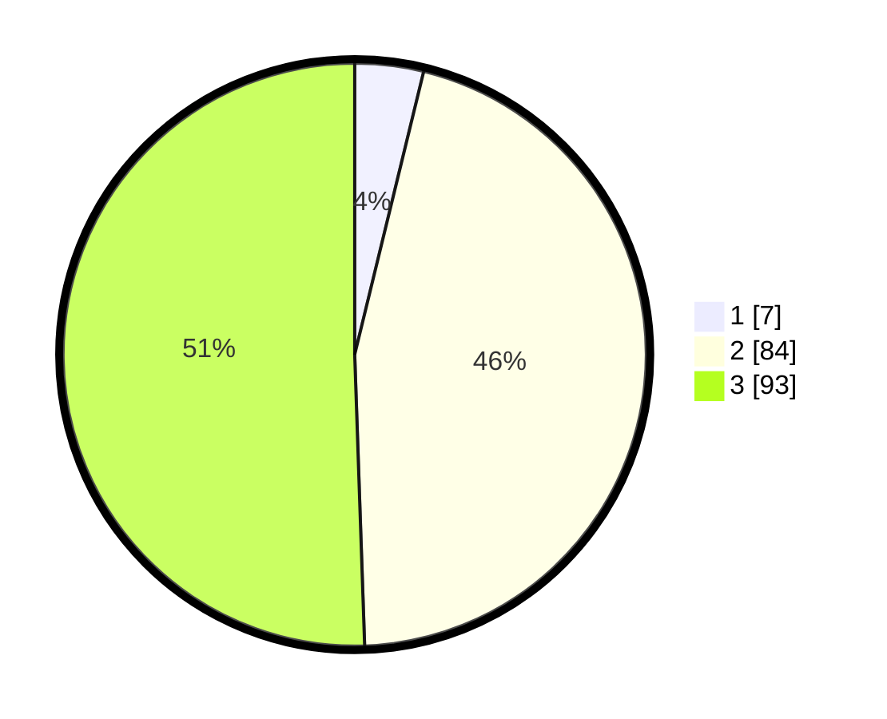

# Hasil

## Grafik

## Tabel

| No. | Nama Paslon    | Suara | Suara (raw) | Persentase |
|:--- |:-------------- | -----:| -----------:| ----------:|
| 1   | ANIES MUHAIMIN | 7     | [7][p-1]    | 3,80       |
| 2   | PRABOWO GIBRAN | 84    | [84][p-2]   | 45,65      |
| 3   | GANJAR MAHFUD  | 93    | [93][p-3]   | 50,54      |

[p-1]: https://github.com/gigit-pemilu/pemilu-2024/blob/main/pilpres/hitung-suara/sub/51-bali/sub/08-buleleng/sub/03-busungbiu/sub/2001-sepang/sub/009-tps/sub/paslon-1.txt
[p-2]: https://github.com/gigit-pemilu/pemilu-2024/blob/main/pilpres/hitung-suara/sub/51-bali/sub/08-buleleng/sub/03-busungbiu/sub/2001-sepang/sub/009-tps/sub/paslon-2.txt
[p-3]: https://github.com/gigit-pemilu/pemilu-2024/blob/main/pilpres/hitung-suara/sub/51-bali/sub/08-buleleng/sub/03-busungbiu/sub/2001-sepang/sub/009-tps/sub/paslon-3.txt

## Foto C Plano

https://sirekap-obj-formc.kpu.go.id/3e72/pemilu/ppwp/51/08/03/20/01/5108032001009-20240214-225617--da10b3bb-0aa3-4072-82cd-1a9067e5ed2d.jpg

https://sirekap-obj-formc.kpu.go.id/3e72/pemilu/ppwp/51/08/03/20/01/5108032001009-20240214-225737--43ca3b10-22f0-4909-af99-f667c27ff150.jpg

https://sirekap-obj-formc.kpu.go.id/3e72/pemilu/ppwp/51/08/03/20/01/5108032001009-20240214-225902--d6deff49-f5be-4a29-b249-916699e69bfd.jpg

## Metadata

| Key        | Value               |
| ---------- | ------------------- |
| Time Stamp | 2024-02-24 22:31:28 |

