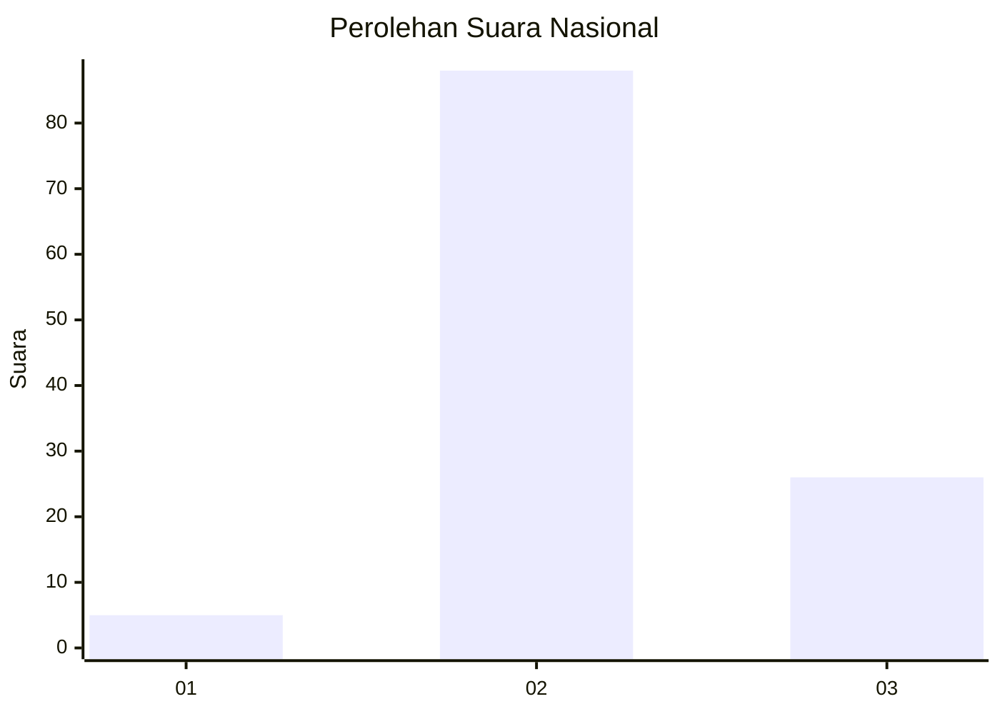

# Hasil

## Grafik

## Tabel

| No. | Nama Paslon    | Suara | Suara (raw) | Persentase |
|:--- |:-------------- | -----:| -----------:| ----------:|
| 1   | ANIES MUHAIMIN | 5     | [5][p-1]    | 4,20       |
| 2   | PRABOWO GIBRAN | 88    | [88][p-2]   | 73,95      |
| 3   | GANJAR MAHFUD  | 26    | [26][p-3]   | 21,85      |

[p-1]: https://github.com/gigit-pemilu/pemilu-2024/blob/main/pilpres/hitung-suara/sub/51-bali/sub/08-buleleng/sub/03-busungbiu/sub/2001-sepang/sub/015-tps/sub/paslon-1.txt
[p-2]: https://github.com/gigit-pemilu/pemilu-2024/blob/main/pilpres/hitung-suara/sub/51-bali/sub/08-buleleng/sub/03-busungbiu/sub/2001-sepang/sub/015-tps/sub/paslon-2.txt
[p-3]: https://github.com/gigit-pemilu/pemilu-2024/blob/main/pilpres/hitung-suara/sub/51-bali/sub/08-buleleng/sub/03-busungbiu/sub/2001-sepang/sub/015-tps/sub/paslon-3.txt

## Foto C Plano

https://sirekap-obj-formc.kpu.go.id/c4da/pemilu/ppwp/51/08/03/20/01/5108032001015-20240214-200416--3994b917-4a7e-4116-ae1c-637c112b9fd5.jpg

https://sirekap-obj-formc.kpu.go.id/c4da/pemilu/ppwp/51/08/03/20/01/5108032001015-20240214-200456--72a80a35-d287-4edd-8dc8-58e91582310f.jpg

https://sirekap-obj-formc.kpu.go.id/c4da/pemilu/ppwp/51/08/03/20/01/5108032001015-20240214-200524--7722e998-8c5d-426f-a416-60781c44bed7.jpg

## Metadata

| Key        | Value               |
| ---------- | ------------------- |
| Time Stamp | 2024-02-15 00:41:44 |

## DATA PEMILIH TETAP

Jumlah pemilih dalam DPT: **211**.
 * L: **100**.
 * P: **111**.

## DATA PENGGUNA HAK PILIH

Jumlah pengguna hak pilih dalam DPT: **122**.
 * L: **71**.
 * P: **51**.

Jumlah pengguna hak pilih dalam DPTb: **0**.
 * L: **0**.
 * P: **0**.

Jumlah pengguna hak pilih dalam DPK: **0**.
 * L: **0**.
 * P: **0**.

Jumlah pengguna hak pilih: **122**.
 * L: **75**.
 * P: **53**.

## JUMLAH SUARA SAH DAN TIDAK SAH

JUMLAH SELURUH SUARA SAH: **119**.

JUMLAH SUARA TIDAK SAH: **3**.

JUMLAH SELURUH SUARA SAH DAN SUARA TIDAK SAH: **122**.

