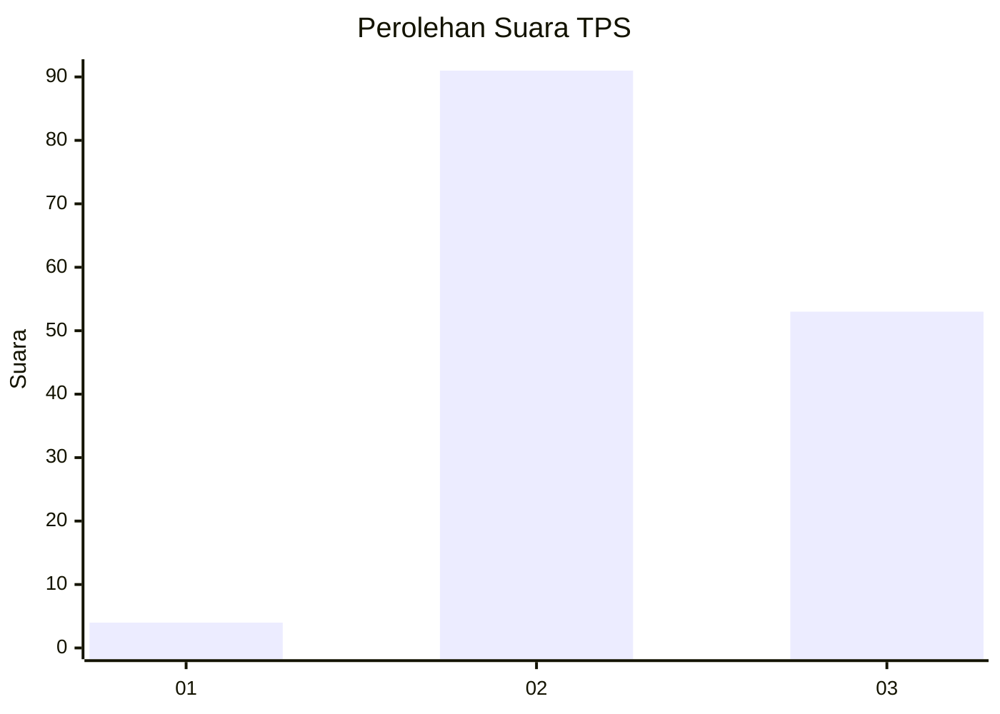
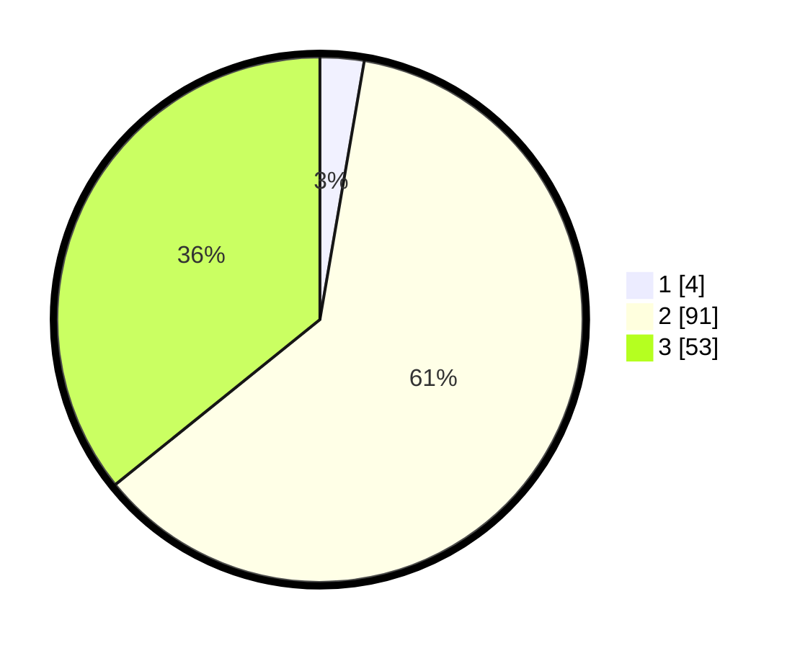

# Hasil

## Grafik

## Tabel

| No. | Nama Paslon    | Suara | Suara (raw) | Persentase |
|:--- |:-------------- | -----:| -----------:| ----------:|
| 1   | ANIES MUHAIMIN | 4     | [4][p-1]    | 2,70       |
| 2   | PRABOWO GIBRAN | 91    | [91][p-2]   | 61,49      |
| 3   | GANJAR MAHFUD  | 53    | [53][p-3]   | 35,81      |

[p-1]: https://github.com/gigit-pemilu/pemilu-2024-51-bali/blob/main/pilpres/hitung-suara/sub/51-bali/sub/08-buleleng/sub/03-busungbiu/sub/2002-dapdap-putih/sub/001-tps/sub/paslon-1.txt
[p-2]: https://github.com/gigit-pemilu/pemilu-2024-51-bali/blob/main/pilpres/hitung-suara/sub/51-bali/sub/08-buleleng/sub/03-busungbiu/sub/2002-dapdap-putih/sub/001-tps/sub/paslon-2.txt
[p-3]: https://github.com/gigit-pemilu/pemilu-2024-51-bali/blob/main/pilpres/hitung-suara/sub/51-bali/sub/08-buleleng/sub/03-busungbiu/sub/2002-dapdap-putih/sub/001-tps/sub/paslon-3.txt

## Foto C Plano

https://sirekap-obj-formc.kpu.go.id/7579/pemilu/ppwp/51/08/03/20/02/5108032002001-20240214-200650--ed19486d-a757-46f8-bb0b-e1cf9a0c0fea.jpg

https://sirekap-obj-formc.kpu.go.id/7579/pemilu/ppwp/51/08/03/20/02/5108032002001-20240214-200741--ee91cf94-8447-4766-b7ff-eeaae2169b04.jpg

https://sirekap-obj-formc.kpu.go.id/7579/pemilu/ppwp/51/08/03/20/02/5108032002001-20240214-200754--a4811f25-79ba-4efd-a49f-25959ca3ce22.jpg

## Metadata

| Key        | Value               |
| ---------- | ------------------- |
| Time Stamp | 2024-02-24 22:31:28 |

