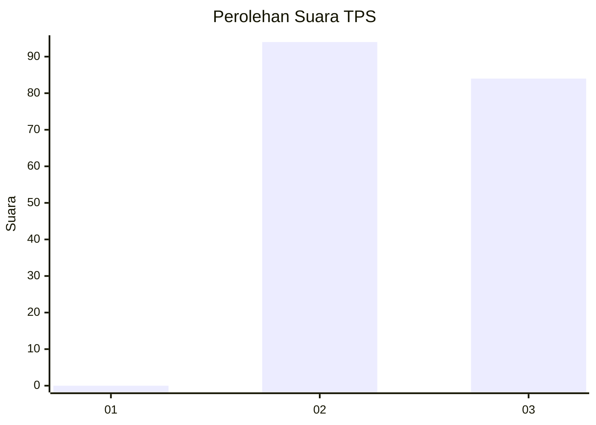
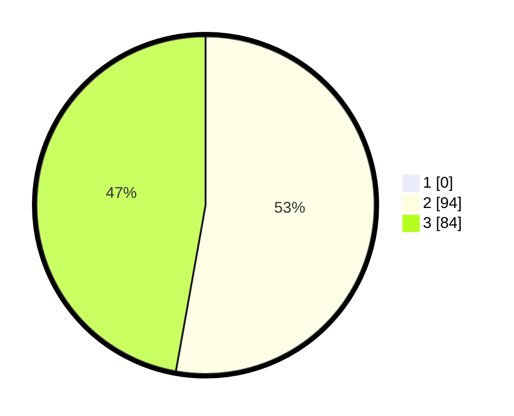

# Hasil

## Grafik

## Tabel

| No. | Nama Paslon    | Suara | Suara (raw) | Persentase |
|:--- |:-------------- | -----:| -----------:| ----------:|
| 1   | ANIES MUHAIMIN | 0     | [0][p-1]    | 0,00       |
| 2   | PRABOWO GIBRAN | 94    | [94][p-2]   | 52,81      |
| 3   | GANJAR MAHFUD  | 84    | [84][p-3]   | 47,19      |

[p-1]: https://github.com/gigit-pemilu/pemilu-2024-51-bali/blob/main/pilpres/hitung-suara/sub/51-bali/sub/08-buleleng/sub/03-busungbiu/sub/2002-dapdap-putih/sub/006-tps/sub/paslon-1.txt
[p-2]: https://github.com/gigit-pemilu/pemilu-2024-51-bali/blob/main/pilpres/hitung-suara/sub/51-bali/sub/08-buleleng/sub/03-busungbiu/sub/2002-dapdap-putih/sub/006-tps/sub/paslon-2.txt
[p-3]: https://github.com/gigit-pemilu/pemilu-2024-51-bali/blob/main/pilpres/hitung-suara/sub/51-bali/sub/08-buleleng/sub/03-busungbiu/sub/2002-dapdap-putih/sub/006-tps/sub/paslon-3.txt

## Foto C Plano

https://sirekap-obj-formc.kpu.go.id/da3e/pemilu/ppwp/51/08/03/20/02/5108032002006-20240214-215912--d1ff2162-fe63-4035-9237-0c6d842d0abb.jpg

https://sirekap-obj-formc.kpu.go.id/da3e/pemilu/ppwp/51/08/03/20/02/5108032002006-20240214-220229--0d0a6f0a-6fa8-41e9-b201-434968d7d5ef.jpg

https://sirekap-obj-formc.kpu.go.id/da3e/pemilu/ppwp/51/08/03/20/02/5108032002006-20240214-220422--04593209-040d-4fd1-a977-32d372c684bc.jpg

## Metadata

| Key        | Value               |
| ---------- | ------------------- |
| Time Stamp | 2024-02-24 22:31:28 |

