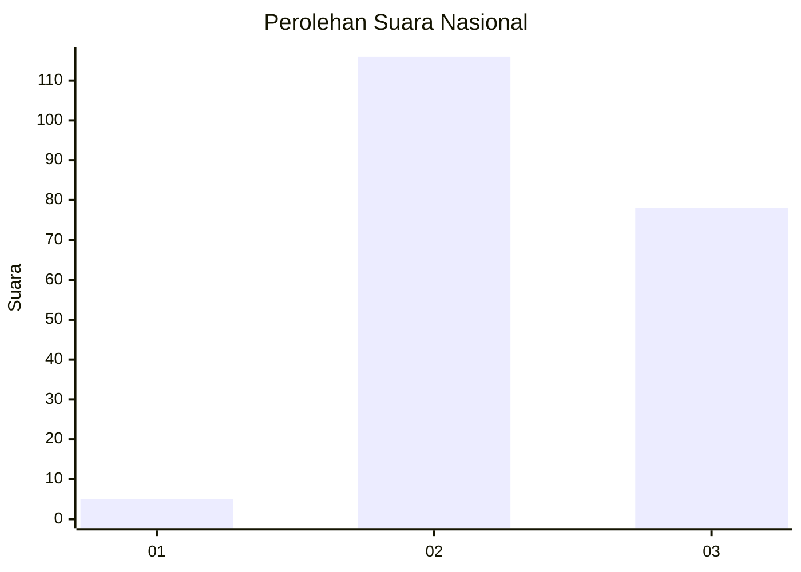
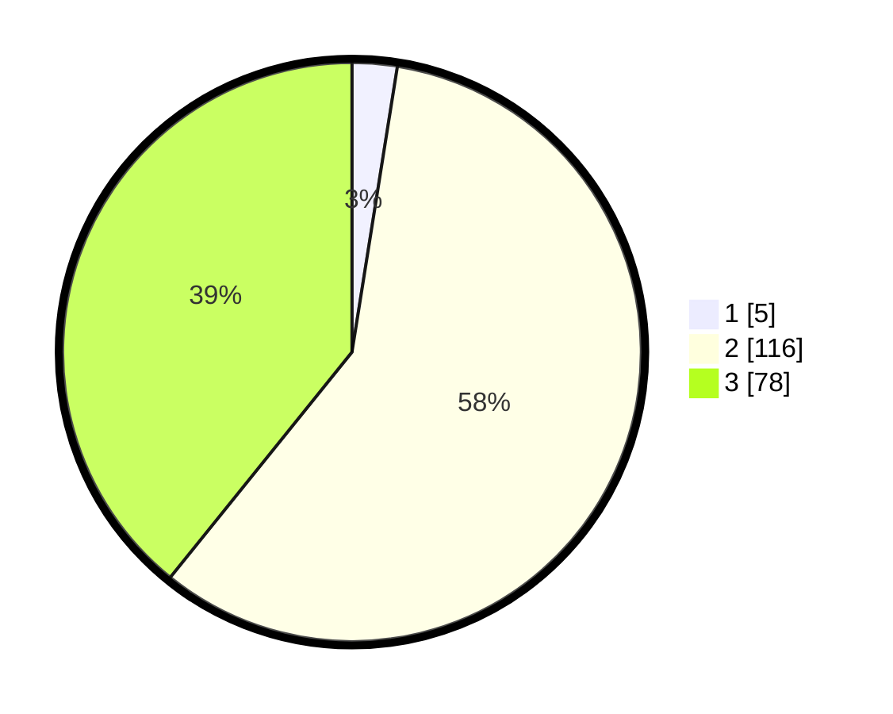

# Hasil

## Grafik

## Tabel

| No. | Nama Paslon    | Suara | Suara (raw) | Persentase |
|:--- |:-------------- | -----:| -----------:| ----------:|
| 1   | ANIES MUHAIMIN | 5     | [5][p-1]    | 2,51       |
| 2   | PRABOWO GIBRAN | 116   | [116][p-2]  | 58,29      |
| 3   | GANJAR MAHFUD  | 78    | [78][p-3]   | 39,20      |

[p-1]: https://github.com/gigit-pemilu/pemilu-2024/blob/main/pilpres/hitung-suara/sub/51-bali/sub/08-buleleng/sub/03-busungbiu/sub/2002-dapdap-putih/sub/008-tps/sub/paslon-1.txt
[p-2]: https://github.com/gigit-pemilu/pemilu-2024/blob/main/pilpres/hitung-suara/sub/51-bali/sub/08-buleleng/sub/03-busungbiu/sub/2002-dapdap-putih/sub/008-tps/sub/paslon-2.txt
[p-3]: https://github.com/gigit-pemilu/pemilu-2024/blob/main/pilpres/hitung-suara/sub/51-bali/sub/08-buleleng/sub/03-busungbiu/sub/2002-dapdap-putih/sub/008-tps/sub/paslon-3.txt

## Foto C Plano

https://sirekap-obj-formc.kpu.go.id/0840/pemilu/ppwp/51/08/03/20/02/5108032002008-20240214-215506--f3b6b101-04af-4a4d-b5fb-9b73aaf62bbd.jpg

https://sirekap-obj-formc.kpu.go.id/0840/pemilu/ppwp/51/08/03/20/02/5108032002008-20240214-220136--06d28d61-663b-41b8-b8d0-d13cd25dde53.jpg

https://sirekap-obj-formc.kpu.go.id/0840/pemilu/ppwp/51/08/03/20/02/5108032002008-20240214-215542--b20821a4-3899-4499-8ab5-a1af41b5ad95.jpg

## Metadata

| Key        | Value               |
| ---------- | ------------------- |
| Time Stamp | 2024-02-24 22:31:28 |

