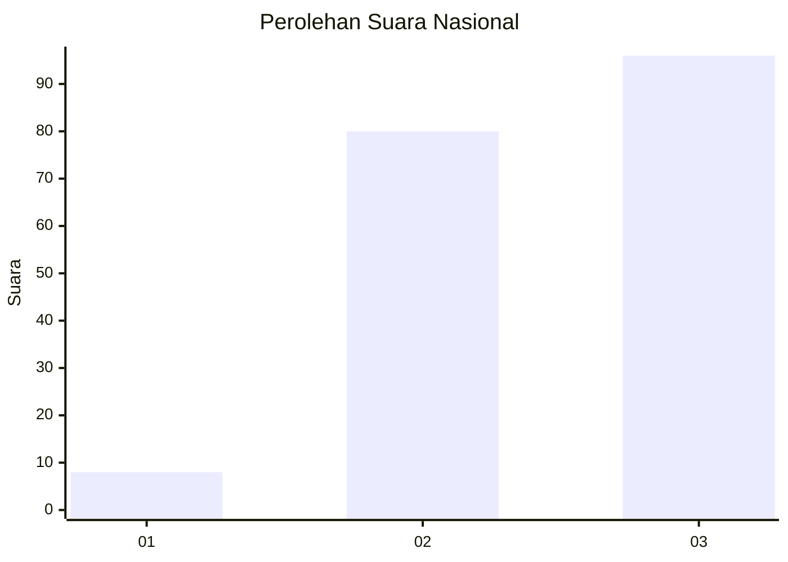
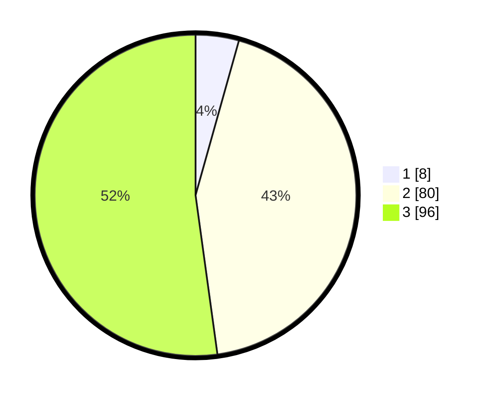

# Hasil

## Grafik

## Tabel

| No. | Nama Paslon    | Suara | Suara (raw) | Persentase |
|:--- |:-------------- | -----:| -----------:| ----------:|
| 1   | ANIES MUHAIMIN | 8     | [8][p-1]    | 4,35       |
| 2   | PRABOWO GIBRAN | 80    | [80][p-2]   | 43,48      |
| 3   | GANJAR MAHFUD  | 96    | [96][p-3]   | 52,17      |

[p-1]: https://github.com/gigit-pemilu/pemilu-2024/blob/main/pilpres/hitung-suara/sub/51-bali/sub/08-buleleng/sub/03-busungbiu/sub/2002-dapdap-putih/sub/010-tps/sub/paslon-1.txt
[p-2]: https://github.com/gigit-pemilu/pemilu-2024/blob/main/pilpres/hitung-suara/sub/51-bali/sub/08-buleleng/sub/03-busungbiu/sub/2002-dapdap-putih/sub/010-tps/sub/paslon-2.txt
[p-3]: https://github.com/gigit-pemilu/pemilu-2024/blob/main/pilpres/hitung-suara/sub/51-bali/sub/08-buleleng/sub/03-busungbiu/sub/2002-dapdap-putih/sub/010-tps/sub/paslon-3.txt

## Foto C Plano

https://sirekap-obj-formc.kpu.go.id/1739/pemilu/ppwp/51/08/03/20/02/5108032002010-20240214-233039--147cac6a-6620-4b46-b33b-7232a5bddbf8.jpg

https://sirekap-obj-formc.kpu.go.id/1739/pemilu/ppwp/51/08/03/20/02/5108032002010-20240214-233110--cf8b8031-248b-4cfb-a325-1738dc63ec84.jpg

https://sirekap-obj-formc.kpu.go.id/1739/pemilu/ppwp/51/08/03/20/02/5108032002010-20240214-233140--4d238bb5-8064-443b-83db-a67243662073.jpg

## Metadata

| Key        | Value               |
| ---------- | ------------------- |
| Time Stamp | 2024-02-24 22:31:28 |

