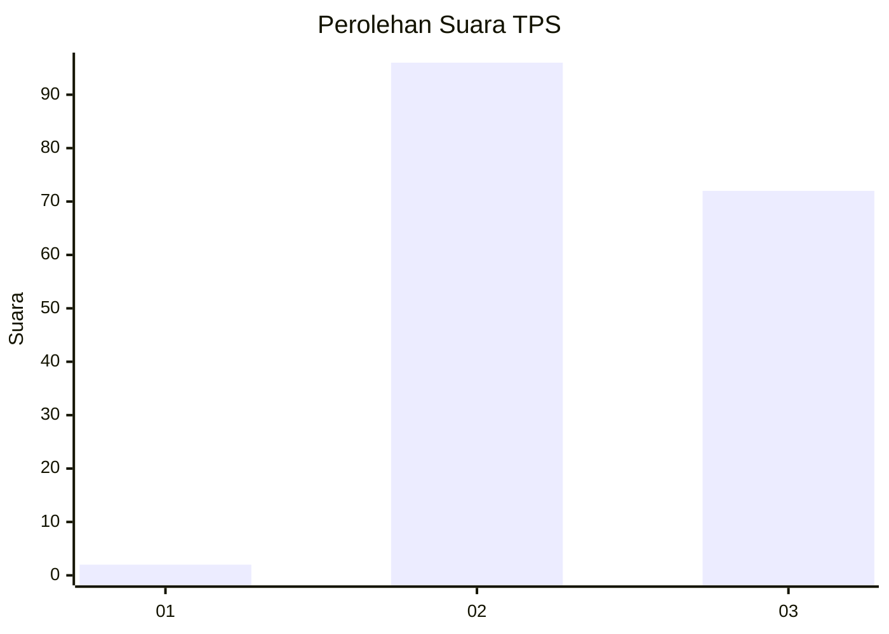
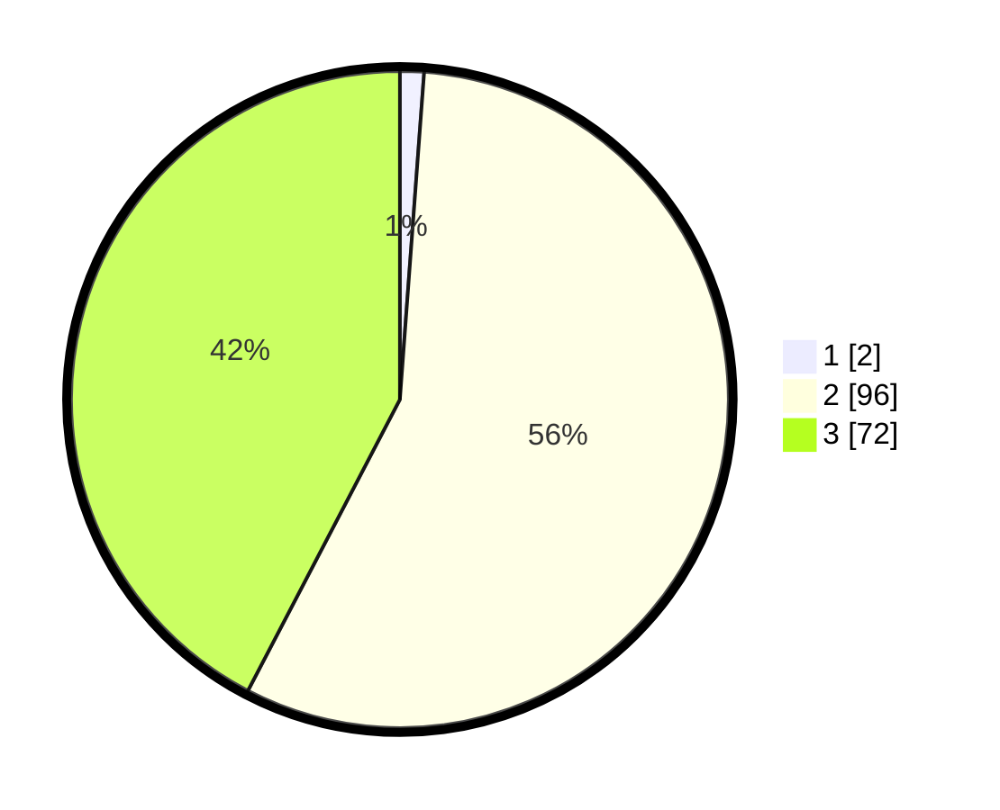

# Hasil

## Grafik

## Tabel

| No. | Nama Paslon    | Suara | Suara (raw) | Persentase |
|:--- |:-------------- | -----:| -----------:| ----------:|
| 1   | ANIES MUHAIMIN | 2     | [2][p-1]    | 1,18       |
| 2   | PRABOWO GIBRAN | 96    | [96][p-2]   | 56,47      |
| 3   | GANJAR MAHFUD  | 72    | [72][p-3]   | 42,35      |

[p-1]: https://github.com/gigit-pemilu/pemilu-2024-51-bali/blob/main/pilpres/hitung-suara/sub/51-bali/sub/08-buleleng/sub/03-busungbiu/sub/2002-dapdap-putih/sub/011-tps/sub/paslon-1.txt
[p-2]: https://github.com/gigit-pemilu/pemilu-2024-51-bali/blob/main/pilpres/hitung-suara/sub/51-bali/sub/08-buleleng/sub/03-busungbiu/sub/2002-dapdap-putih/sub/011-tps/sub/paslon-2.txt
[p-3]: https://github.com/gigit-pemilu/pemilu-2024-51-bali/blob/main/pilpres/hitung-suara/sub/51-bali/sub/08-buleleng/sub/03-busungbiu/sub/2002-dapdap-putih/sub/011-tps/sub/paslon-3.txt

## Foto C Plano

https://sirekap-obj-formc.kpu.go.id/986d/pemilu/ppwp/51/08/03/20/02/5108032002011-20240214-133004--1c1749c8-a6c9-4f8b-8717-42822017c920.jpg

https://sirekap-obj-formc.kpu.go.id/986d/pemilu/ppwp/51/08/03/20/02/5108032002011-20240214-133051--81181b95-1e34-4d4f-8ee5-a8fdd0571f7a.jpg

https://sirekap-obj-formc.kpu.go.id/986d/pemilu/ppwp/51/08/03/20/02/5108032002011-20240214-133121--54dfd985-6b5e-4c46-9392-5d7d8d4232d7.jpg

## Metadata

| Key        | Value               |
| ---------- | ------------------- |
| Time Stamp | 2024-02-24 22:31:28 |

