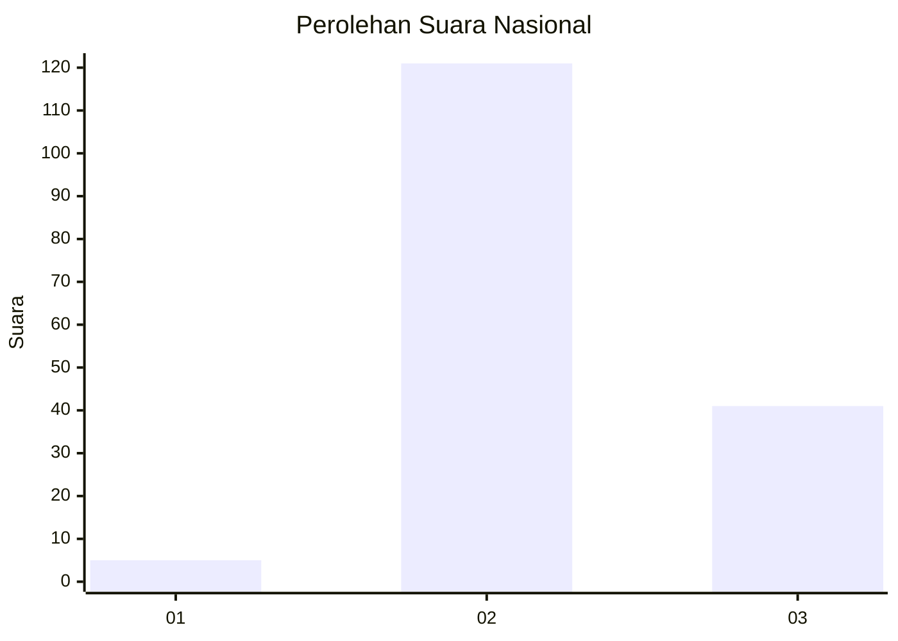
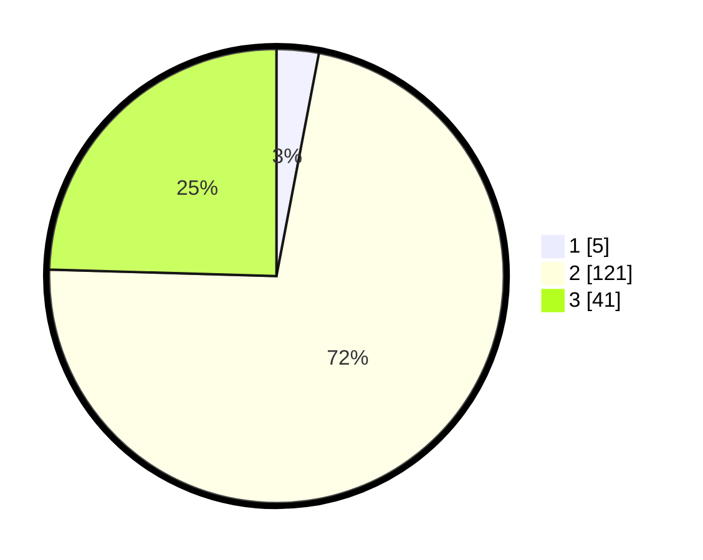

# Hasil

## Grafik

## Tabel

| No. | Nama Paslon    | Suara | Suara (raw) | Persentase |
|:--- |:-------------- | -----:| -----------:| ----------:|
| 1   | ANIES MUHAIMIN | 5     | [5][p-1]    | 2,99       |
| 2   | PRABOWO GIBRAN | 121   | [121][p-2]  | 72,46      |
| 3   | GANJAR MAHFUD  | 41    | [41][p-3]   | 24,55      |

[p-1]: https://github.com/gigit-pemilu/pemilu-2024/blob/main/pilpres/hitung-suara/sub/51-bali/sub/08-buleleng/sub/03-busungbiu/sub/2006-titab/sub/001-tps/sub/paslon-1.txt
[p-2]: https://github.com/gigit-pemilu/pemilu-2024/blob/main/pilpres/hitung-suara/sub/51-bali/sub/08-buleleng/sub/03-busungbiu/sub/2006-titab/sub/001-tps/sub/paslon-2.txt
[p-3]: https://github.com/gigit-pemilu/pemilu-2024/blob/main/pilpres/hitung-suara/sub/51-bali/sub/08-buleleng/sub/03-busungbiu/sub/2006-titab/sub/001-tps/sub/paslon-3.txt

## Foto C Plano

https://sirekap-obj-formc.kpu.go.id/b6e0/pemilu/ppwp/51/08/03/20/06/5108032006001-20240214-231220--92520da5-2990-4bb6-9497-d01bbc55c79a.jpg

https://sirekap-obj-formc.kpu.go.id/b6e0/pemilu/ppwp/51/08/03/20/06/5108032006001-20240214-232108--ce07621b-330c-401f-a281-cbc6e4b63a05.jpg

https://sirekap-obj-formc.kpu.go.id/b6e0/pemilu/ppwp/51/08/03/20/06/5108032006001-20240214-232216--2f6eabde-2278-4586-a14c-0c7e8e2fa1df.jpg

## Metadata

| Key        | Value               |
| ---------- | ------------------- |
| Time Stamp | 2024-02-25 15:00:00 |

