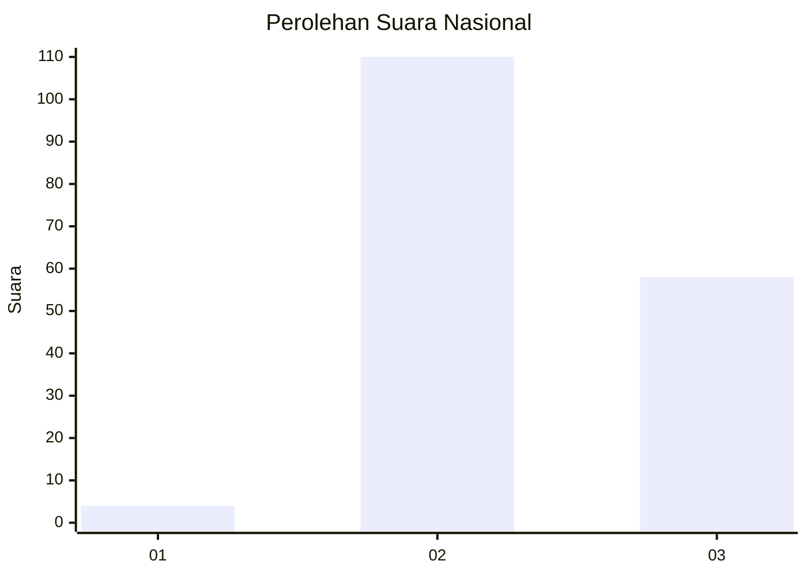
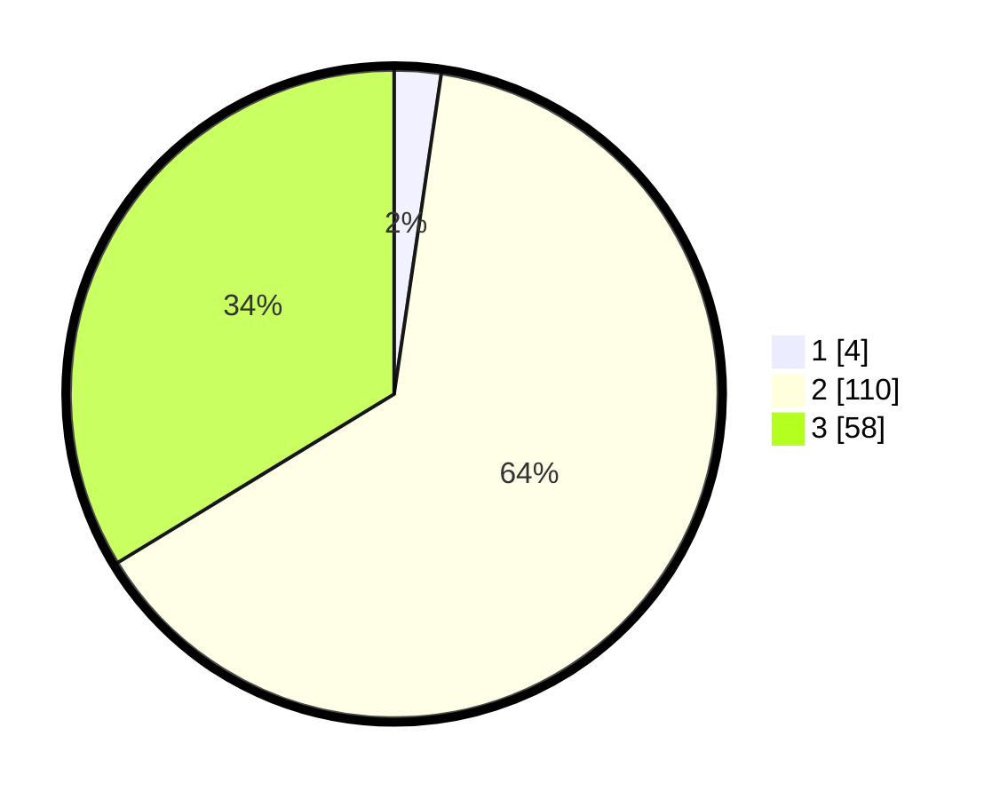

# Hasil

## Grafik

## Tabel

| No. | Nama Paslon    | Suara | Suara (raw) | Persentase |
|:--- |:-------------- | -----:| -----------:| ----------:|
| 1   | ANIES MUHAIMIN | 4     | [4][p-1]    | 2,33       |
| 2   | PRABOWO GIBRAN | 110   | [110][p-2]  | 63,95      |
| 3   | GANJAR MAHFUD  | 58    | [58][p-3]   | 33,72      |

[p-1]: https://github.com/gigit-pemilu/pemilu-2024/blob/main/pilpres/hitung-suara/sub/51-bali/sub/08-buleleng/sub/03-busungbiu/sub/2006-titab/sub/002-tps/sub/paslon-1.txt
[p-2]: https://github.com/gigit-pemilu/pemilu-2024/blob/main/pilpres/hitung-suara/sub/51-bali/sub/08-buleleng/sub/03-busungbiu/sub/2006-titab/sub/002-tps/sub/paslon-2.txt
[p-3]: https://github.com/gigit-pemilu/pemilu-2024/blob/main/pilpres/hitung-suara/sub/51-bali/sub/08-buleleng/sub/03-busungbiu/sub/2006-titab/sub/002-tps/sub/paslon-3.txt

## Foto C Plano

https://sirekap-obj-formc.kpu.go.id/735c/pemilu/ppwp/51/08/03/20/06/5108032006002-20240214-214011--a42d64ae-cfcf-4661-8afe-d83b4af9a266.jpg

https://sirekap-obj-formc.kpu.go.id/735c/pemilu/ppwp/51/08/03/20/06/5108032006002-20240214-141456--51d284ce-0063-42b2-bb02-403b4e067dda.jpg

https://sirekap-obj-formc.kpu.go.id/735c/pemilu/ppwp/51/08/03/20/06/5108032006002-20240214-141748--bdd139a9-210f-4406-8c0a-1dc9b4f177b2.jpg

## Metadata

| Key        | Value               |
| ---------- | ------------------- |
| Time Stamp | 2024-02-24 22:31:28 |

