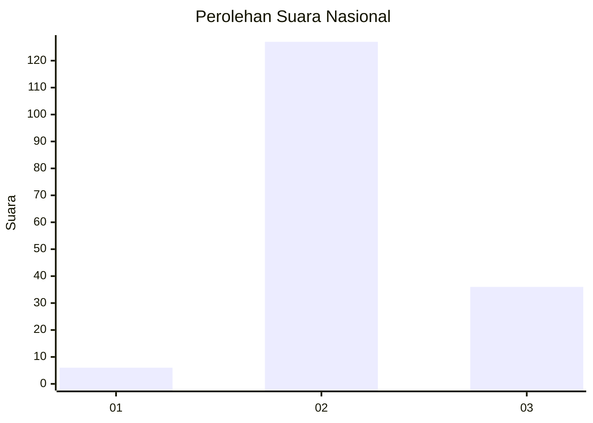

# Hasil

## Grafik

## Tabel

| No. | Nama Paslon    | Suara | Suara (raw) | Persentase |
|:--- |:-------------- | -----:| -----------:| ----------:|
| 1   | ANIES MUHAIMIN | 6     | [6][p-1]    | 3,55       |
| 2   | PRABOWO GIBRAN | 127   | [127][p-2]  | 75,15      |
| 3   | GANJAR MAHFUD  | 36    | [36][p-3]   | 21,30      |

[p-1]: https://github.com/gigit-pemilu/pemilu-2024/blob/main/pilpres/hitung-suara/sub/51-bali/sub/08-buleleng/sub/03-busungbiu/sub/2007-subuk/sub/002-tps/sub/paslon-1.txt
[p-2]: https://github.com/gigit-pemilu/pemilu-2024/blob/main/pilpres/hitung-suara/sub/51-bali/sub/08-buleleng/sub/03-busungbiu/sub/2007-subuk/sub/002-tps/sub/paslon-2.txt
[p-3]: https://github.com/gigit-pemilu/pemilu-2024/blob/main/pilpres/hitung-suara/sub/51-bali/sub/08-buleleng/sub/03-busungbiu/sub/2007-subuk/sub/002-tps/sub/paslon-3.txt

## Foto C Plano

https://sirekap-obj-formc.kpu.go.id/0b97/pemilu/ppwp/51/08/03/20/07/5108032007002-20240214-220922--335b2c4a-1984-4546-b114-d8a3ec321634.jpg

https://sirekap-obj-formc.kpu.go.id/0b97/pemilu/ppwp/51/08/03/20/07/5108032007002-20240214-221058--9facc6cd-203b-4104-9972-039dd08f1937.jpg

https://sirekap-obj-formc.kpu.go.id/0b97/pemilu/ppwp/51/08/03/20/07/5108032007002-20240214-221251--8e79fdc8-d238-4700-977e-50e116d2477b.jpg

## Metadata

| Key        | Value               |
| ---------- | ------------------- |
| Time Stamp | 2024-02-25 12:00:00 |

