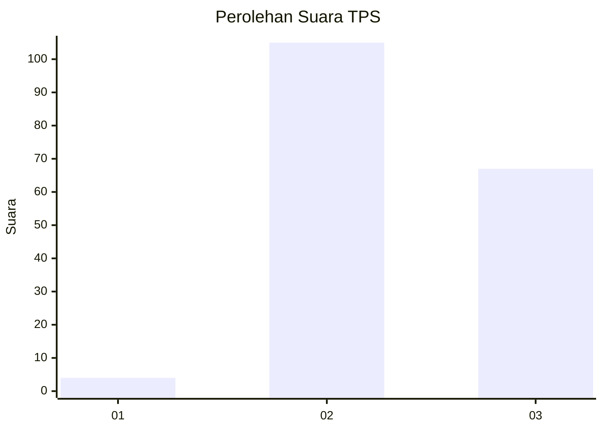
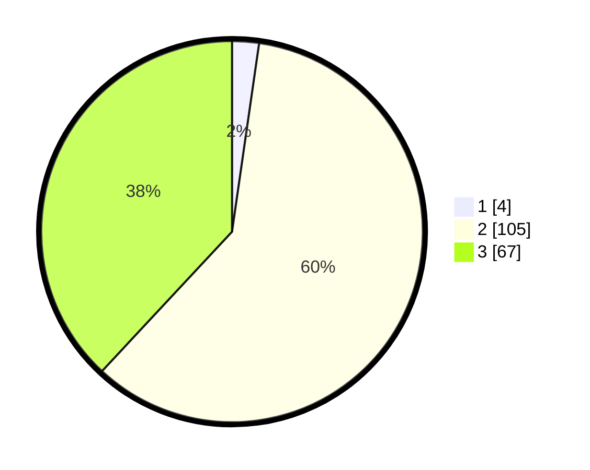

# Hasil

## Grafik

## Tabel

| No. | Nama Paslon    | Suara | Suara (raw) | Persentase |
|:--- |:-------------- | -----:| -----------:| ----------:|
| 1   | ANIES MUHAIMIN | 4     | [4][p-1]    | 2,27       |
| 2   | PRABOWO GIBRAN | 105   | [105][p-2]  | 59,66      |
| 3   | GANJAR MAHFUD  | 67    | [67][p-3]   | 38,07      |

[p-1]: https://github.com/gigit-pemilu/pemilu-2024-51-bali/blob/main/pilpres/hitung-suara/sub/51-bali/sub/08-buleleng/sub/03-busungbiu/sub/2007-subuk/sub/003-tps/sub/paslon-1.txt
[p-2]: https://github.com/gigit-pemilu/pemilu-2024-51-bali/blob/main/pilpres/hitung-suara/sub/51-bali/sub/08-buleleng/sub/03-busungbiu/sub/2007-subuk/sub/003-tps/sub/paslon-2.txt
[p-3]: https://github.com/gigit-pemilu/pemilu-2024-51-bali/blob/main/pilpres/hitung-suara/sub/51-bali/sub/08-buleleng/sub/03-busungbiu/sub/2007-subuk/sub/003-tps/sub/paslon-3.txt

## Foto C Plano

https://sirekap-obj-formc.kpu.go.id/ff37/pemilu/ppwp/51/08/03/20/07/5108032007003-20240214-231133--a9dd0251-4089-48f5-98d3-150b37db0934.jpg

https://sirekap-obj-formc.kpu.go.id/ff37/pemilu/ppwp/51/08/03/20/07/5108032007003-20240214-231153--6fe8142f-b874-41b6-a434-3abf655b7c71.jpg

https://sirekap-obj-formc.kpu.go.id/ff37/pemilu/ppwp/51/08/03/20/07/5108032007003-20240214-231203--3ab8ac05-75de-43e7-875f-6411fc7d4c0d.jpg

## Metadata

| Key        | Value               |
| ---------- | ------------------- |
| Time Stamp | 2024-02-24 22:31:28 |

