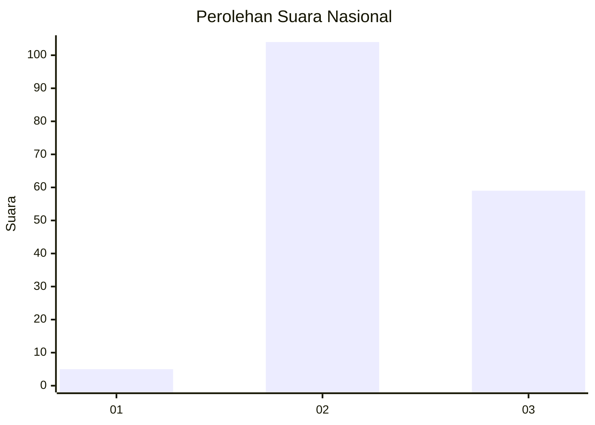
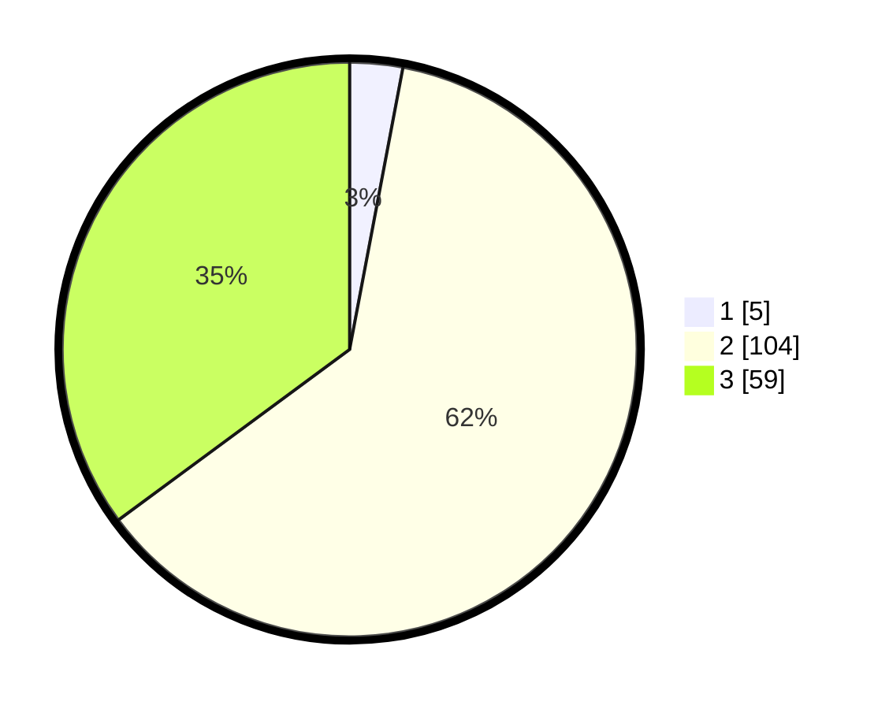

# Hasil

## Grafik

## Tabel

| No. | Nama Paslon    | Suara | Suara (raw) | Persentase |
|:--- |:-------------- | -----:| -----------:| ----------:|
| 1   | ANIES MUHAIMIN | 5     | [5][p-1]    | 2,98       |
| 2   | PRABOWO GIBRAN | 104   | [104][p-2]  | 61,90      |
| 3   | GANJAR MAHFUD  | 59    | [59][p-3]   | 35,12      |

[p-1]: https://github.com/gigit-pemilu/pemilu-2024/blob/main/pilpres/hitung-suara/sub/51-bali/sub/08-buleleng/sub/03-busungbiu/sub/2007-subuk/sub/005-tps/sub/paslon-1.txt
[p-2]: https://github.com/gigit-pemilu/pemilu-2024/blob/main/pilpres/hitung-suara/sub/51-bali/sub/08-buleleng/sub/03-busungbiu/sub/2007-subuk/sub/005-tps/sub/paslon-2.txt
[p-3]: https://github.com/gigit-pemilu/pemilu-2024/blob/main/pilpres/hitung-suara/sub/51-bali/sub/08-buleleng/sub/03-busungbiu/sub/2007-subuk/sub/005-tps/sub/paslon-3.txt

## Foto C Plano

https://sirekap-obj-formc.kpu.go.id/7f14/pemilu/ppwp/51/08/03/20/07/5108032007005-20240214-225402--dead8b31-cbef-420d-8aa2-f75425ec12e5.jpg

https://sirekap-obj-formc.kpu.go.id/7f14/pemilu/ppwp/51/08/03/20/07/5108032007005-20240214-225406--97ad2ebb-ce54-4c27-9e17-808f8c99683e.jpg

https://sirekap-obj-formc.kpu.go.id/7f14/pemilu/ppwp/51/08/03/20/07/5108032007005-20240214-225410--ca147de2-e7d3-48d9-b175-030222b4603c.jpg

## Metadata

| Key        | Value               |
| ---------- | ------------------- |
| Time Stamp | 2024-02-24 22:31:28 |

