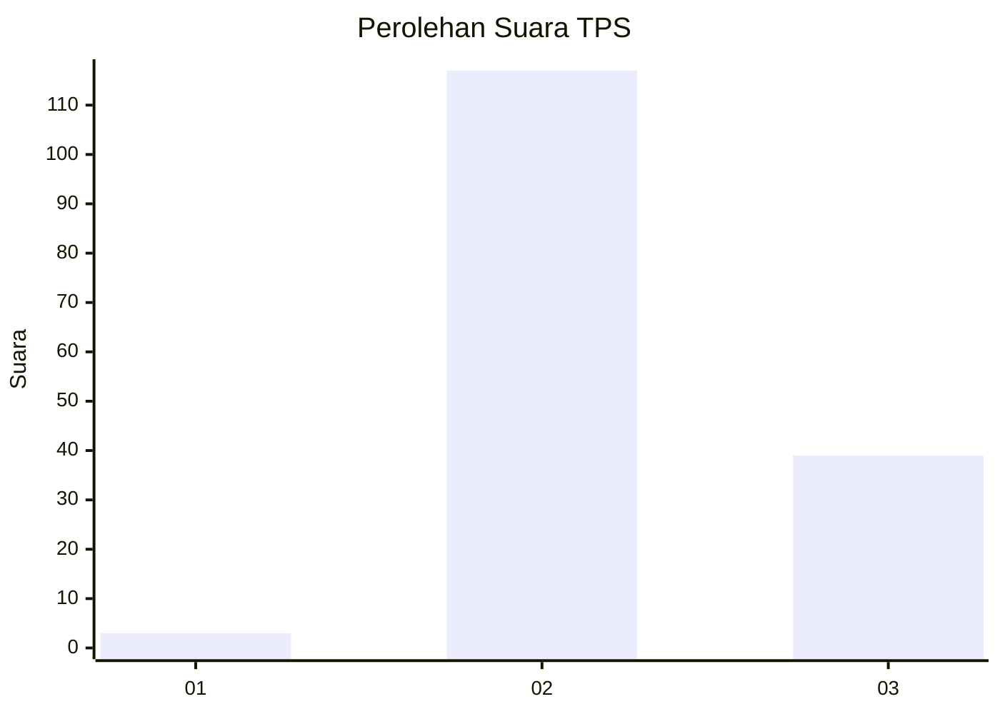
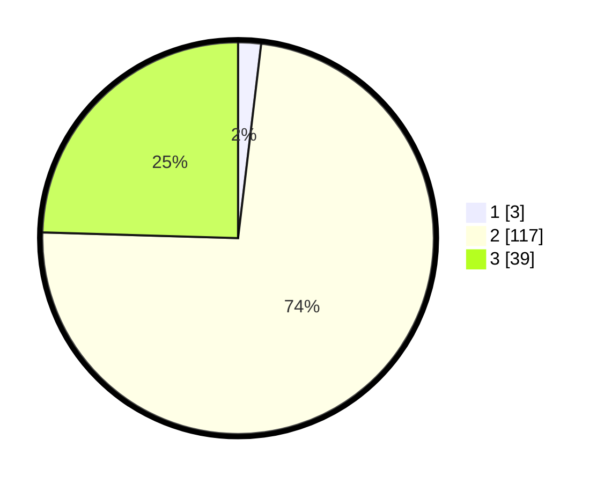

# Hasil

## Grafik

## Tabel

| No. | Nama Paslon    | Suara | Suara (raw) | Persentase |
|:--- |:-------------- | -----:| -----------:| ----------:|
| 1   | ANIES MUHAIMIN | 3     | [3][p-1]    | 1,89       |
| 2   | PRABOWO GIBRAN | 117   | [117][p-2]  | 73,58      |
| 3   | GANJAR MAHFUD  | 39    | [39][p-3]   | 24,53      |

[p-1]: https://github.com/gigit-pemilu/pemilu-2024-51-bali/blob/main/pilpres/hitung-suara/sub/51-bali/sub/08-buleleng/sub/03-busungbiu/sub/2008-tinggarsari/sub/009-tps/sub/paslon-1.txt
[p-2]: https://github.com/gigit-pemilu/pemilu-2024-51-bali/blob/main/pilpres/hitung-suara/sub/51-bali/sub/08-buleleng/sub/03-busungbiu/sub/2008-tinggarsari/sub/009-tps/sub/paslon-2.txt
[p-3]: https://github.com/gigit-pemilu/pemilu-2024-51-bali/blob/main/pilpres/hitung-suara/sub/51-bali/sub/08-buleleng/sub/03-busungbiu/sub/2008-tinggarsari/sub/009-tps/sub/paslon-3.txt

## Foto C Plano

https://sirekap-obj-formc.kpu.go.id/6377/pemilu/ppwp/51/08/03/20/08/5108032008009-20240214-214931--5141e7e0-f03a-4e73-9a8d-b092a4406429.jpg

https://sirekap-obj-formc.kpu.go.id/6377/pemilu/ppwp/51/08/03/20/08/5108032008009-20240214-141648--cd9c6ffd-6dce-4e22-ba4f-7139d8e726b0.jpg

https://sirekap-obj-formc.kpu.go.id/6377/pemilu/ppwp/51/08/03/20/08/5108032008009-20240214-141742--23ac9ffd-088b-45c5-ba75-b1e83b5be4e1.jpg

## Metadata

| Key        | Value               |
| ---------- | ------------------- |
| Time Stamp | 2024-02-24 22:31:28 |

