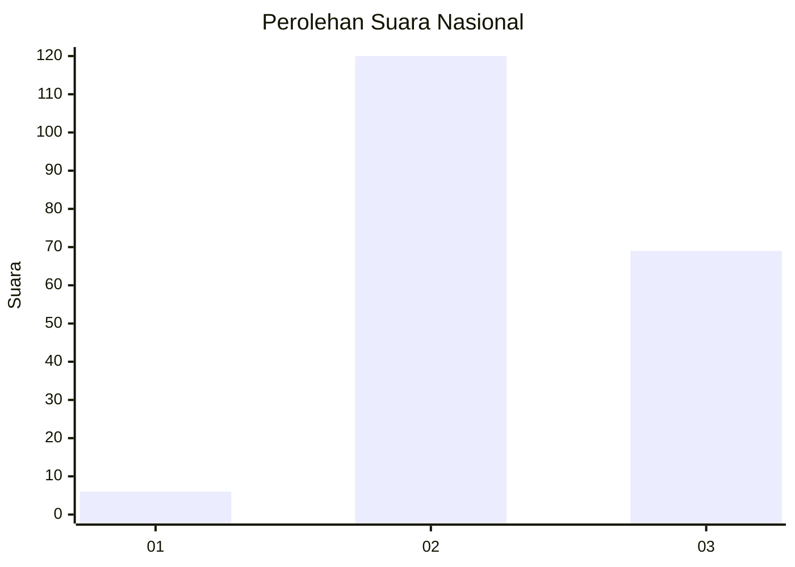
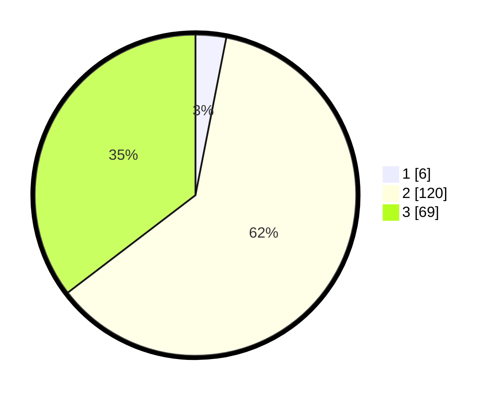

# Hasil

## Grafik

## Tabel

| No. | Nama Paslon    | Suara | Suara (raw) | Persentase |
|:--- |:-------------- | -----:| -----------:| ----------:|
| 1   | ANIES MUHAIMIN | 6     | [6][p-1]    | 3,08       |
| 2   | PRABOWO GIBRAN | 120   | [120][p-2]  | 61,54      |
| 3   | GANJAR MAHFUD  | 69    | [69][p-3]   | 35,38      |

[p-1]: https://github.com/gigit-pemilu/pemilu-2024/blob/main/pilpres/hitung-suara/sub/51-bali/sub/08-buleleng/sub/03-busungbiu/sub/2009-kedis/sub/001-tps/sub/paslon-1.txt
[p-2]: https://github.com/gigit-pemilu/pemilu-2024/blob/main/pilpres/hitung-suara/sub/51-bali/sub/08-buleleng/sub/03-busungbiu/sub/2009-kedis/sub/001-tps/sub/paslon-2.txt
[p-3]: https://github.com/gigit-pemilu/pemilu-2024/blob/main/pilpres/hitung-suara/sub/51-bali/sub/08-buleleng/sub/03-busungbiu/sub/2009-kedis/sub/001-tps/sub/paslon-3.txt

## Foto C Plano

https://sirekap-obj-formc.kpu.go.id/64d1/pemilu/ppwp/51/08/03/20/09/5108032009001-20240215-020820--7ab34d9e-f185-477c-9fe8-3257841b36f7.jpg

https://sirekap-obj-formc.kpu.go.id/64d1/pemilu/ppwp/51/08/03/20/09/5108032009001-20240215-020929--07863299-7f25-4c53-9af4-1a2ec2cf2554.jpg

https://sirekap-obj-formc.kpu.go.id/64d1/pemilu/ppwp/51/08/03/20/09/5108032009001-20240215-021211--eff5e5c1-af8e-4e78-aabc-fe7e2ec0ca0e.jpg

## Metadata

| Key        | Value               |
| ---------- | ------------------- |
| Time Stamp | 2024-02-24 22:31:28 |

