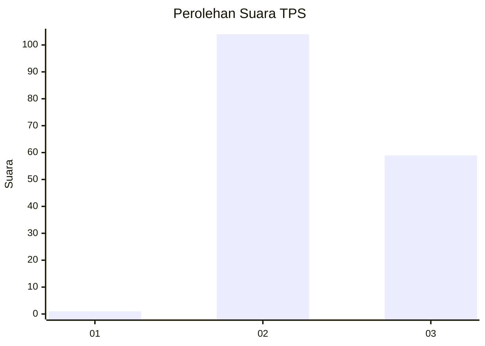
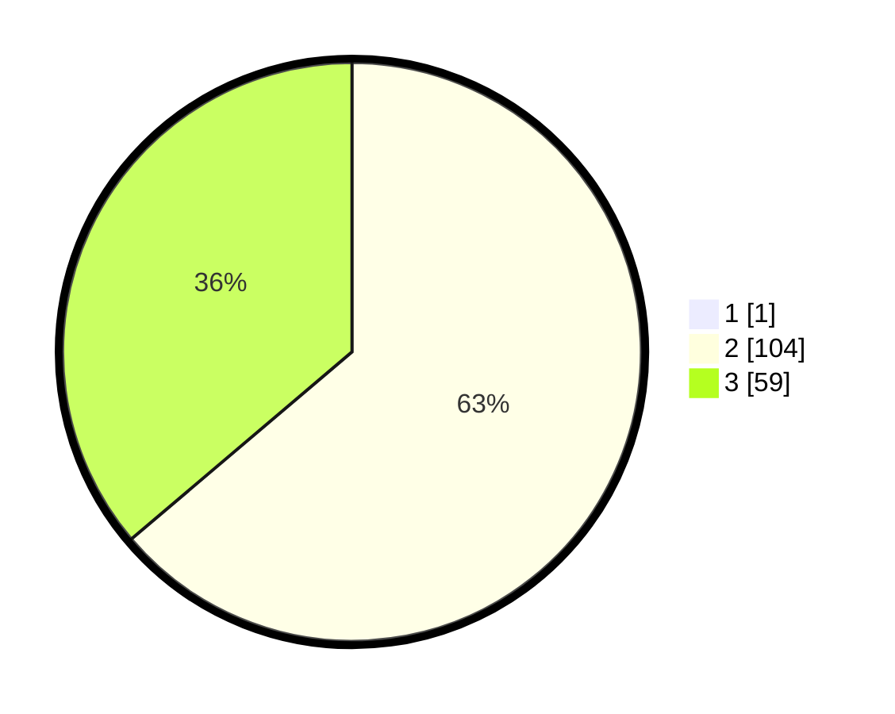

# Hasil

## Grafik

## Tabel

| No. | Nama Paslon    | Suara | Suara (raw) | Persentase |
|:--- |:-------------- | -----:| -----------:| ----------:|
| 1   | ANIES MUHAIMIN | 1     | [1][p-1]    | 0,61       |
| 2   | PRABOWO GIBRAN | 104   | [104][p-2]  | 63,41      |
| 3   | GANJAR MAHFUD  | 59    | [59][p-3]   | 35,98      |

[p-1]: https://github.com/gigit-pemilu/pemilu-2024-51-bali/blob/main/pilpres/hitung-suara/sub/51-bali/sub/08-buleleng/sub/03-busungbiu/sub/2009-kedis/sub/002-tps/sub/paslon-1.txt
[p-2]: https://github.com/gigit-pemilu/pemilu-2024-51-bali/blob/main/pilpres/hitung-suara/sub/51-bali/sub/08-buleleng/sub/03-busungbiu/sub/2009-kedis/sub/002-tps/sub/paslon-2.txt
[p-3]: https://github.com/gigit-pemilu/pemilu-2024-51-bali/blob/main/pilpres/hitung-suara/sub/51-bali/sub/08-buleleng/sub/03-busungbiu/sub/2009-kedis/sub/002-tps/sub/paslon-3.txt

## Foto C Plano

https://sirekap-obj-formc.kpu.go.id/8784/pemilu/ppwp/51/08/03/20/09/5108032009002-20240216-081301--c9ce1acc-035b-44d7-a828-f4431527c8dd.jpg

https://sirekap-obj-formc.kpu.go.id/8784/pemilu/ppwp/51/08/03/20/09/5108032009002-20240216-081310--89b7c80f-bf58-4613-9015-d219e1e2a7ef.jpg

https://sirekap-obj-formc.kpu.go.id/8784/pemilu/ppwp/51/08/03/20/09/5108032009002-20240216-081333--1af84ea7-8b05-423d-bf37-51f90f286cec.jpg

## Metadata

| Key        | Value               |
| ---------- | ------------------- |
| Time Stamp | 2024-02-24 22:31:28 |

