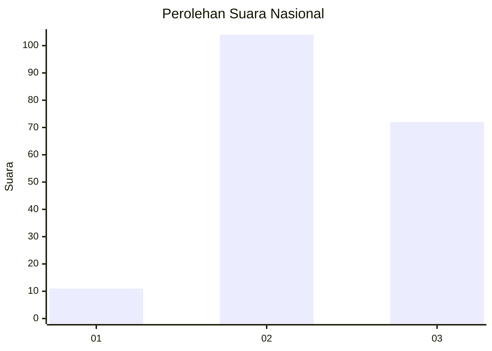
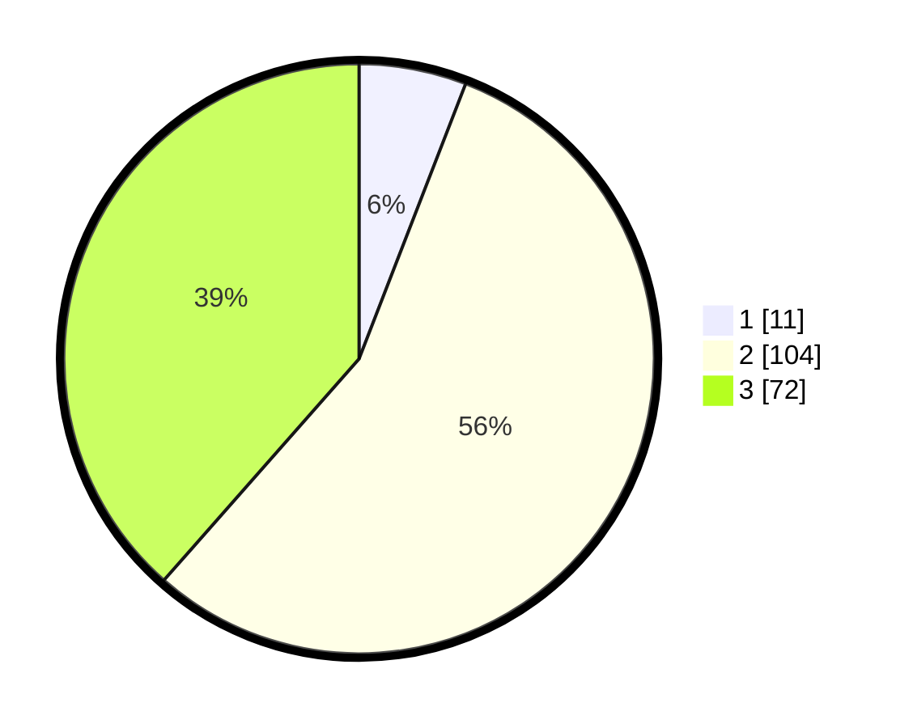

# Hasil

## Grafik

## Tabel

| No. | Nama Paslon    | Suara | Suara (raw) | Persentase |
|:--- |:-------------- | -----:| -----------:| ----------:|
| 1   | ANIES MUHAIMIN | 11    | [11][p-1]   | 5,88       |
| 2   | PRABOWO GIBRAN | 104   | [104][p-2]  | 55,61      |
| 3   | GANJAR MAHFUD  | 72    | [72][p-3]   | 38,50      |

[p-1]: https://github.com/gigit-pemilu/pemilu-2024/blob/main/pilpres/hitung-suara/sub/51-bali/sub/08-buleleng/sub/03-busungbiu/sub/2009-kedis/sub/004-tps/sub/paslon-1.txt
[p-2]: https://github.com/gigit-pemilu/pemilu-2024/blob/main/pilpres/hitung-suara/sub/51-bali/sub/08-buleleng/sub/03-busungbiu/sub/2009-kedis/sub/004-tps/sub/paslon-2.txt
[p-3]: https://github.com/gigit-pemilu/pemilu-2024/blob/main/pilpres/hitung-suara/sub/51-bali/sub/08-buleleng/sub/03-busungbiu/sub/2009-kedis/sub/004-tps/sub/paslon-3.txt

## Foto C Plano

https://sirekap-obj-formc.kpu.go.id/db5a/pemilu/ppwp/51/08/03/20/09/5108032009004-20240215-002242--b12c385b-6896-41bc-a681-57d069f3a156.jpg

https://sirekap-obj-formc.kpu.go.id/db5a/pemilu/ppwp/51/08/03/20/09/5108032009004-20240214-235350--30e039ea-4edf-4b4b-adc4-55da114c8756.jpg

https://sirekap-obj-formc.kpu.go.id/db5a/pemilu/ppwp/51/08/03/20/09/5108032009004-20240214-235339--a65616ad-34bc-4ee2-8e30-154fb978c423.jpg

## Metadata

| Key        | Value               |
| ---------- | ------------------- |
| Time Stamp | 2024-02-16 08:30:27 |

