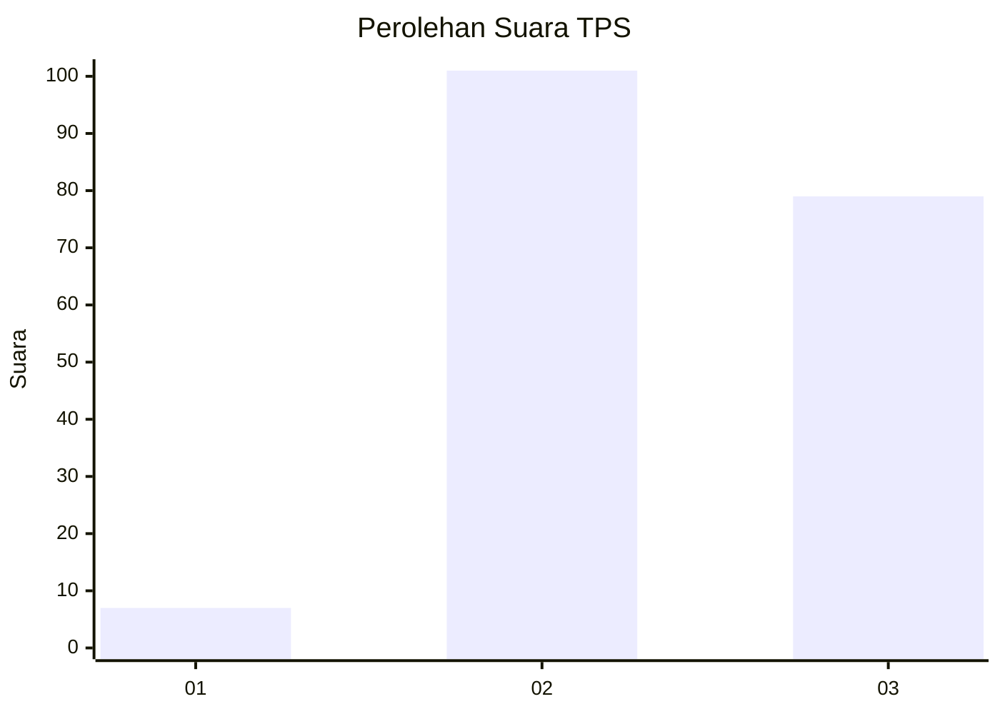
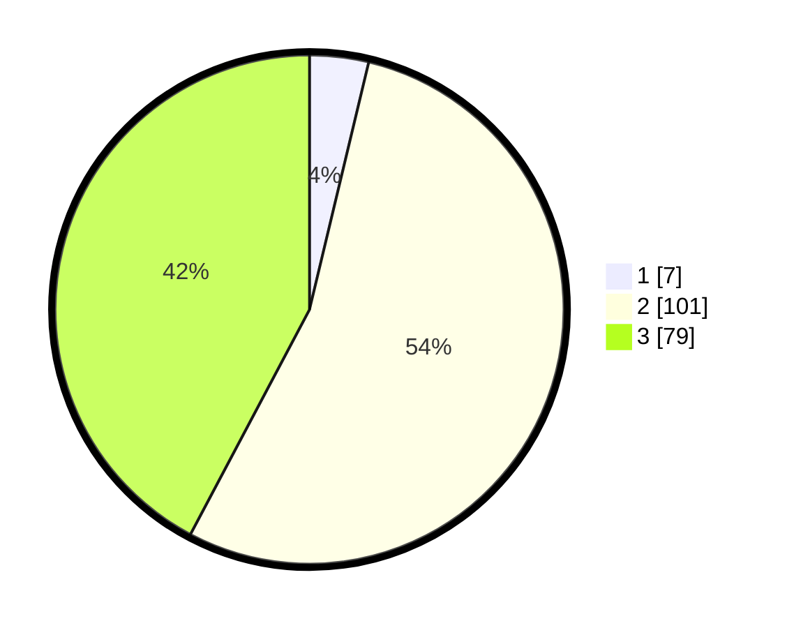

# Hasil

## Grafik

## Tabel

| No. | Nama Paslon    | Suara | Suara (raw) | Persentase |
|:--- |:-------------- | -----:| -----------:| ----------:|
| 1   | ANIES MUHAIMIN | 7     | [7][p-1]    | 3,74       |
| 2   | PRABOWO GIBRAN | 101   | [101][p-2]  | 54,01      |
| 3   | GANJAR MAHFUD  | 79    | [79][p-3]   | 42,25      |

[p-1]: https://github.com/gigit-pemilu/pemilu-2024-51-bali/blob/main/pilpres/hitung-suara/sub/51-bali/sub/08-buleleng/sub/03-busungbiu/sub/2009-kedis/sub/005-tps/sub/paslon-1.txt
[p-2]: https://github.com/gigit-pemilu/pemilu-2024-51-bali/blob/main/pilpres/hitung-suara/sub/51-bali/sub/08-buleleng/sub/03-busungbiu/sub/2009-kedis/sub/005-tps/sub/paslon-2.txt
[p-3]: https://github.com/gigit-pemilu/pemilu-2024-51-bali/blob/main/pilpres/hitung-suara/sub/51-bali/sub/08-buleleng/sub/03-busungbiu/sub/2009-kedis/sub/005-tps/sub/paslon-3.txt

## Foto C Plano

https://sirekap-obj-formc.kpu.go.id/4f7f/pemilu/ppwp/51/08/03/20/09/5108032009005-20240214-231457--3df02d29-8536-4984-b097-83b79b1f4a2f.jpg

https://sirekap-obj-formc.kpu.go.id/4f7f/pemilu/ppwp/51/08/03/20/09/5108032009005-20240214-231523--c56b726d-8ccf-429e-b179-f4d9a405e5b7.jpg

## Metadata

| Key        | Value               |
| ---------- | ------------------- |
| Time Stamp | 2024-02-16 09:00:28 |

