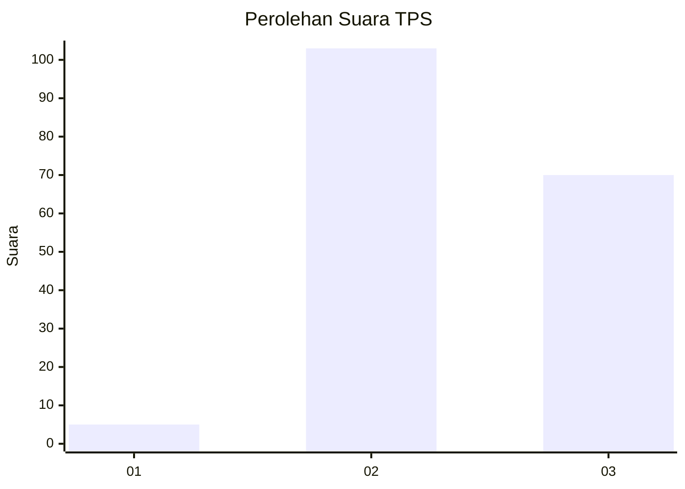
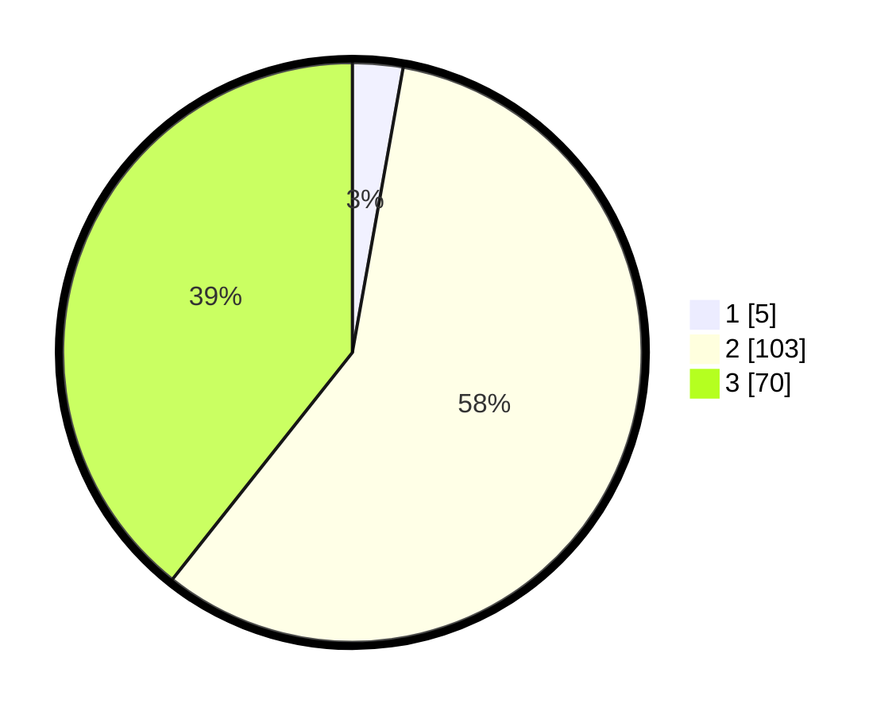

# Hasil

## Grafik

## Tabel

| No. | Nama Paslon    | Suara | Suara (raw) | Persentase |
|:--- |:-------------- | -----:| -----------:| ----------:|
| 1   | ANIES MUHAIMIN | 5     | [5][p-1]    | 2,81       |
| 2   | PRABOWO GIBRAN | 103   | [103][p-2]  | 57,87      |
| 3   | GANJAR MAHFUD  | 70    | [70][p-3]   | 39,33      |

[p-1]: https://github.com/gigit-pemilu/pemilu-2024-51-bali/blob/main/pilpres/hitung-suara/sub/51-bali/sub/08-buleleng/sub/03-busungbiu/sub/2009-kedis/sub/009-tps/sub/paslon-1.txt
[p-2]: https://github.com/gigit-pemilu/pemilu-2024-51-bali/blob/main/pilpres/hitung-suara/sub/51-bali/sub/08-buleleng/sub/03-busungbiu/sub/2009-kedis/sub/009-tps/sub/paslon-2.txt
[p-3]: https://github.com/gigit-pemilu/pemilu-2024-51-bali/blob/main/pilpres/hitung-suara/sub/51-bali/sub/08-buleleng/sub/03-busungbiu/sub/2009-kedis/sub/009-tps/sub/paslon-3.txt

## Foto C Plano

https://sirekap-obj-formc.kpu.go.id/2750/pemilu/ppwp/51/08/03/20/09/5108032009009-20240215-181308--0eed2971-7904-46b3-9a25-39f7825e1605.jpg

https://sirekap-obj-formc.kpu.go.id/2750/pemilu/ppwp/51/08/03/20/09/5108032009009-20240215-181319--53a2babf-e8c9-46e4-b2d2-56d8751b078c.jpg

https://sirekap-obj-formc.kpu.go.id/2750/pemilu/ppwp/51/08/03/20/09/5108032009009-20240215-181323--bc244158-bc82-491b-aae2-07a0316aeb10.jpg

## Metadata

| Key        | Value               |
| ---------- | ------------------- |
| Time Stamp | 2024-02-24 22:31:28 |

