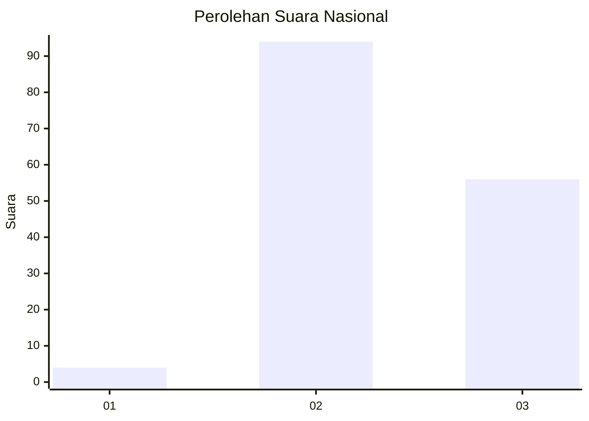
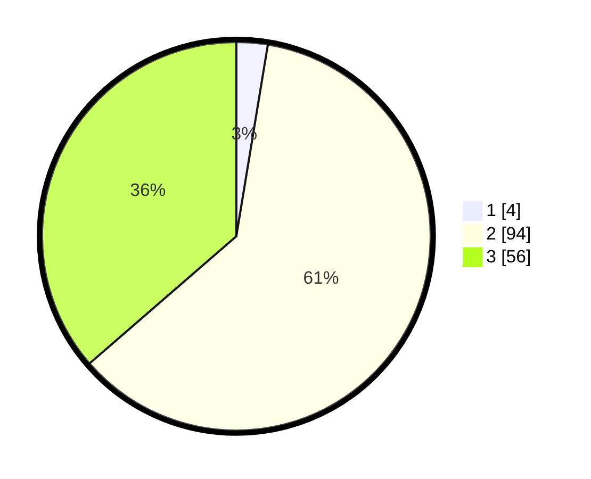

# Hasil

## Grafik

## Tabel

| No. | Nama Paslon    | Suara | Suara (raw) | Persentase |
|:--- |:-------------- | -----:| -----------:| ----------:|
| 1   | ANIES MUHAIMIN | 4     | [4][p-1]    | 2,60       |
| 2   | PRABOWO GIBRAN | 94    | [94][p-2]   | 61,04      |
| 3   | GANJAR MAHFUD  | 56    | [56][p-3]   | 36,36      |

[p-1]: https://github.com/gigit-pemilu/pemilu-2024/blob/main/pilpres/hitung-suara/sub/51-bali/sub/08-buleleng/sub/03-busungbiu/sub/2009-kedis/sub/010-tps/sub/paslon-1.txt
[p-2]: https://github.com/gigit-pemilu/pemilu-2024/blob/main/pilpres/hitung-suara/sub/51-bali/sub/08-buleleng/sub/03-busungbiu/sub/2009-kedis/sub/010-tps/sub/paslon-2.txt
[p-3]: https://github.com/gigit-pemilu/pemilu-2024/blob/main/pilpres/hitung-suara/sub/51-bali/sub/08-buleleng/sub/03-busungbiu/sub/2009-kedis/sub/010-tps/sub/paslon-3.txt

## Foto C Plano

https://sirekap-obj-formc.kpu.go.id/a430/pemilu/ppwp/51/08/03/20/09/5108032009010-20240214-233639--e8840774-a77f-4b6f-9029-b3b43d807961.jpg

https://sirekap-obj-formc.kpu.go.id/a430/pemilu/ppwp/51/08/03/20/09/5108032009010-20240214-233901--e3795483-3fa1-4781-801c-8ccb043ed977.jpg

https://sirekap-obj-formc.kpu.go.id/a430/pemilu/ppwp/51/08/03/20/09/5108032009010-20240214-234136--349c1112-e8a6-4cc2-9c58-ae8bd74dd548.jpg

## Metadata

| Key        | Value               |
| ---------- | ------------------- |
| Time Stamp | 2024-02-24 22:31:28 |

