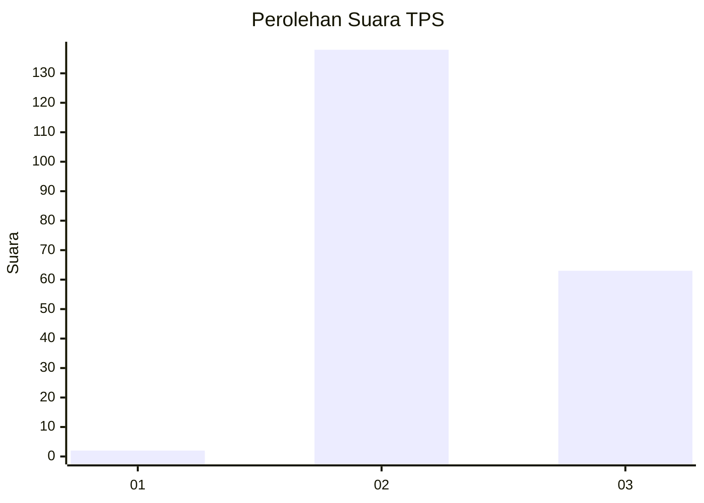
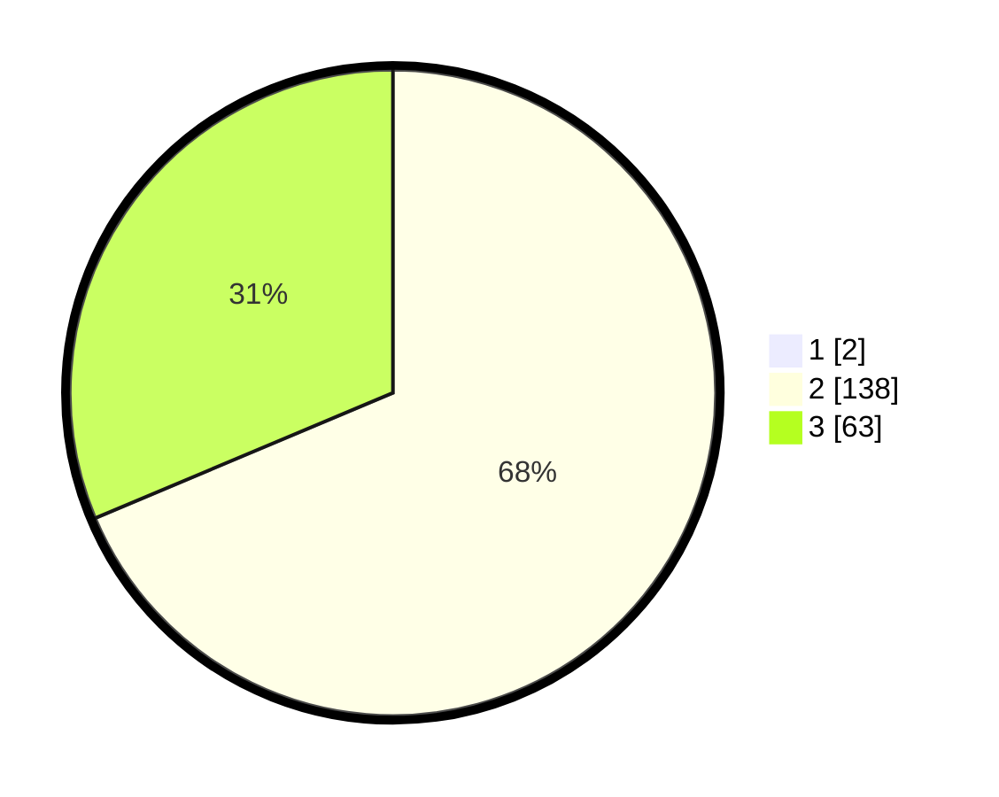

# Hasil

## Grafik

## Tabel

| No. | Nama Paslon    | Suara | Suara (raw) | Persentase |
|:--- |:-------------- | -----:| -----------:| ----------:|
| 1   | ANIES MUHAIMIN | 2     | [2][p-1]    | 0,99       |
| 2   | PRABOWO GIBRAN | 138   | [138][p-2]  | 67,98      |
| 3   | GANJAR MAHFUD  | 63    | [63][p-3]   | 31,03      |

[p-1]: https://github.com/gigit-pemilu/pemilu-2024-51-bali/blob/main/pilpres/hitung-suara/sub/51-bali/sub/08-buleleng/sub/03-busungbiu/sub/2011-busungbiu/sub/001-tps/sub/paslon-1.txt
[p-2]: https://github.com/gigit-pemilu/pemilu-2024-51-bali/blob/main/pilpres/hitung-suara/sub/51-bali/sub/08-buleleng/sub/03-busungbiu/sub/2011-busungbiu/sub/001-tps/sub/paslon-2.txt
[p-3]: https://github.com/gigit-pemilu/pemilu-2024-51-bali/blob/main/pilpres/hitung-suara/sub/51-bali/sub/08-buleleng/sub/03-busungbiu/sub/2011-busungbiu/sub/001-tps/sub/paslon-3.txt

## Foto C Plano

https://sirekap-obj-formc.kpu.go.id/ae5b/pemilu/ppwp/51/08/03/20/11/5108032011001-20240214-233034--a640f783-d042-429e-b7f9-39dab36bc7f6.jpg

https://sirekap-obj-formc.kpu.go.id/ae5b/pemilu/ppwp/51/08/03/20/11/5108032011001-20240214-233150--53da10eb-fb0f-46f0-9c86-ddf74ddffe15.jpg

https://sirekap-obj-formc.kpu.go.id/ae5b/pemilu/ppwp/51/08/03/20/11/5108032011001-20240214-233339--948a805e-bb4c-45b5-8964-a38fe2b59f89.jpg

## Metadata

| Key        | Value               |
| ---------- | ------------------- |
| Time Stamp | 2024-02-24 22:31:28 |

