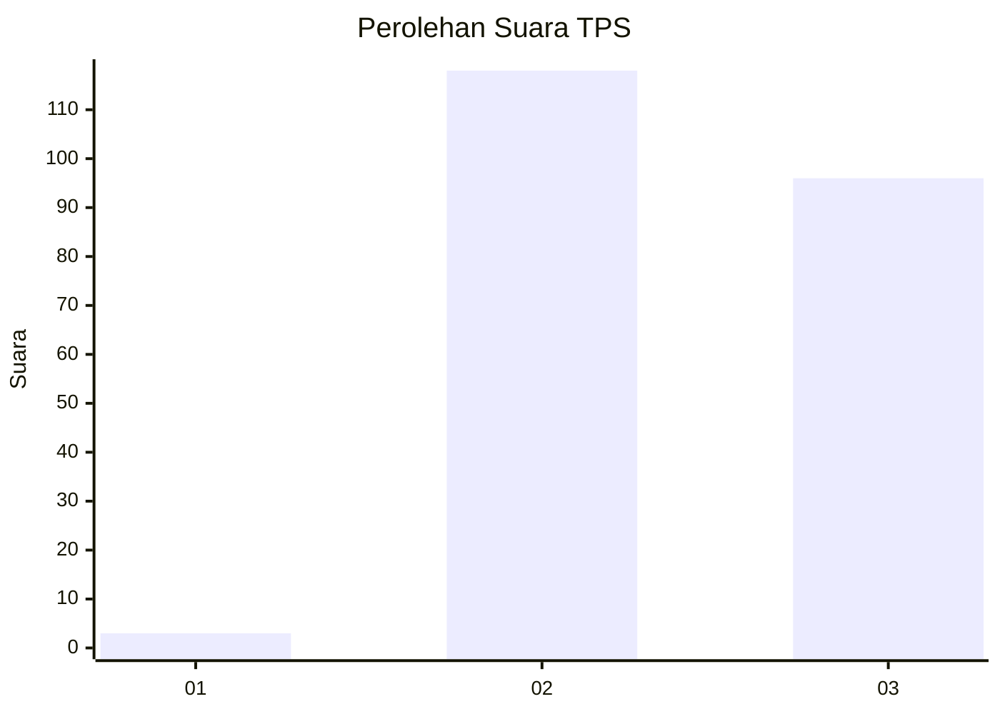
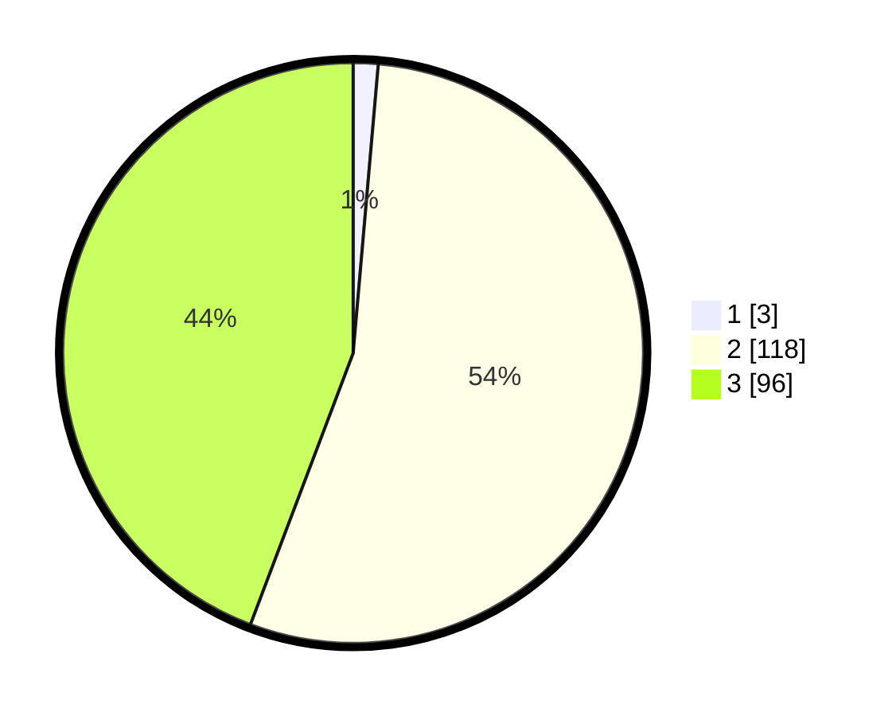

# Hasil

## Grafik

## Tabel

| No. | Nama Paslon    | Suara | Suara (raw) | Persentase |
|:--- |:-------------- | -----:| -----------:| ----------:|
| 1   | ANIES MUHAIMIN | 3     | [3][p-1]    | 1,38       |
| 2   | PRABOWO GIBRAN | 118   | [118][p-2]  | 54,38      |
| 3   | GANJAR MAHFUD  | 96    | [96][p-3]   | 44,24      |

[p-1]: https://github.com/gigit-pemilu/pemilu-2024-51-bali/blob/main/pilpres/hitung-suara/sub/51-bali/sub/08-buleleng/sub/03-busungbiu/sub/2011-busungbiu/sub/015-tps/sub/paslon-1.txt
[p-2]: https://github.com/gigit-pemilu/pemilu-2024-51-bali/blob/main/pilpres/hitung-suara/sub/51-bali/sub/08-buleleng/sub/03-busungbiu/sub/2011-busungbiu/sub/015-tps/sub/paslon-2.txt
[p-3]: https://github.com/gigit-pemilu/pemilu-2024-51-bali/blob/main/pilpres/hitung-suara/sub/51-bali/sub/08-buleleng/sub/03-busungbiu/sub/2011-busungbiu/sub/015-tps/sub/paslon-3.txt

## Foto C Plano

https://sirekap-obj-formc.kpu.go.id/e6f4/pemilu/ppwp/51/08/03/20/11/5108032011015-20240215-021013--83fb94f9-0953-4768-b3c6-00e9e0d5d42c.jpg

https://sirekap-obj-formc.kpu.go.id/e6f4/pemilu/ppwp/51/08/03/20/11/5108032011015-20240214-232709--a8e6ee61-cb1f-4da0-a92c-f0760a38534d.jpg

https://sirekap-obj-formc.kpu.go.id/e6f4/pemilu/ppwp/51/08/03/20/11/5108032011015-20240214-232740--58775f96-f30c-408e-9737-3d97cb490658.jpg

## Metadata

| Key        | Value               |
| ---------- | ------------------- |
| Time Stamp | 2024-02-24 22:31:28 |

