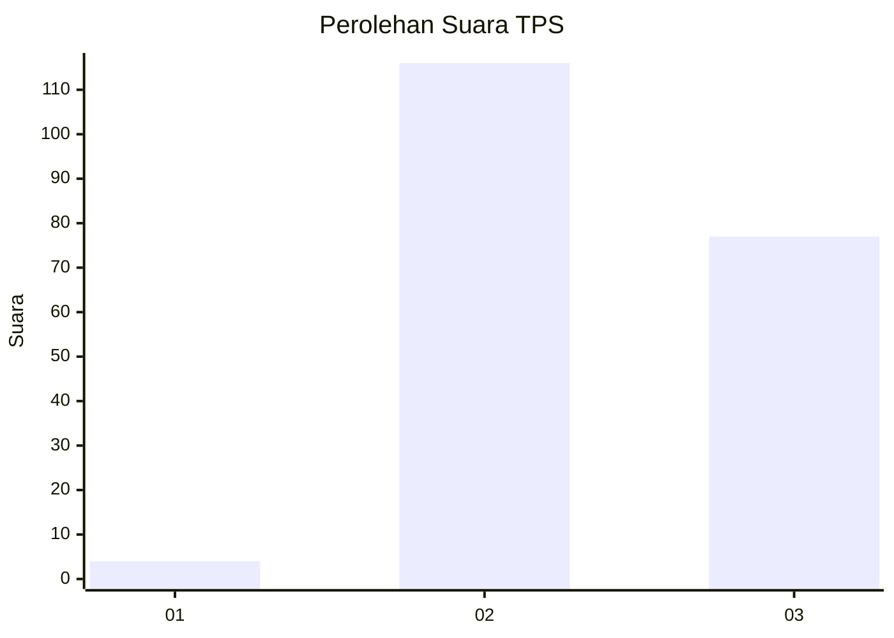
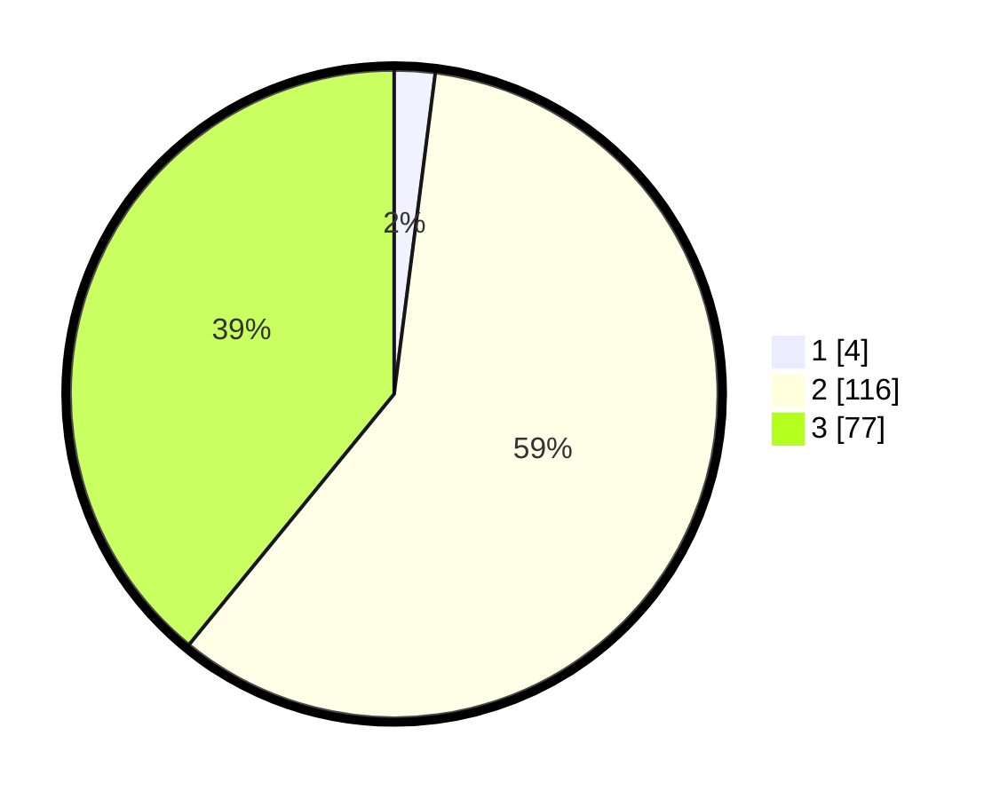

# Hasil

## Grafik

## Tabel

| No. | Nama Paslon    | Suara | Suara (raw) | Persentase |
|:--- |:-------------- | -----:| -----------:| ----------:|
| 1   | ANIES MUHAIMIN | 4     | [4][p-1]    | 2,03       |
| 2   | PRABOWO GIBRAN | 116   | [116][p-2]  | 58,88      |
| 3   | GANJAR MAHFUD  | 77    | [77][p-3]   | 39,09      |

[p-1]: https://github.com/gigit-pemilu/pemilu-2024-51-bali/blob/main/pilpres/hitung-suara/sub/51-bali/sub/08-buleleng/sub/03-busungbiu/sub/2011-busungbiu/sub/025-tps/sub/paslon-1.txt
[p-2]: https://github.com/gigit-pemilu/pemilu-2024-51-bali/blob/main/pilpres/hitung-suara/sub/51-bali/sub/08-buleleng/sub/03-busungbiu/sub/2011-busungbiu/sub/025-tps/sub/paslon-2.txt
[p-3]: https://github.com/gigit-pemilu/pemilu-2024-51-bali/blob/main/pilpres/hitung-suara/sub/51-bali/sub/08-buleleng/sub/03-busungbiu/sub/2011-busungbiu/sub/025-tps/sub/paslon-3.txt

## Foto C Plano

https://sirekap-obj-formc.kpu.go.id/bf54/pemilu/ppwp/51/08/03/20/11/5108032011025-20240214-225612--084de135-004b-4801-ba4e-54561a33dc9f.jpg

https://sirekap-obj-formc.kpu.go.id/bf54/pemilu/ppwp/51/08/03/20/11/5108032011025-20240214-225717--af678c53-668e-4286-ac42-39dd0baa8db4.jpg

https://sirekap-obj-formc.kpu.go.id/bf54/pemilu/ppwp/51/08/03/20/11/5108032011025-20240214-225816--36ffb8ed-664c-4787-86e4-52b63da3f114.jpg

## Metadata

| Key        | Value               |
| ---------- | ------------------- |
| Time Stamp | 2024-02-24 22:31:28 |

