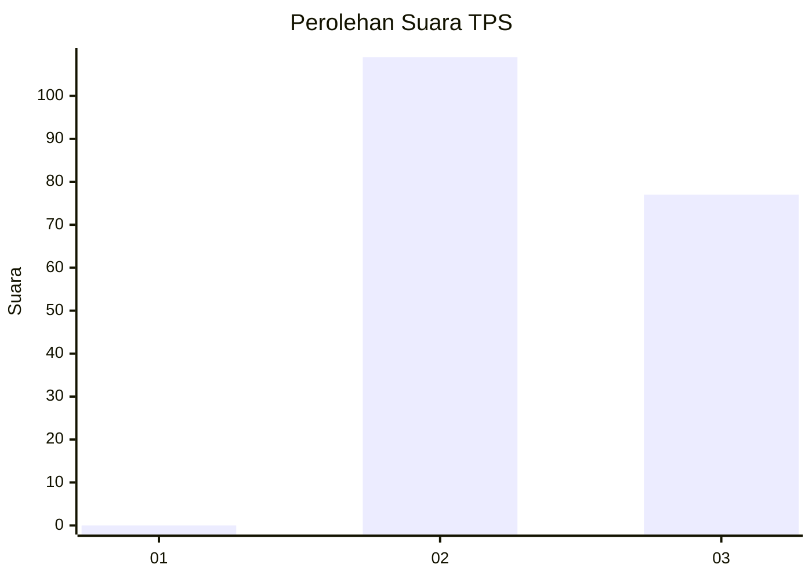
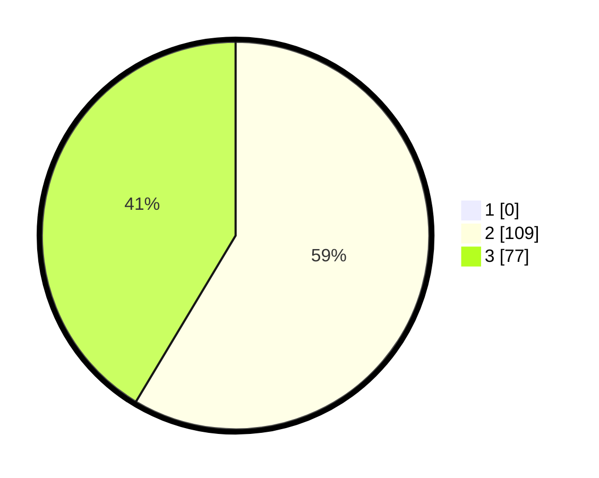

# Hasil

## Grafik

## Tabel

| No. | Nama Paslon    | Suara | Suara (raw) | Persentase |
|:--- |:-------------- | -----:| -----------:| ----------:|
| 1   | ANIES MUHAIMIN | 0     | [0][p-1]    | 0,00       |
| 2   | PRABOWO GIBRAN | 109   | [109][p-2]  | 58,60      |
| 3   | GANJAR MAHFUD  | 77    | [77][p-3]   | 41,40      |

[p-1]: https://github.com/gigit-pemilu/pemilu-2024-51-bali/blob/main/pilpres/hitung-suara/sub/51-bali/sub/08-buleleng/sub/03-busungbiu/sub/2011-busungbiu/sub/026-tps/sub/paslon-1.txt
[p-2]: https://github.com/gigit-pemilu/pemilu-2024-51-bali/blob/main/pilpres/hitung-suara/sub/51-bali/sub/08-buleleng/sub/03-busungbiu/sub/2011-busungbiu/sub/026-tps/sub/paslon-2.txt
[p-3]: https://github.com/gigit-pemilu/pemilu-2024-51-bali/blob/main/pilpres/hitung-suara/sub/51-bali/sub/08-buleleng/sub/03-busungbiu/sub/2011-busungbiu/sub/026-tps/sub/paslon-3.txt

## Foto C Plano

https://sirekap-obj-formc.kpu.go.id/e7b8/pemilu/ppwp/51/08/03/20/11/5108032011026-20240214-141146--72a0f749-5512-41d2-813f-16952ea35a3d.jpg

https://sirekap-obj-formc.kpu.go.id/e7b8/pemilu/ppwp/51/08/03/20/11/5108032011026-20240214-141354--a1b78962-3f11-48c7-962b-00a1e471c34b.jpg

https://sirekap-obj-formc.kpu.go.id/e7b8/pemilu/ppwp/51/08/03/20/11/5108032011026-20240214-141504--e6368e6d-3631-4237-a1c1-f99b97f7403f.jpg

## Metadata

| Key        | Value               |
| ---------- | ------------------- |
| Time Stamp | 2024-02-14 21:46:01 |

