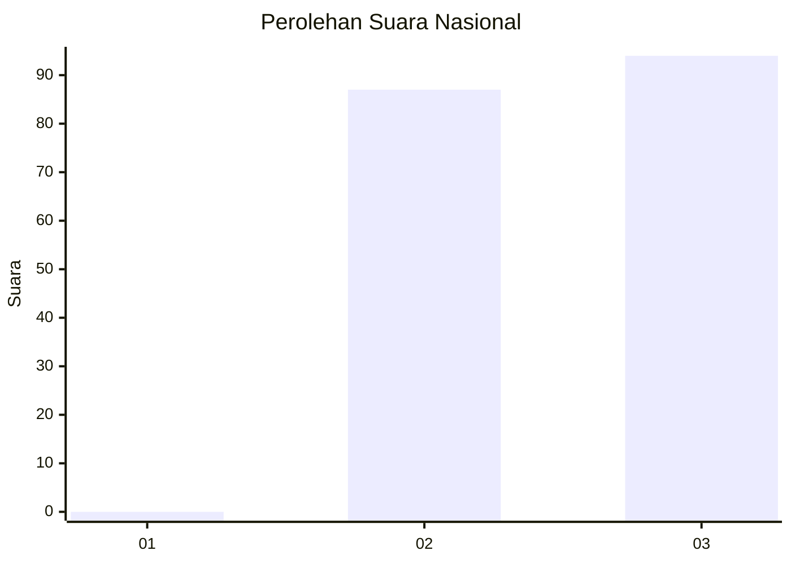
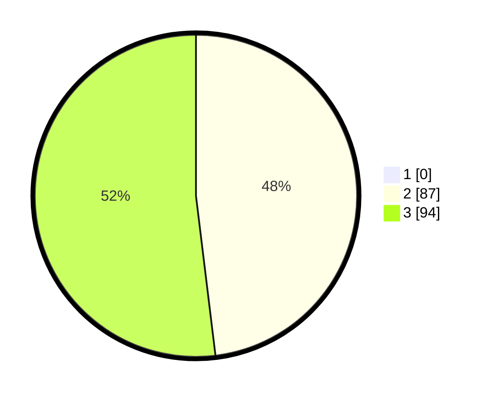

# Hasil

## Grafik

## Tabel

| No. | Nama Paslon    | Suara | Suara (raw) | Persentase |
|:--- |:-------------- | -----:| -----------:| ----------:|
| 1   | ANIES MUHAIMIN | 0     | [0][p-1]    | 0,00       |
| 2   | PRABOWO GIBRAN | 87    | [87][p-2]   | 48,07      |
| 3   | GANJAR MAHFUD  | 94    | [94][p-3]   | 51,93      |

[p-1]: https://github.com/gigit-pemilu/pemilu-2024/blob/main/pilpres/hitung-suara/sub/51-bali/sub/08-buleleng/sub/03-busungbiu/sub/2012-pelapuan/sub/001-tps/sub/paslon-1.txt
[p-2]: https://github.com/gigit-pemilu/pemilu-2024/blob/main/pilpres/hitung-suara/sub/51-bali/sub/08-buleleng/sub/03-busungbiu/sub/2012-pelapuan/sub/001-tps/sub/paslon-2.txt
[p-3]: https://github.com/gigit-pemilu/pemilu-2024/blob/main/pilpres/hitung-suara/sub/51-bali/sub/08-buleleng/sub/03-busungbiu/sub/2012-pelapuan/sub/001-tps/sub/paslon-3.txt

## Foto C Plano

https://sirekap-obj-formc.kpu.go.id/a1ca/pemilu/ppwp/51/08/03/20/12/5108032012001-20240214-232400--7ccc6154-cb66-4754-a7c3-19d990fbd8de.jpg

https://sirekap-obj-formc.kpu.go.id/a1ca/pemilu/ppwp/51/08/03/20/12/5108032012001-20240214-232436--5d03eb74-e42a-4f70-8a6f-c83f2ee8c2bc.jpg

https://sirekap-obj-formc.kpu.go.id/a1ca/pemilu/ppwp/51/08/03/20/12/5108032012001-20240214-232609--e2db5053-4b1a-4fed-82e6-f7f5ebb72c83.jpg

## Metadata

| Key        | Value               |
| ---------- | ------------------- |
| Time Stamp | 2024-02-24 22:31:28 |

