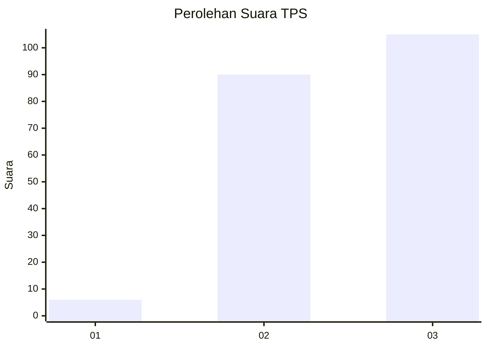
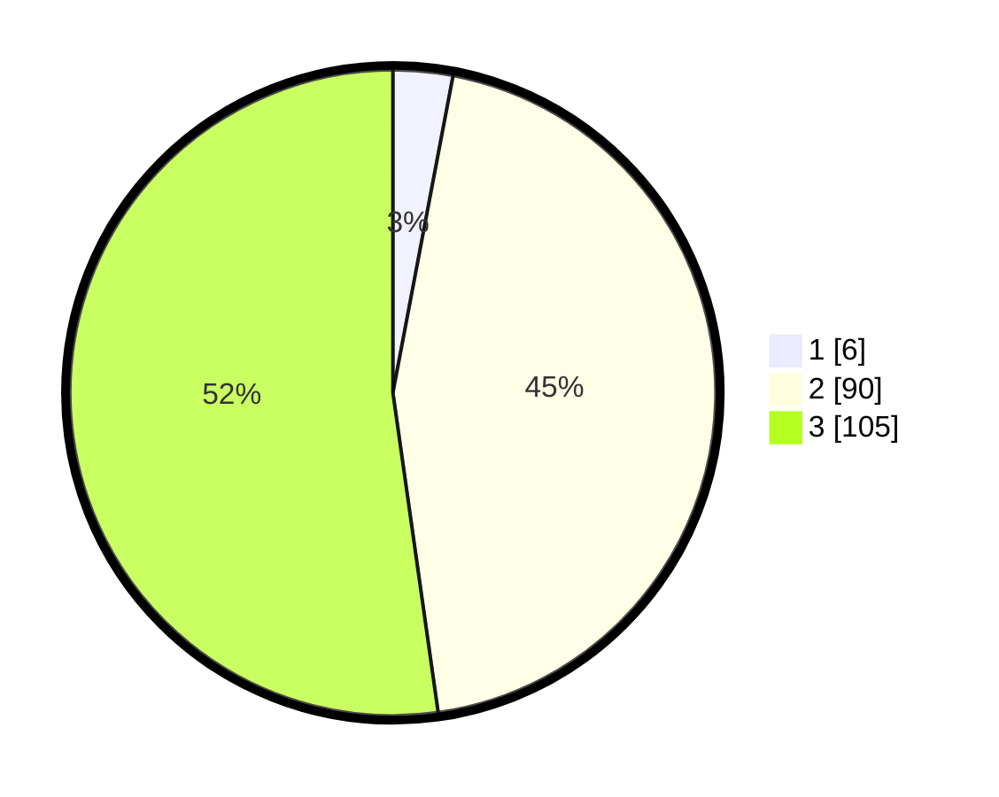

# Hasil

## Grafik

## Tabel

| No. | Nama Paslon    | Suara | Suara (raw) | Persentase |
|:--- |:-------------- | -----:| -----------:| ----------:|
| 1   | ANIES MUHAIMIN | 6     | [6][p-1]    | 2,99       |
| 2   | PRABOWO GIBRAN | 90    | [90][p-2]   | 44,78      |
| 3   | GANJAR MAHFUD  | 105   | [105][p-3]  | 52,24      |

[p-1]: https://github.com/gigit-pemilu/pemilu-2024-51-bali/blob/main/pilpres/hitung-suara/sub/51-bali/sub/08-buleleng/sub/03-busungbiu/sub/2012-pelapuan/sub/002-tps/sub/paslon-1.txt
[p-2]: https://github.com/gigit-pemilu/pemilu-2024-51-bali/blob/main/pilpres/hitung-suara/sub/51-bali/sub/08-buleleng/sub/03-busungbiu/sub/2012-pelapuan/sub/002-tps/sub/paslon-2.txt
[p-3]: https://github.com/gigit-pemilu/pemilu-2024-51-bali/blob/main/pilpres/hitung-suara/sub/51-bali/sub/08-buleleng/sub/03-busungbiu/sub/2012-pelapuan/sub/002-tps/sub/paslon-3.txt

## Foto C Plano

https://sirekap-obj-formc.kpu.go.id/1ff5/pemilu/ppwp/51/08/03/20/12/5108032012002-20240214-220907--b2085d66-6869-40b5-85cb-a59998bf160a.jpg

https://sirekap-obj-formc.kpu.go.id/1ff5/pemilu/ppwp/51/08/03/20/12/5108032012002-20240214-221050--83b629d3-214e-4b20-b227-60c50049d11e.jpg

https://sirekap-obj-formc.kpu.go.id/1ff5/pemilu/ppwp/51/08/03/20/12/5108032012002-20240214-221152--7eef35f2-1e6f-4e34-8e32-149a8fc57825.jpg

## Metadata

| Key        | Value               |
| ---------- | ------------------- |
| Time Stamp | 2024-02-24 22:31:28 |

