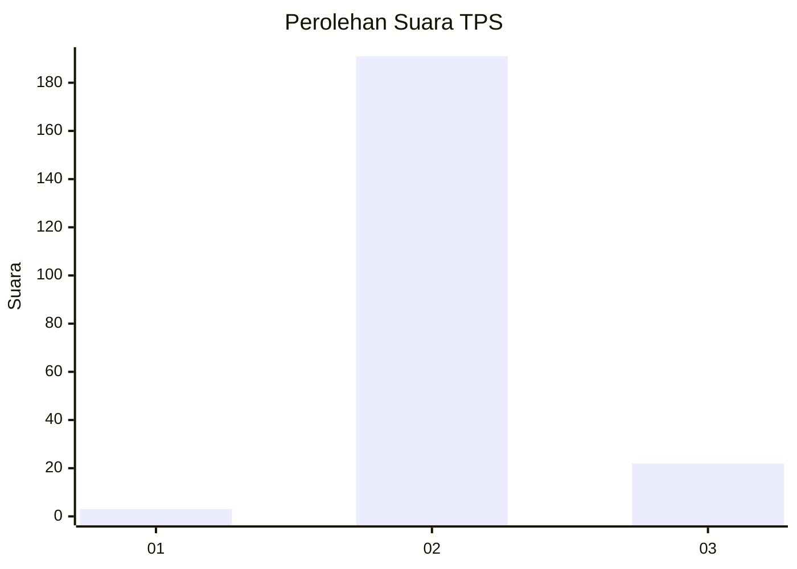
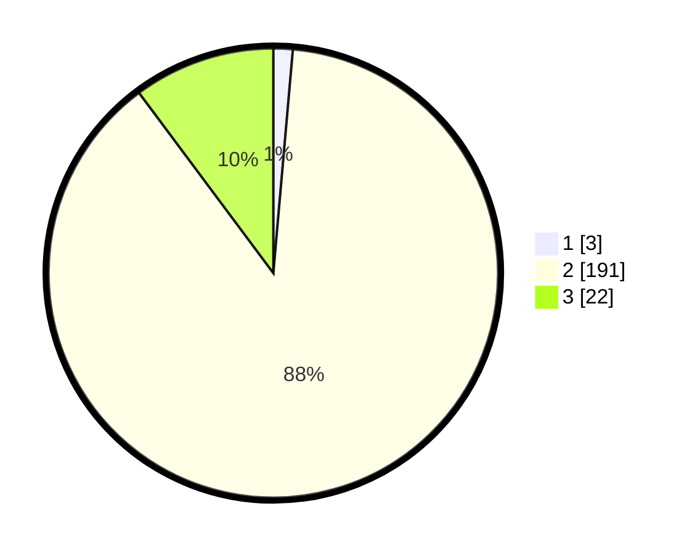

# Hasil

## Grafik

## Tabel

| No. | Nama Paslon    | Suara | Suara (raw) | Persentase |
|:--- |:-------------- | -----:| -----------:| ----------:|
| 1   | ANIES MUHAIMIN | 3     | [3][p-1]    | 1,39       |
| 2   | PRABOWO GIBRAN | 191   | [191][p-2]  | 88,43      |
| 3   | GANJAR MAHFUD  | 22    | [22][p-3]   | 10,19      |

[p-1]: https://github.com/gigit-pemilu/pemilu-2024-51-bali/blob/main/pilpres/hitung-suara/sub/51-bali/sub/08-buleleng/sub/03-busungbiu/sub/2012-pelapuan/sub/004-tps/sub/paslon-1.txt
[p-2]: https://github.com/gigit-pemilu/pemilu-2024-51-bali/blob/main/pilpres/hitung-suara/sub/51-bali/sub/08-buleleng/sub/03-busungbiu/sub/2012-pelapuan/sub/004-tps/sub/paslon-2.txt
[p-3]: https://github.com/gigit-pemilu/pemilu-2024-51-bali/blob/main/pilpres/hitung-suara/sub/51-bali/sub/08-buleleng/sub/03-busungbiu/sub/2012-pelapuan/sub/004-tps/sub/paslon-3.txt

## Foto C Plano

https://sirekap-obj-formc.kpu.go.id/ab80/pemilu/ppwp/51/08/03/20/12/5108032012004-20240214-141922--02c8687e-64cd-4314-b8de-41874acf411d.jpg

https://sirekap-obj-formc.kpu.go.id/ab80/pemilu/ppwp/51/08/03/20/12/5108032012004-20240214-215457--b323a1e3-a4d1-43d4-9ff2-625675ffa205.jpg

https://sirekap-obj-formc.kpu.go.id/ab80/pemilu/ppwp/51/08/03/20/12/5108032012004-20240214-215526--80b6cf43-8738-44e5-a3c2-27a8e2fef3a1.jpg

## Metadata

| Key        | Value               |
| ---------- | ------------------- |
| Time Stamp | 2024-02-15 15:00:29 |

