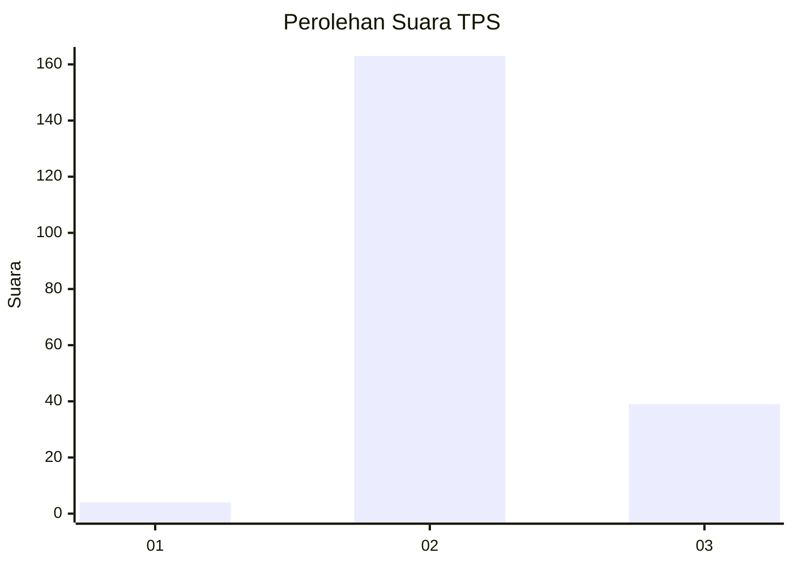
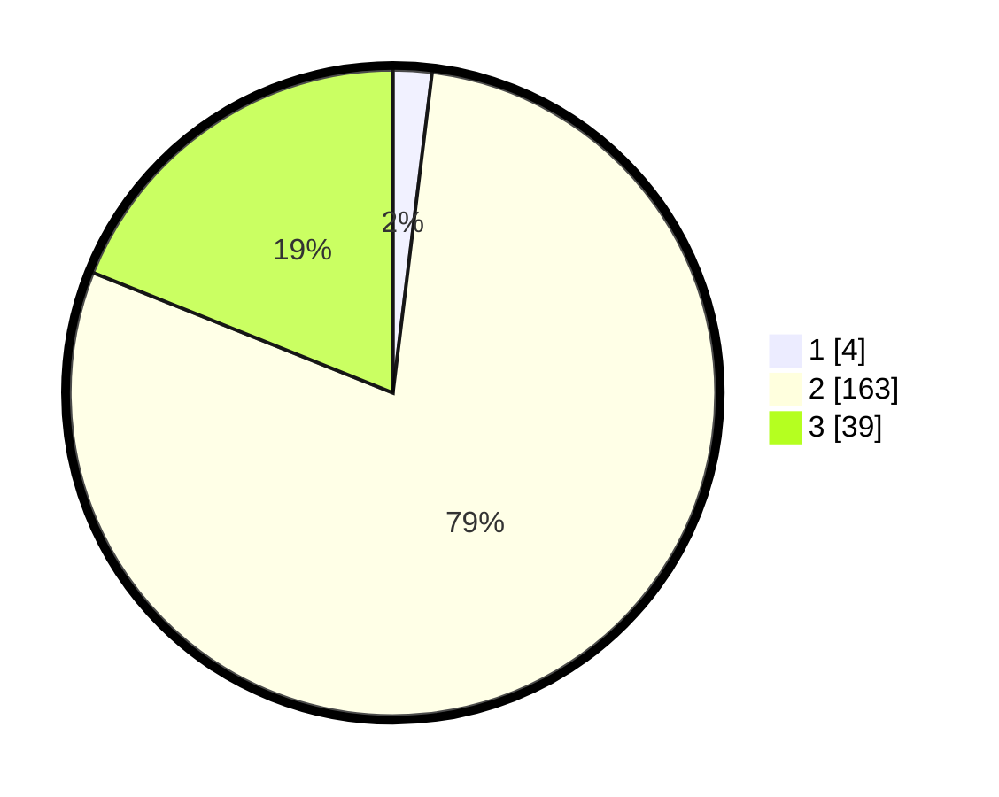

# Hasil

## Grafik

## Tabel

| No. | Nama Paslon    | Suara | Suara (raw) | Persentase |
|:--- |:-------------- | -----:| -----------:| ----------:|
| 1   | ANIES MUHAIMIN | 4     | [4][p-1]    | 1,94       |
| 2   | PRABOWO GIBRAN | 163   | [163][p-2]  | 79,13      |
| 3   | GANJAR MAHFUD  | 39    | [39][p-3]   | 18,93      |

[p-1]: https://github.com/gigit-pemilu/pemilu-2024-51-bali/blob/main/pilpres/hitung-suara/sub/51-bali/sub/08-buleleng/sub/03-busungbiu/sub/2012-pelapuan/sub/006-tps/sub/paslon-1.txt
[p-2]: https://github.com/gigit-pemilu/pemilu-2024-51-bali/blob/main/pilpres/hitung-suara/sub/51-bali/sub/08-buleleng/sub/03-busungbiu/sub/2012-pelapuan/sub/006-tps/sub/paslon-2.txt
[p-3]: https://github.com/gigit-pemilu/pemilu-2024-51-bali/blob/main/pilpres/hitung-suara/sub/51-bali/sub/08-buleleng/sub/03-busungbiu/sub/2012-pelapuan/sub/006-tps/sub/paslon-3.txt

## Foto C Plano

https://sirekap-obj-formc.kpu.go.id/4565/pemilu/ppwp/51/08/03/20/12/5108032012006-20240214-131410--6c25af84-1bb0-4574-a1bc-b61558a0e130.jpg

https://sirekap-obj-formc.kpu.go.id/4565/pemilu/ppwp/51/08/03/20/12/5108032012006-20240214-130832--64cf9a5e-0857-4530-b0b1-734fe1cbe429.jpg

https://sirekap-obj-formc.kpu.go.id/4565/pemilu/ppwp/51/08/03/20/12/5108032012006-20240214-132949--6d2e492d-f6c8-4d95-b8c0-596307a7e866.jpg

## Metadata

| Key        | Value               |
| ---------- | ------------------- |
| Time Stamp | 2024-02-24 22:31:28 |

