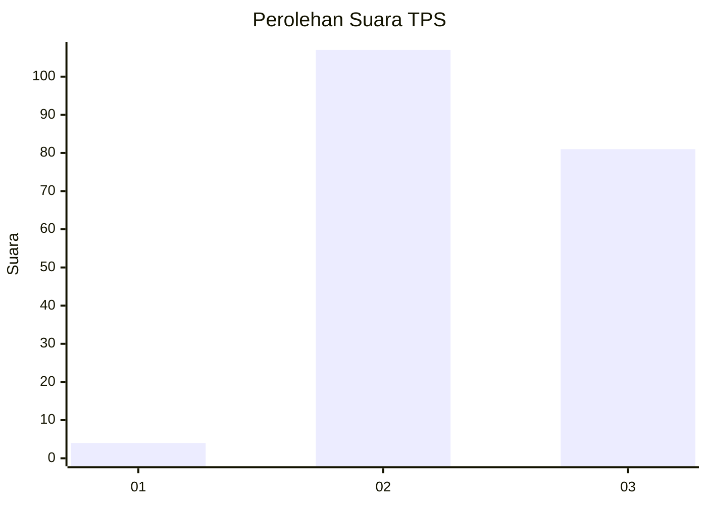
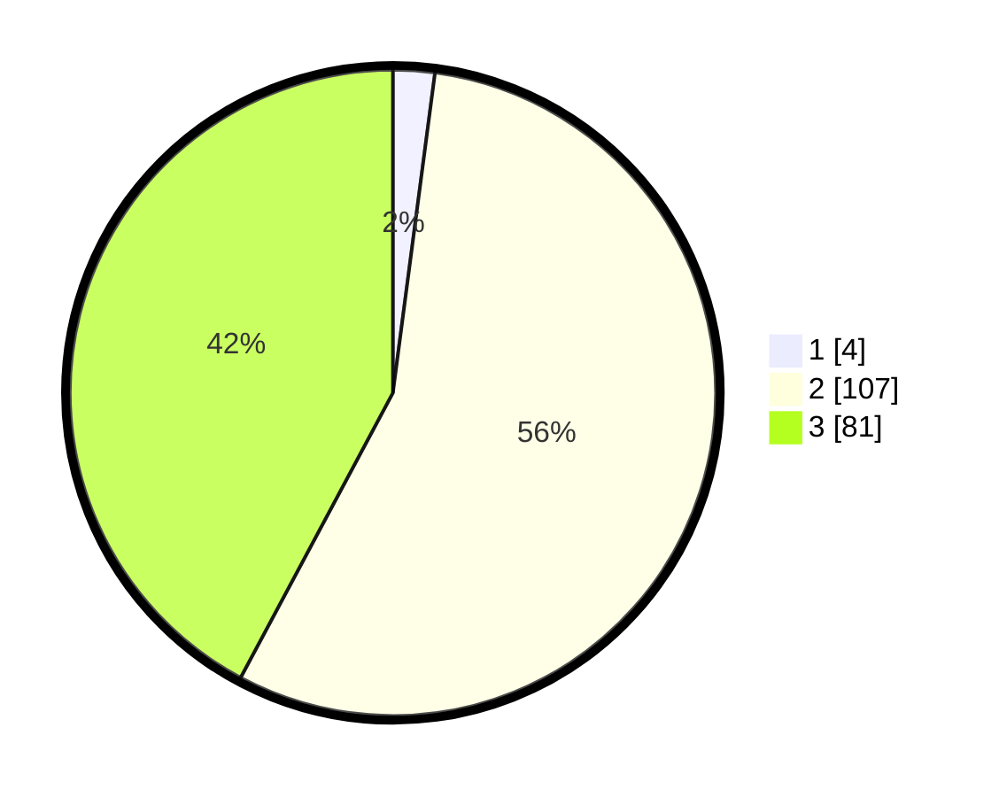

# Hasil

## Grafik

## Tabel

| No. | Nama Paslon    | Suara | Suara (raw) | Persentase |
|:--- |:-------------- | -----:| -----------:| ----------:|
| 1   | ANIES MUHAIMIN | 4     | [4][p-1]    | 2,08       |
| 2   | PRABOWO GIBRAN | 107   | [107][p-2]  | 55,73      |
| 3   | GANJAR MAHFUD  | 81    | [81][p-3]   | 42,19      |

[p-1]: https://github.com/gigit-pemilu/pemilu-2024-51-bali/blob/main/pilpres/hitung-suara/sub/51-bali/sub/08-buleleng/sub/03-busungbiu/sub/2012-pelapuan/sub/009-tps/sub/paslon-1.txt
[p-2]: https://github.com/gigit-pemilu/pemilu-2024-51-bali/blob/main/pilpres/hitung-suara/sub/51-bali/sub/08-buleleng/sub/03-busungbiu/sub/2012-pelapuan/sub/009-tps/sub/paslon-2.txt
[p-3]: https://github.com/gigit-pemilu/pemilu-2024-51-bali/blob/main/pilpres/hitung-suara/sub/51-bali/sub/08-buleleng/sub/03-busungbiu/sub/2012-pelapuan/sub/009-tps/sub/paslon-3.txt

## Foto C Plano

https://sirekap-obj-formc.kpu.go.id/8873/pemilu/ppwp/51/08/03/20/12/5108032012009-20240215-034240--78502de9-2754-40fd-bebd-2b6346595948.jpg

https://sirekap-obj-formc.kpu.go.id/8873/pemilu/ppwp/51/08/03/20/12/5108032012009-20240215-034300--8b752ef2-e787-4635-8a34-e133905d280c.jpg

https://sirekap-obj-formc.kpu.go.id/8873/pemilu/ppwp/51/08/03/20/12/5108032012009-20240215-034308--916dacd4-5233-4a91-9465-f3845ee5e772.jpg

## Metadata

| Key        | Value               |
| ---------- | ------------------- |
| Time Stamp | 2024-02-15 17:30:25 |

