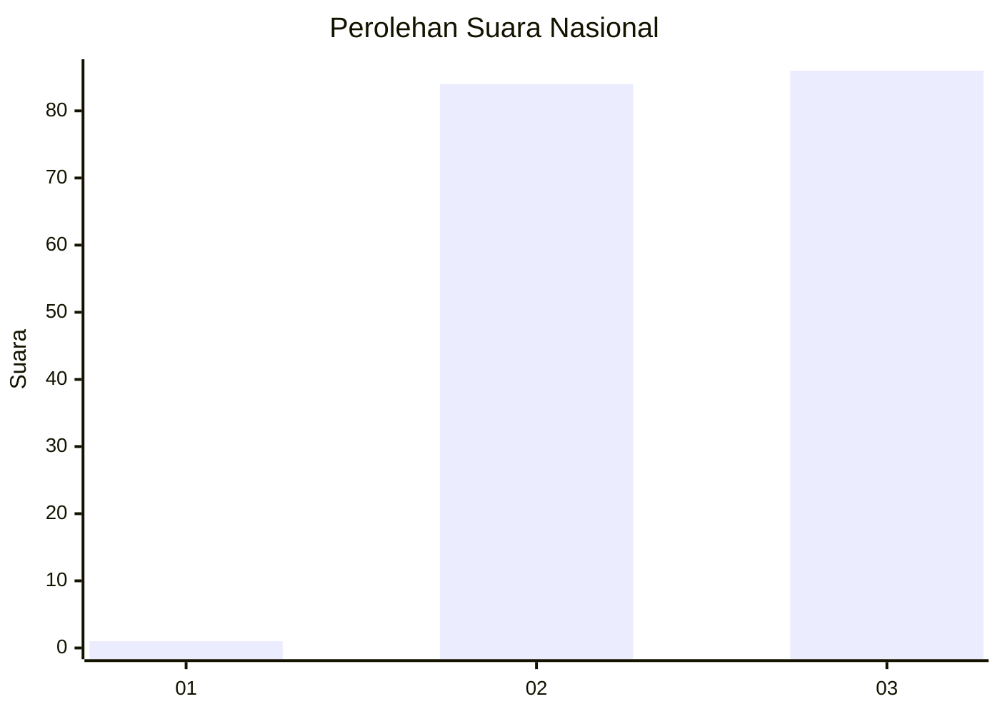
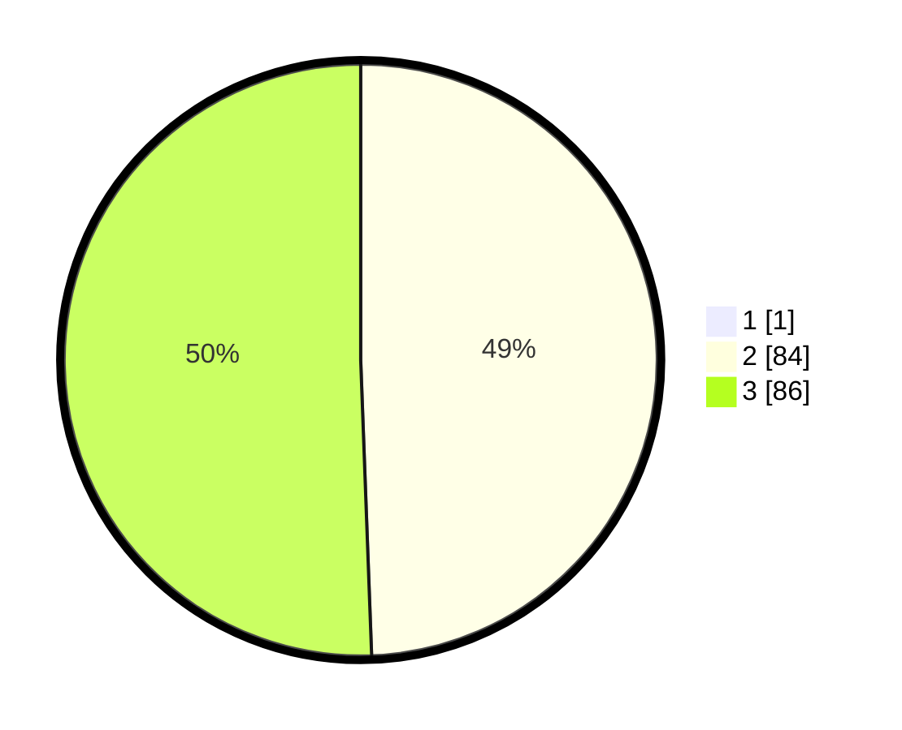

# Hasil

## Grafik

## Tabel

| No. | Nama Paslon    | Suara | Suara (raw) | Persentase |
|:--- |:-------------- | -----:| -----------:| ----------:|
| 1   | ANIES MUHAIMIN | 1     | [1][p-1]    | 0,58       |
| 2   | PRABOWO GIBRAN | 84    | [84][p-2]   | 49,12      |
| 3   | GANJAR MAHFUD  | 86    | [86][p-3]   | 50,29      |

[p-1]: https://github.com/gigit-pemilu/pemilu-2024/blob/main/pilpres/hitung-suara/sub/51-bali/sub/08-buleleng/sub/03-busungbiu/sub/2013-bengkel/sub/006-tps/sub/paslon-1.txt
[p-2]: https://github.com/gigit-pemilu/pemilu-2024/blob/main/pilpres/hitung-suara/sub/51-bali/sub/08-buleleng/sub/03-busungbiu/sub/2013-bengkel/sub/006-tps/sub/paslon-2.txt
[p-3]: https://github.com/gigit-pemilu/pemilu-2024/blob/main/pilpres/hitung-suara/sub/51-bali/sub/08-buleleng/sub/03-busungbiu/sub/2013-bengkel/sub/006-tps/sub/paslon-3.txt

## Foto C Plano

https://sirekap-obj-formc.kpu.go.id/71a6/pemilu/ppwp/51/08/03/20/13/5108032013006-20240214-132810--0e65c8f4-c8bf-4615-9902-c808f3cb02dd.jpg

https://sirekap-obj-formc.kpu.go.id/71a6/pemilu/ppwp/51/08/03/20/13/5108032013006-20240214-132807--4705a4cc-5b00-4286-a454-8e916d938d26.jpg

https://sirekap-obj-formc.kpu.go.id/71a6/pemilu/ppwp/51/08/03/20/13/5108032013006-20240214-132544--df5e9247-8da6-4999-b885-4fdc67894800.jpg

## Metadata

| Key        | Value               |
| ---------- | ------------------- |
| Time Stamp | 2024-02-16 11:00:29 |

