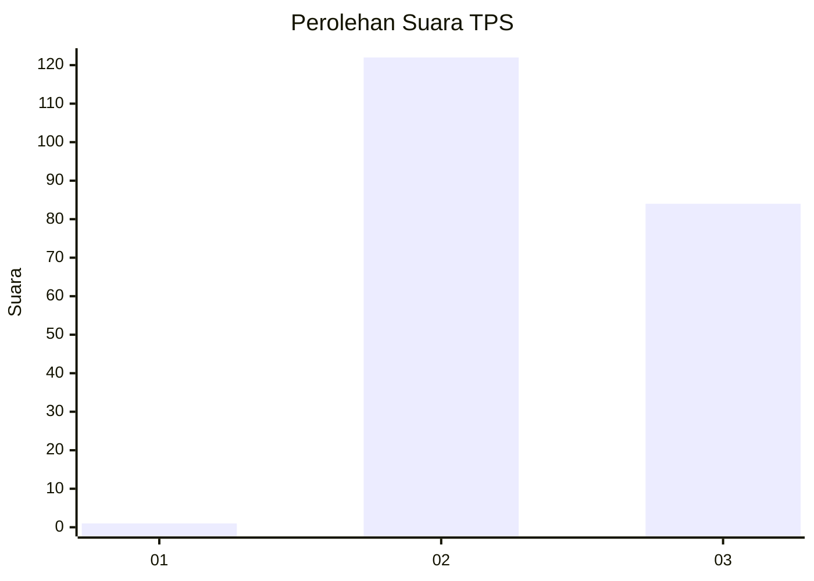
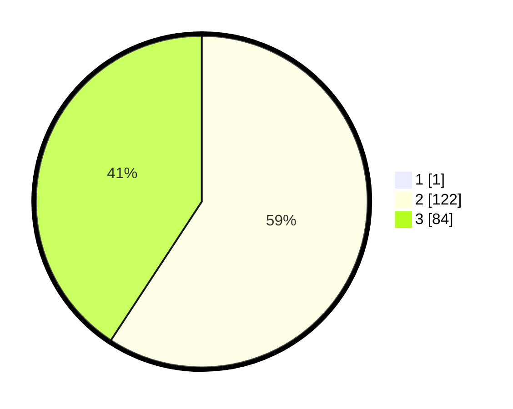

# Hasil

## Grafik

## Tabel

| No. | Nama Paslon    | Suara | Suara (raw) | Persentase |
|:--- |:-------------- | -----:| -----------:| ----------:|
| 1   | ANIES MUHAIMIN | 1     | [1][p-1]    | 0,48       |
| 2   | PRABOWO GIBRAN | 122   | [122][p-2]  | 58,94      |
| 3   | GANJAR MAHFUD  | 84    | [84][p-3]   | 40,58      |

[p-1]: https://github.com/gigit-pemilu/pemilu-2024-51-bali/blob/main/pilpres/hitung-suara/sub/51-bali/sub/08-buleleng/sub/03-busungbiu/sub/2015-sepang-kelod/sub/002-tps/sub/paslon-1.txt
[p-2]: https://github.com/gigit-pemilu/pemilu-2024-51-bali/blob/main/pilpres/hitung-suara/sub/51-bali/sub/08-buleleng/sub/03-busungbiu/sub/2015-sepang-kelod/sub/002-tps/sub/paslon-2.txt
[p-3]: https://github.com/gigit-pemilu/pemilu-2024-51-bali/blob/main/pilpres/hitung-suara/sub/51-bali/sub/08-buleleng/sub/03-busungbiu/sub/2015-sepang-kelod/sub/002-tps/sub/paslon-3.txt

## Foto C Plano

https://sirekap-obj-formc.kpu.go.id/3fcd/pemilu/ppwp/51/08/03/20/15/5108032015002-20240214-155519--2c8057c8-0ac3-46ce-b7c5-48d9de48a3cd.jpg

https://sirekap-obj-formc.kpu.go.id/3fcd/pemilu/ppwp/51/08/03/20/15/5108032015002-20240215-092501--b4025393-e2bf-49be-a306-deb1be00c4ae.jpg

https://sirekap-obj-formc.kpu.go.id/3fcd/pemilu/ppwp/51/08/03/20/15/5108032015002-20240215-092511--d6a1235f-e648-4b70-ae7a-db0b133438ad.jpg

## Metadata

| Key        | Value               |
| ---------- | ------------------- |
| Time Stamp | 2024-02-25 17:00:00 |

