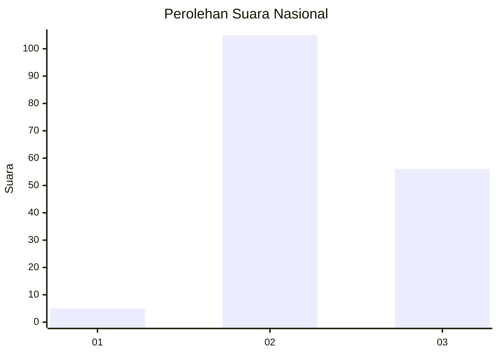
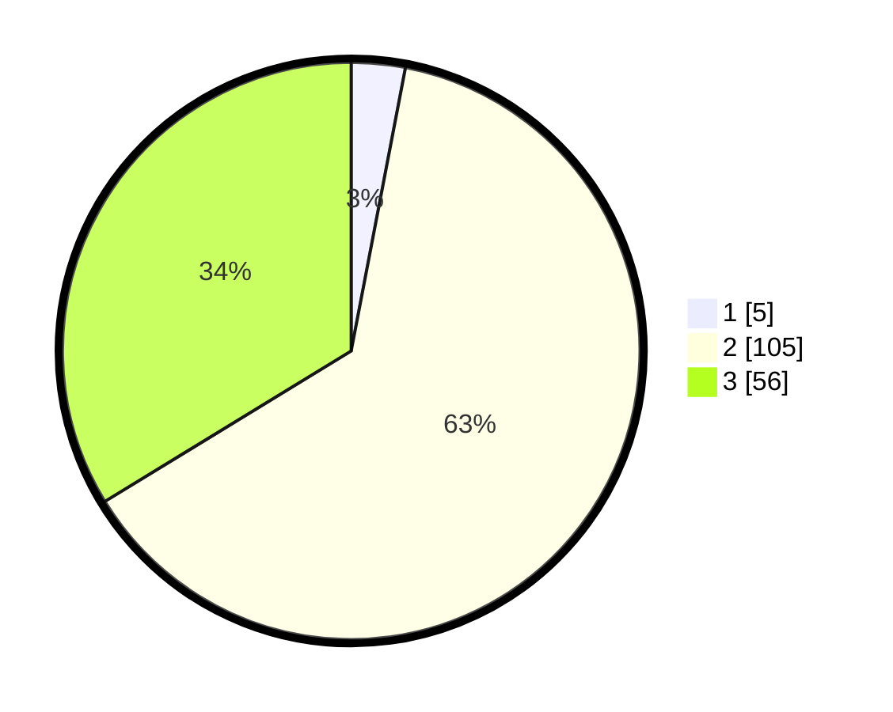

# Hasil

## Grafik

## Tabel

| No. | Nama Paslon    | Suara | Suara (raw) | Persentase |
|:--- |:-------------- | -----:| -----------:| ----------:|
| 1   | ANIES MUHAIMIN | 5     | [5][p-1]    | 3,01       |
| 2   | PRABOWO GIBRAN | 105   | [105][p-2]  | 63,25      |
| 3   | GANJAR MAHFUD  | 56    | [56][p-3]   | 33,73      |

[p-1]: https://github.com/gigit-pemilu/pemilu-2024/blob/main/pilpres/hitung-suara/sub/51-bali/sub/08-buleleng/sub/03-busungbiu/sub/2015-sepang-kelod/sub/005-tps/sub/paslon-1.txt
[p-2]: https://github.com/gigit-pemilu/pemilu-2024/blob/main/pilpres/hitung-suara/sub/51-bali/sub/08-buleleng/sub/03-busungbiu/sub/2015-sepang-kelod/sub/005-tps/sub/paslon-2.txt
[p-3]: https://github.com/gigit-pemilu/pemilu-2024/blob/main/pilpres/hitung-suara/sub/51-bali/sub/08-buleleng/sub/03-busungbiu/sub/2015-sepang-kelod/sub/005-tps/sub/paslon-3.txt

## Foto C Plano

https://sirekap-obj-formc.kpu.go.id/a640/pemilu/ppwp/51/08/03/20/15/5108032015005-20240215-014449--3e91833d-b09b-4ee4-8550-197c1bb1e66f.jpg

https://sirekap-obj-formc.kpu.go.id/a640/pemilu/ppwp/51/08/03/20/15/5108032015005-20240214-233525--bc1c6137-9d9e-4e8c-8fad-2b23b4e3ce27.jpg

https://sirekap-obj-formc.kpu.go.id/a640/pemilu/ppwp/51/08/03/20/15/5108032015005-20240214-233615--32f296dc-6927-4d5b-8220-81cce1302e9a.jpg

## Metadata

| Key        | Value               |
| ---------- | ------------------- |
| Time Stamp | 2024-02-15 20:00:44 |

