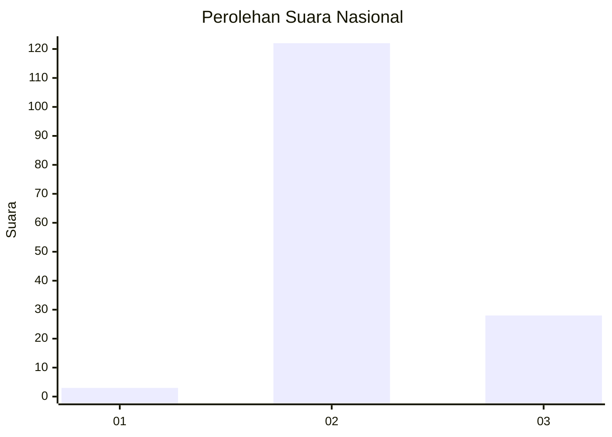
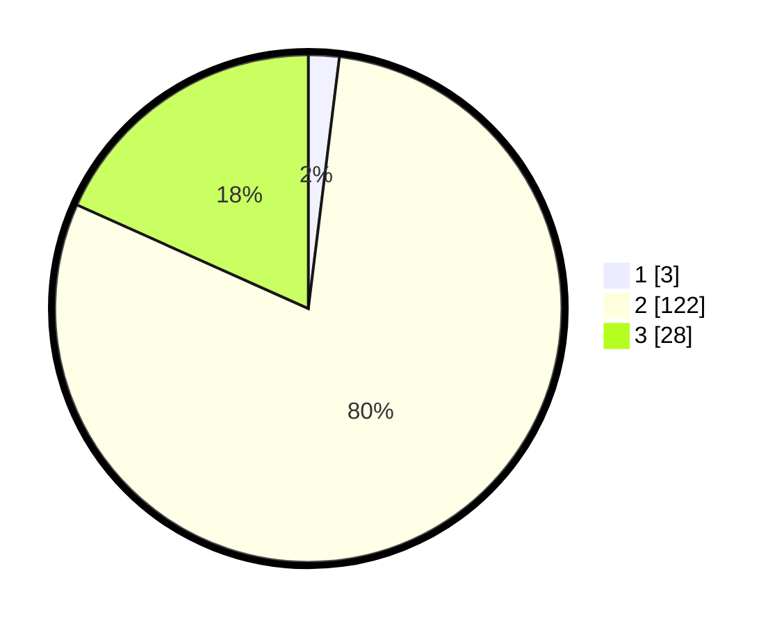

# Hasil

## Grafik

## Tabel

| No. | Nama Paslon    | Suara | Suara (raw) | Persentase |
|:--- |:-------------- | -----:| -----------:| ----------:|
| 1   | ANIES MUHAIMIN | 3     | [3][p-1]    | 1,96       |
| 2   | PRABOWO GIBRAN | 122   | [122][p-2]  | 79,74      |
| 3   | GANJAR MAHFUD  | 28    | [28][p-3]   | 18,30      |

[p-1]: https://github.com/gigit-pemilu/pemilu-2024/blob/main/pilpres/hitung-suara/sub/51-bali/sub/08-buleleng/sub/04-banjar/sub/2001-banyuseri/sub/001-tps/sub/paslon-1.txt
[p-2]: https://github.com/gigit-pemilu/pemilu-2024/blob/main/pilpres/hitung-suara/sub/51-bali/sub/08-buleleng/sub/04-banjar/sub/2001-banyuseri/sub/001-tps/sub/paslon-2.txt
[p-3]: https://github.com/gigit-pemilu/pemilu-2024/blob/main/pilpres/hitung-suara/sub/51-bali/sub/08-buleleng/sub/04-banjar/sub/2001-banyuseri/sub/001-tps/sub/paslon-3.txt

## Foto C Plano

https://sirekap-obj-formc.kpu.go.id/2e29/pemilu/ppwp/51/08/04/20/01/5108042001001-20240214-203617--74e6cd43-9d62-4f17-baad-fb97d146983f.jpg

https://sirekap-obj-formc.kpu.go.id/2e29/pemilu/ppwp/51/08/04/20/01/5108042001001-20240214-213310--359ba942-6d76-40d5-abe2-683e772e84b1.jpg

https://sirekap-obj-formc.kpu.go.id/2e29/pemilu/ppwp/51/08/04/20/01/5108042001001-20240214-205043--f73e55be-504f-4332-bf93-f46349c357cb.jpg

## Metadata

| Key        | Value               |
| ---------- | ------------------- |
| Time Stamp | 2024-02-24 22:31:28 |

