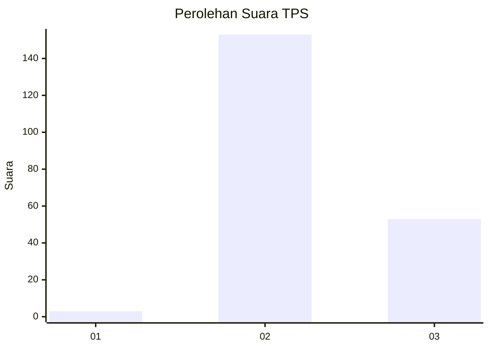
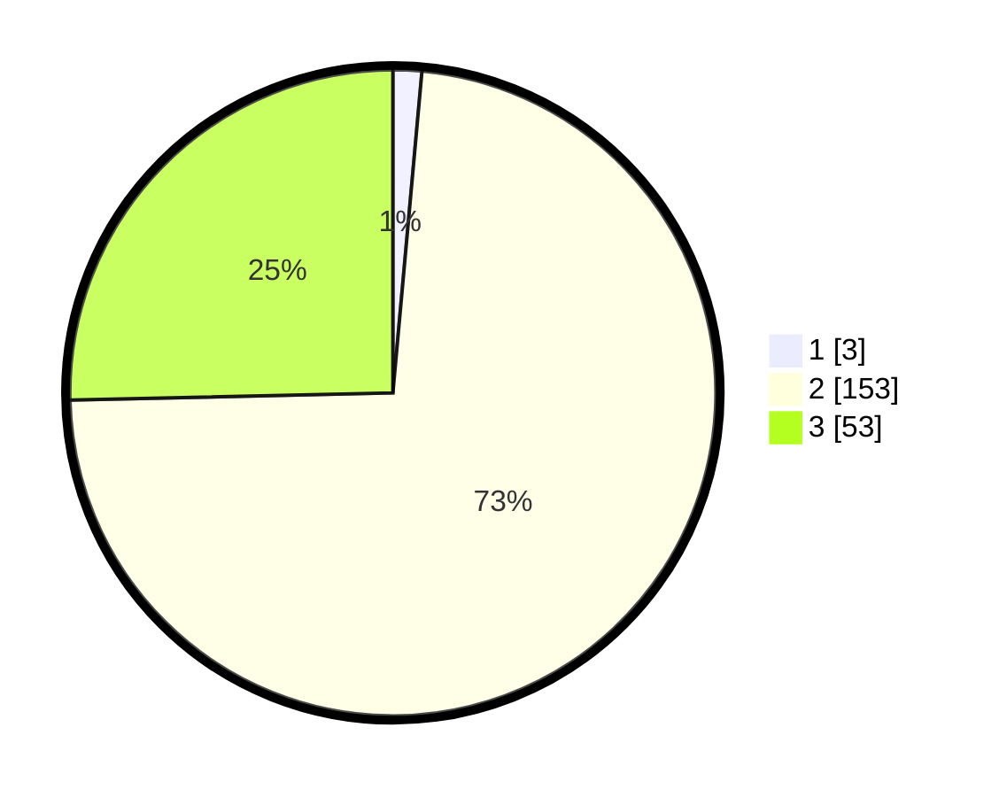

# Hasil

## Grafik

## Tabel

| No. | Nama Paslon    | Suara | Suara (raw) | Persentase |
|:--- |:-------------- | -----:| -----------:| ----------:|
| 1   | ANIES MUHAIMIN | 3     | [3][p-1]    | 1,44       |
| 2   | PRABOWO GIBRAN | 153   | [153][p-2]  | 73,21      |
| 3   | GANJAR MAHFUD  | 53    | [53][p-3]   | 25,36      |

[p-1]: https://github.com/gigit-pemilu/pemilu-2024-51-bali/blob/main/pilpres/hitung-suara/sub/51-bali/sub/08-buleleng/sub/04-banjar/sub/2001-banyuseri/sub/003-tps/sub/paslon-1.txt
[p-2]: https://github.com/gigit-pemilu/pemilu-2024-51-bali/blob/main/pilpres/hitung-suara/sub/51-bali/sub/08-buleleng/sub/04-banjar/sub/2001-banyuseri/sub/003-tps/sub/paslon-2.txt
[p-3]: https://github.com/gigit-pemilu/pemilu-2024-51-bali/blob/main/pilpres/hitung-suara/sub/51-bali/sub/08-buleleng/sub/04-banjar/sub/2001-banyuseri/sub/003-tps/sub/paslon-3.txt

## Foto C Plano

https://sirekap-obj-formc.kpu.go.id/251a/pemilu/ppwp/51/08/04/20/01/5108042001003-20240214-222401--b10ff42f-c1a1-4901-b183-47432643757d.jpg

https://sirekap-obj-formc.kpu.go.id/251a/pemilu/ppwp/51/08/04/20/01/5108042001003-20240214-222656--bf8fa978-49b9-489c-98e5-b24646e8ded1.jpg

https://sirekap-obj-formc.kpu.go.id/251a/pemilu/ppwp/51/08/04/20/01/5108042001003-20240214-222836--30075921-1ae3-40bf-906a-a8947989caa0.jpg

## Metadata

| Key        | Value               |
| ---------- | ------------------- |
| Time Stamp | 2024-02-24 22:31:28 |

