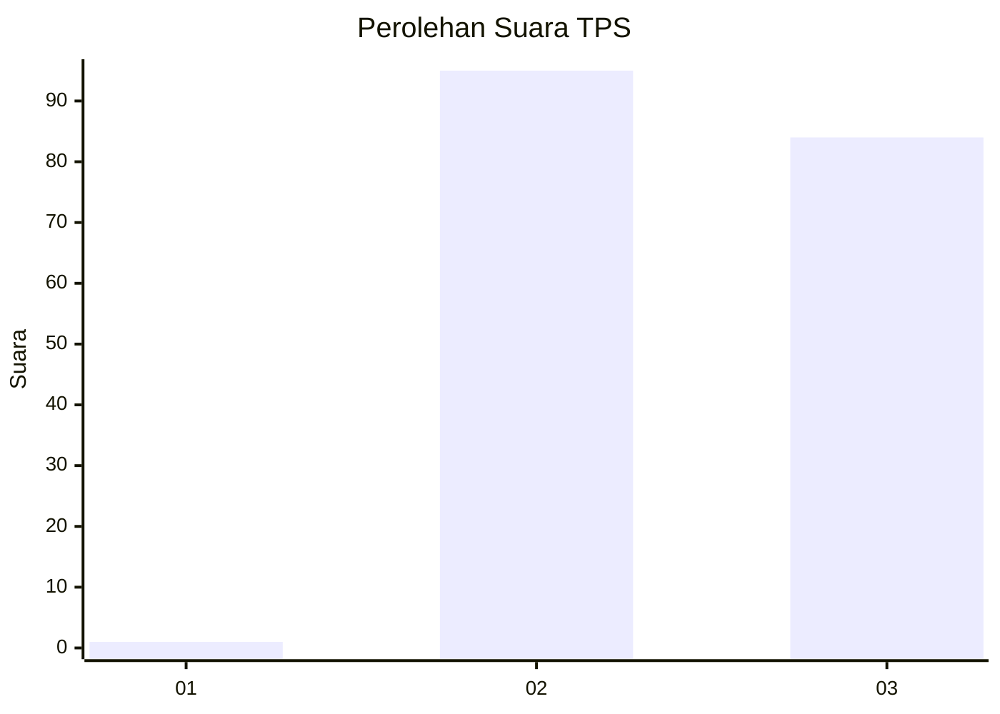
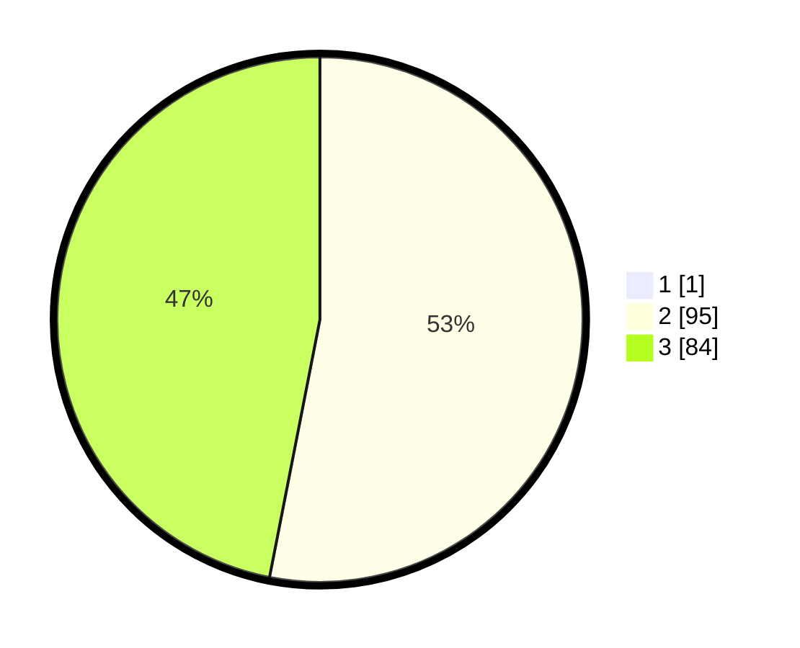

# Hasil

## Grafik

## Tabel

| No. | Nama Paslon    | Suara | Suara (raw) | Persentase |
|:--- |:-------------- | -----:| -----------:| ----------:|
| 1   | ANIES MUHAIMIN | 1     | [1][p-1]    | 0,56       |
| 2   | PRABOWO GIBRAN | 95    | [95][p-2]   | 52,78      |
| 3   | GANJAR MAHFUD  | 84    | [84][p-3]   | 46,67      |

[p-1]: https://github.com/gigit-pemilu/pemilu-2024-51-bali/blob/main/pilpres/hitung-suara/sub/51-bali/sub/08-buleleng/sub/04-banjar/sub/2002-tirtasari/sub/002-tps/sub/paslon-1.txt
[p-2]: https://github.com/gigit-pemilu/pemilu-2024-51-bali/blob/main/pilpres/hitung-suara/sub/51-bali/sub/08-buleleng/sub/04-banjar/sub/2002-tirtasari/sub/002-tps/sub/paslon-2.txt
[p-3]: https://github.com/gigit-pemilu/pemilu-2024-51-bali/blob/main/pilpres/hitung-suara/sub/51-bali/sub/08-buleleng/sub/04-banjar/sub/2002-tirtasari/sub/002-tps/sub/paslon-3.txt

## Foto C Plano

https://sirekap-obj-formc.kpu.go.id/ed25/pemilu/ppwp/51/08/04/20/02/5108042002002-20240318-102429--79c07f54-777a-4924-8954-442f51135598.jpg

https://sirekap-obj-formc.kpu.go.id/ed25/pemilu/ppwp/51/08/04/20/02/5108042002002-20240214-202905--9b8ac0d3-1ac3-4a7f-ab9a-2b105d4cc2fc.jpg

https://sirekap-obj-formc.kpu.go.id/ed25/pemilu/ppwp/51/08/04/20/02/5108042002002-20240318-102444--b62c03a0-68fe-4725-910a-d1e404a0525b.jpg

## Metadata

| Key        | Value               |
| ---------- | ------------------- |
| Time Stamp | 2024-03-18 10:30:00 |

