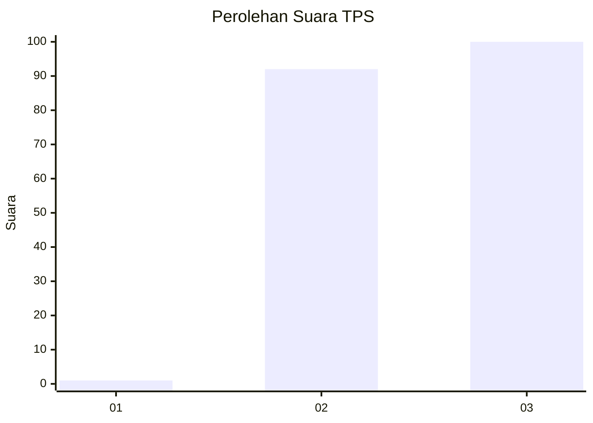
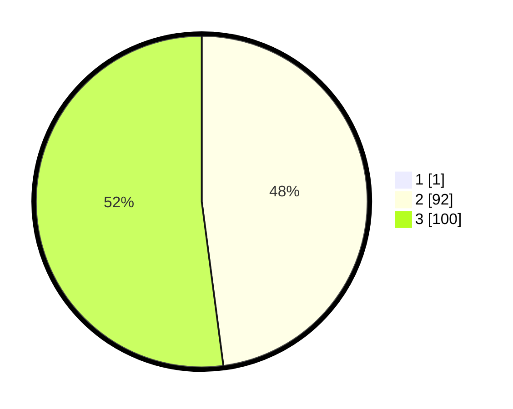

# Hasil

## Grafik

## Tabel

| No. | Nama Paslon    | Suara | Suara (raw) | Persentase |
|:--- |:-------------- | -----:| -----------:| ----------:|
| 1   | ANIES MUHAIMIN | 1     | [1][p-1]    | 0,52       |
| 2   | PRABOWO GIBRAN | 92    | [92][p-2]   | 47,67      |
| 3   | GANJAR MAHFUD  | 100   | [100][p-3]  | 51,81      |

[p-1]: https://github.com/gigit-pemilu/pemilu-2024-51-bali/blob/main/pilpres/hitung-suara/sub/51-bali/sub/08-buleleng/sub/04-banjar/sub/2002-tirtasari/sub/003-tps/sub/paslon-1.txt
[p-2]: https://github.com/gigit-pemilu/pemilu-2024-51-bali/blob/main/pilpres/hitung-suara/sub/51-bali/sub/08-buleleng/sub/04-banjar/sub/2002-tirtasari/sub/003-tps/sub/paslon-2.txt
[p-3]: https://github.com/gigit-pemilu/pemilu-2024-51-bali/blob/main/pilpres/hitung-suara/sub/51-bali/sub/08-buleleng/sub/04-banjar/sub/2002-tirtasari/sub/003-tps/sub/paslon-3.txt

## Foto C Plano

https://sirekap-obj-formc.kpu.go.id/0ff7/pemilu/ppwp/51/08/04/20/02/5108042002003-20240215-020120--1a668600-9247-41ee-af16-5ecad75c8fdf.jpg

https://sirekap-obj-formc.kpu.go.id/0ff7/pemilu/ppwp/51/08/04/20/02/5108042002003-20240215-020215--8e48e21b-78e2-40a4-ade9-68f3ba98f2ac.jpg

https://sirekap-obj-formc.kpu.go.id/0ff7/pemilu/ppwp/51/08/04/20/02/5108042002003-20240215-020300--a4bfb47a-32e4-4a08-9239-8a733d4705b8.jpg

## Metadata

| Key        | Value               |
| ---------- | ------------------- |
| Time Stamp | 2024-02-24 22:31:28 |

