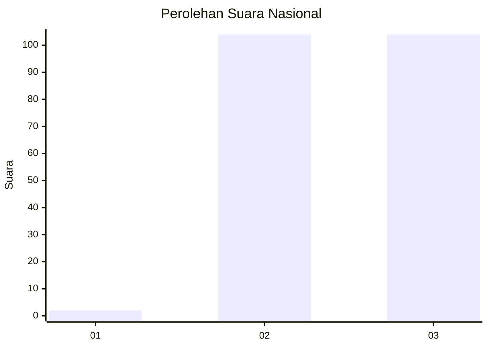
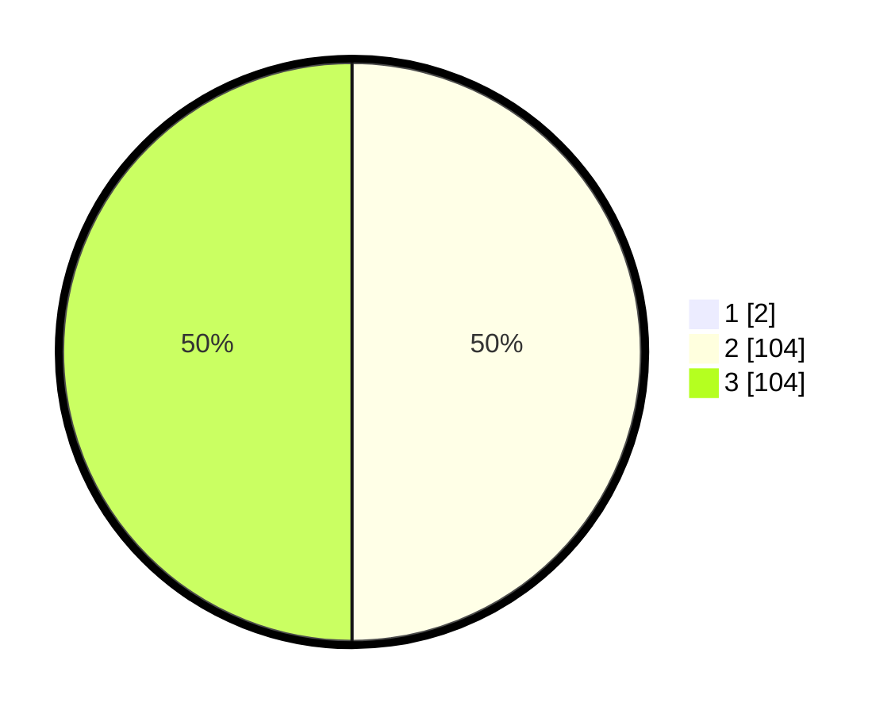

# Hasil

## Grafik

## Tabel

| No. | Nama Paslon    | Suara | Suara (raw) | Persentase |
|:--- |:-------------- | -----:| -----------:| ----------:|
| 1   | ANIES MUHAIMIN | 2     | [2][p-1]    | 0,95       |
| 2   | PRABOWO GIBRAN | 104   | [104][p-2]  | 49,52      |
| 3   | GANJAR MAHFUD  | 104   | [104][p-3]  | 49,52      |

[p-1]: https://github.com/gigit-pemilu/pemilu-2024/blob/main/pilpres/hitung-suara/sub/51-bali/sub/08-buleleng/sub/04-banjar/sub/2002-tirtasari/sub/004-tps/sub/paslon-1.txt
[p-2]: https://github.com/gigit-pemilu/pemilu-2024/blob/main/pilpres/hitung-suara/sub/51-bali/sub/08-buleleng/sub/04-banjar/sub/2002-tirtasari/sub/004-tps/sub/paslon-2.txt
[p-3]: https://github.com/gigit-pemilu/pemilu-2024/blob/main/pilpres/hitung-suara/sub/51-bali/sub/08-buleleng/sub/04-banjar/sub/2002-tirtasari/sub/004-tps/sub/paslon-3.txt

## Foto C Plano

https://sirekap-obj-formc.kpu.go.id/bd08/pemilu/ppwp/51/08/04/20/02/5108042002004-20240215-012949--bf23c411-b5ba-4570-90ab-32babe8b03f2.jpg

https://sirekap-obj-formc.kpu.go.id/bd08/pemilu/ppwp/51/08/04/20/02/5108042002004-20240215-013017--083f4a07-ab13-4656-a335-b2aa60a2d3ad.jpg

https://sirekap-obj-formc.kpu.go.id/bd08/pemilu/ppwp/51/08/04/20/02/5108042002004-20240215-013316--00d333f6-35d5-41b1-894d-c34e6256fb88.jpg

## Metadata

| Key        | Value               |
| ---------- | ------------------- |
| Time Stamp | 2024-02-24 22:31:28 |

