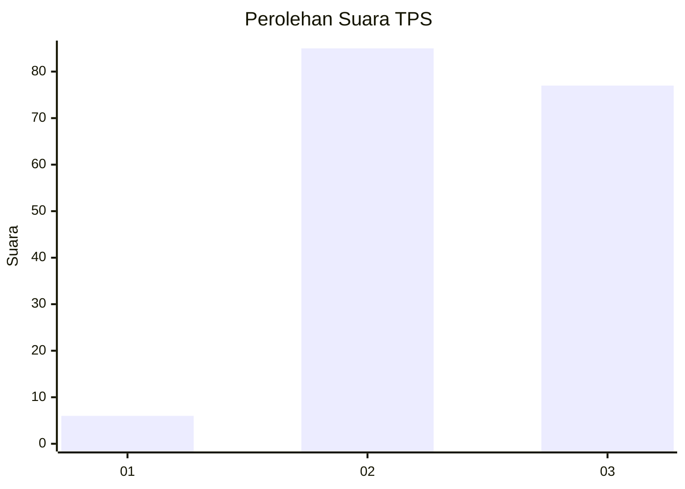
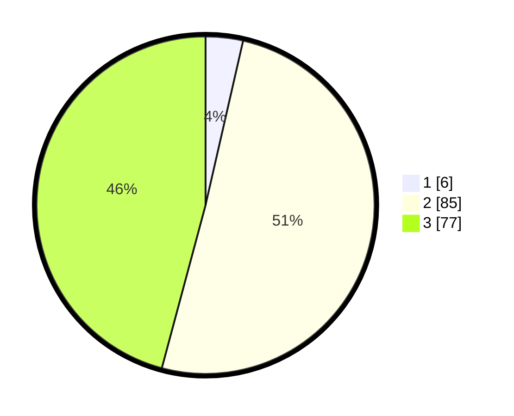

# Hasil

## Grafik

## Tabel

| No. | Nama Paslon    | Suara | Suara (raw) | Persentase |
|:--- |:-------------- | -----:| -----------:| ----------:|
| 1   | ANIES MUHAIMIN | 6     | [6][p-1]    | 3,57       |
| 2   | PRABOWO GIBRAN | 85    | [85][p-2]   | 50,60      |
| 3   | GANJAR MAHFUD  | 77    | [77][p-3]   | 45,83      |

[p-1]: https://github.com/gigit-pemilu/pemilu-2024-51-bali/blob/main/pilpres/hitung-suara/sub/51-bali/sub/08-buleleng/sub/04-banjar/sub/2002-tirtasari/sub/005-tps/sub/paslon-1.txt
[p-2]: https://github.com/gigit-pemilu/pemilu-2024-51-bali/blob/main/pilpres/hitung-suara/sub/51-bali/sub/08-buleleng/sub/04-banjar/sub/2002-tirtasari/sub/005-tps/sub/paslon-2.txt
[p-3]: https://github.com/gigit-pemilu/pemilu-2024-51-bali/blob/main/pilpres/hitung-suara/sub/51-bali/sub/08-buleleng/sub/04-banjar/sub/2002-tirtasari/sub/005-tps/sub/paslon-3.txt

## Foto C Plano

https://sirekap-obj-formc.kpu.go.id/36b6/pemilu/ppwp/51/08/04/20/02/5108042002005-20240214-195431--8fb87f1e-3bbc-446c-88b0-f114ac1b69f8.jpg

https://sirekap-obj-formc.kpu.go.id/36b6/pemilu/ppwp/51/08/04/20/02/5108042002005-20240214-195511--3cfcd78f-06b9-45a2-a601-6d8eb915f2e5.jpg

https://sirekap-obj-formc.kpu.go.id/36b6/pemilu/ppwp/51/08/04/20/02/5108042002005-20240214-195817--e9ec374b-1abe-46e8-b7ee-2d3c5b9060e1.jpg

## Metadata

| Key        | Value               |
| ---------- | ------------------- |
| Time Stamp | 2024-02-24 22:31:28 |

