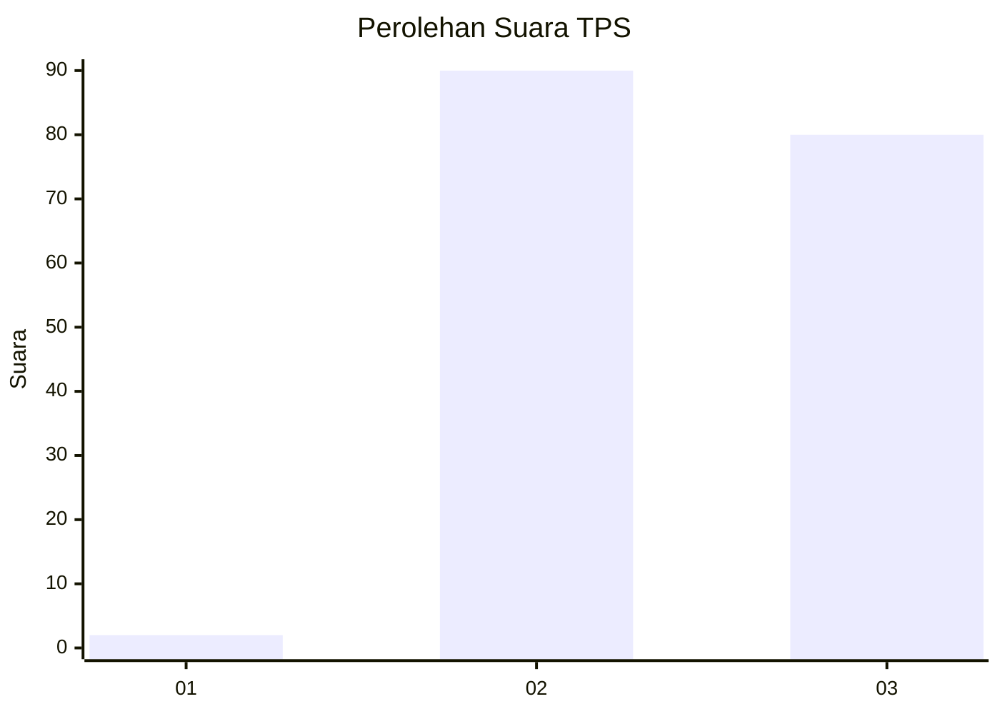
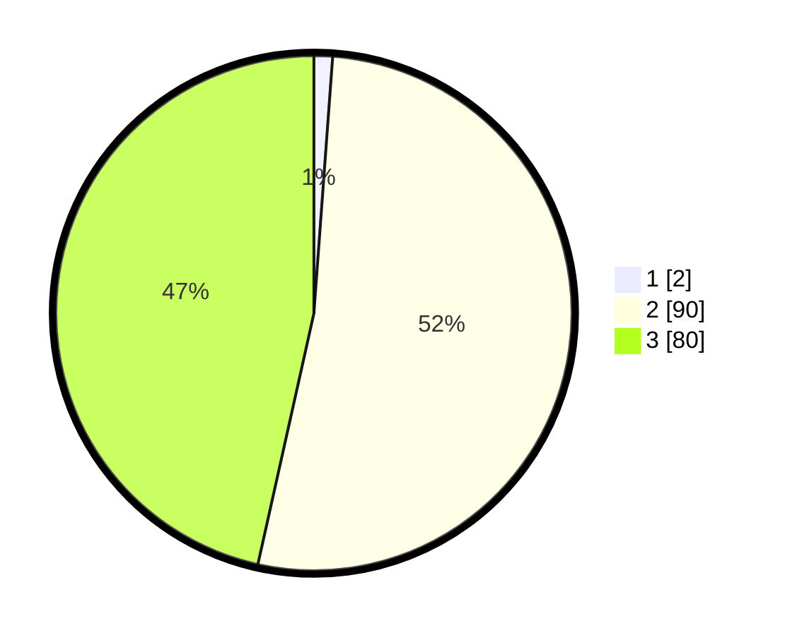

# Hasil

## Grafik

## Tabel

| No. | Nama Paslon    | Suara | Suara (raw) | Persentase |
|:--- |:-------------- | -----:| -----------:| ----------:|
| 1   | ANIES MUHAIMIN | 2     | [2][p-1]    | 1,16       |
| 2   | PRABOWO GIBRAN | 90    | [90][p-2]   | 52,33      |
| 3   | GANJAR MAHFUD  | 80    | [80][p-3]   | 46,51      |

[p-1]: https://github.com/gigit-pemilu/pemilu-2024-51-bali/blob/main/pilpres/hitung-suara/sub/51-bali/sub/08-buleleng/sub/04-banjar/sub/2003-kayuputih/sub/002-tps/sub/paslon-1.txt
[p-2]: https://github.com/gigit-pemilu/pemilu-2024-51-bali/blob/main/pilpres/hitung-suara/sub/51-bali/sub/08-buleleng/sub/04-banjar/sub/2003-kayuputih/sub/002-tps/sub/paslon-2.txt
[p-3]: https://github.com/gigit-pemilu/pemilu-2024-51-bali/blob/main/pilpres/hitung-suara/sub/51-bali/sub/08-buleleng/sub/04-banjar/sub/2003-kayuputih/sub/002-tps/sub/paslon-3.txt

## Foto C Plano

https://sirekap-obj-formc.kpu.go.id/85f1/pemilu/ppwp/51/08/04/20/03/5108042003002-20240214-141646--f89478e9-641d-4215-afd7-f10c28cf805a.jpg

https://sirekap-obj-formc.kpu.go.id/85f1/pemilu/ppwp/51/08/04/20/03/5108042003002-20240214-141706--fb9017ff-264b-40a6-8a57-8b66adf486c8.jpg

https://sirekap-obj-formc.kpu.go.id/85f1/pemilu/ppwp/51/08/04/20/03/5108042003002-20240214-141627--4fbec597-27ba-455e-a841-dd3aa1c9ec15.jpg

## Metadata

| Key        | Value               |
| ---------- | ------------------- |
| Time Stamp | 2024-02-25 19:00:00 |

