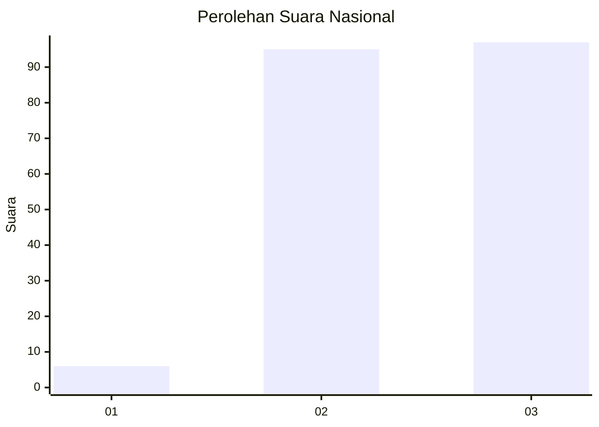
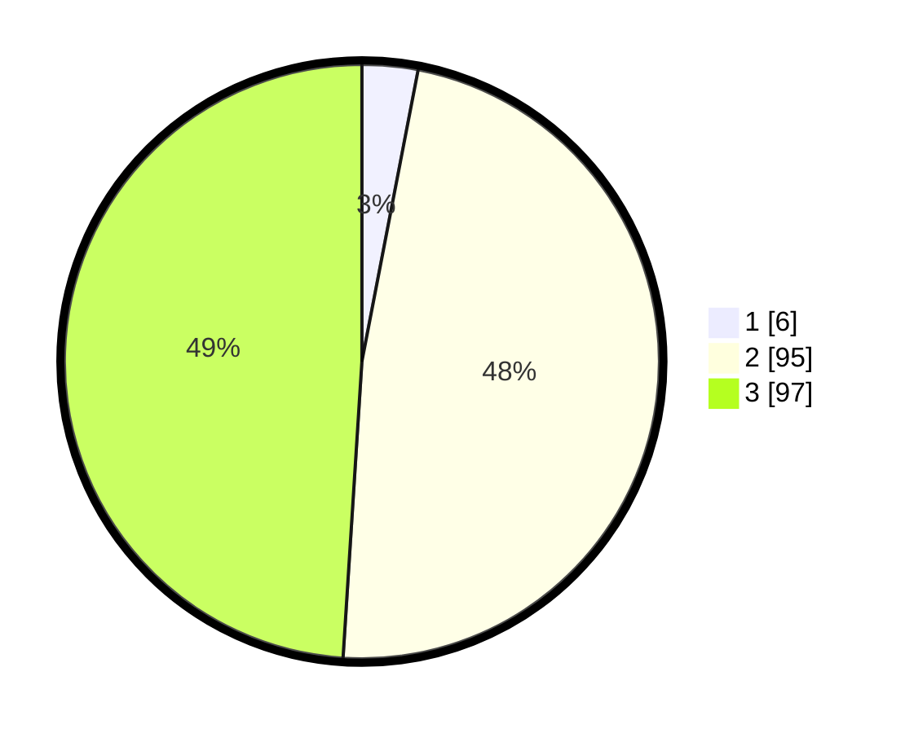

# Hasil

## Grafik

## Tabel

| No. | Nama Paslon    | Suara | Suara (raw) | Persentase |
|:--- |:-------------- | -----:| -----------:| ----------:|
| 1   | ANIES MUHAIMIN | 6     | [6][p-1]    | 3,03       |
| 2   | PRABOWO GIBRAN | 95    | [95][p-2]   | 47,98      |
| 3   | GANJAR MAHFUD  | 97    | [97][p-3]   | 48,99      |

[p-1]: https://github.com/gigit-pemilu/pemilu-2024/blob/main/pilpres/hitung-suara/sub/51-bali/sub/08-buleleng/sub/04-banjar/sub/2003-kayuputih/sub/007-tps/sub/paslon-1.txt
[p-2]: https://github.com/gigit-pemilu/pemilu-2024/blob/main/pilpres/hitung-suara/sub/51-bali/sub/08-buleleng/sub/04-banjar/sub/2003-kayuputih/sub/007-tps/sub/paslon-2.txt
[p-3]: https://github.com/gigit-pemilu/pemilu-2024/blob/main/pilpres/hitung-suara/sub/51-bali/sub/08-buleleng/sub/04-banjar/sub/2003-kayuputih/sub/007-tps/sub/paslon-3.txt

## Foto C Plano

https://sirekap-obj-formc.kpu.go.id/6f28/pemilu/ppwp/51/08/04/20/03/5108042003007-20240214-222128--53475444-24bb-4166-8be1-c4f8eb3acc46.jpg

https://sirekap-obj-formc.kpu.go.id/6f28/pemilu/ppwp/51/08/04/20/03/5108042003007-20240214-222635--af2398c5-191e-4d9a-97a3-a4d120bf4ead.jpg

https://sirekap-obj-formc.kpu.go.id/6f28/pemilu/ppwp/51/08/04/20/03/5108042003007-20240214-222345--4f78852a-c3f3-4135-870a-afa4766e30e3.jpg

## Metadata

| Key        | Value               |
| ---------- | ------------------- |
| Time Stamp | 2024-02-24 22:31:28 |

