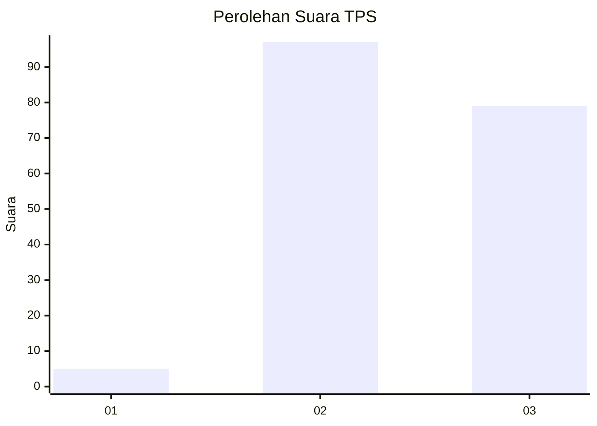
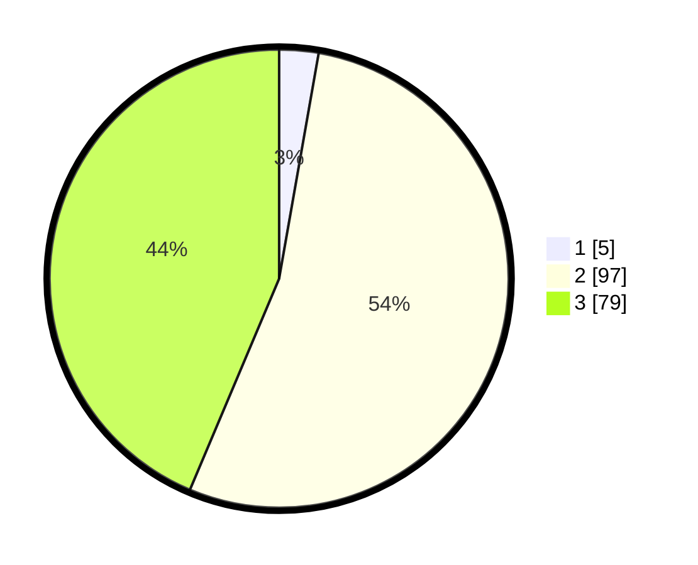

# Hasil

## Grafik

## Tabel

| No. | Nama Paslon    | Suara | Suara (raw) | Persentase |
|:--- |:-------------- | -----:| -----------:| ----------:|
| 1   | ANIES MUHAIMIN | 5     | [5][p-1]    | 2,76       |
| 2   | PRABOWO GIBRAN | 97    | [97][p-2]   | 53,59      |
| 3   | GANJAR MAHFUD  | 79    | [79][p-3]   | 43,65      |

[p-1]: https://github.com/gigit-pemilu/pemilu-2024-51-bali/blob/main/pilpres/hitung-suara/sub/51-bali/sub/08-buleleng/sub/04-banjar/sub/2004-banyuatis/sub/002-tps/sub/paslon-1.txt
[p-2]: https://github.com/gigit-pemilu/pemilu-2024-51-bali/blob/main/pilpres/hitung-suara/sub/51-bali/sub/08-buleleng/sub/04-banjar/sub/2004-banyuatis/sub/002-tps/sub/paslon-2.txt
[p-3]: https://github.com/gigit-pemilu/pemilu-2024-51-bali/blob/main/pilpres/hitung-suara/sub/51-bali/sub/08-buleleng/sub/04-banjar/sub/2004-banyuatis/sub/002-tps/sub/paslon-3.txt

## Foto C Plano

https://sirekap-obj-formc.kpu.go.id/b288/pemilu/ppwp/51/08/04/20/04/5108042004002-20240215-073258--630a17de-918b-4774-b069-94bcb8d94859.jpg

https://sirekap-obj-formc.kpu.go.id/b288/pemilu/ppwp/51/08/04/20/04/5108042004002-20240215-073414--7fb84f29-a232-4076-ad3d-d25c783f8079.jpg

https://sirekap-obj-formc.kpu.go.id/b288/pemilu/ppwp/51/08/04/20/04/5108042004002-20240318-105106--6fd68b80-f1db-49d8-b528-a3a3ab199b1f.jpg

## Metadata

| Key        | Value               |
| ---------- | ------------------- |
| Time Stamp | 2024-03-18 11:00:00 |

