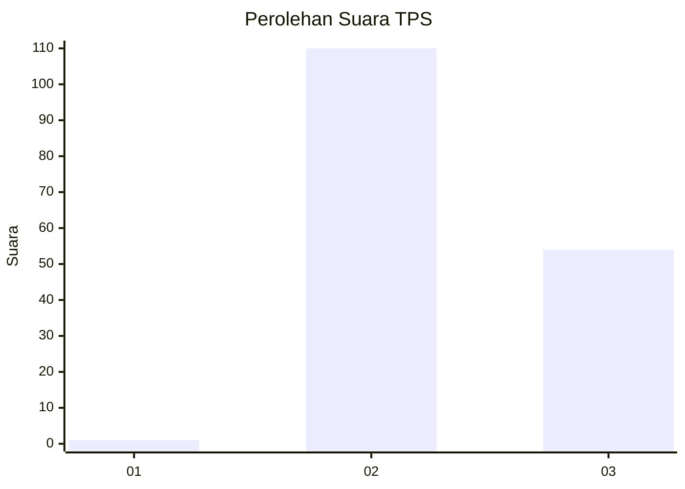
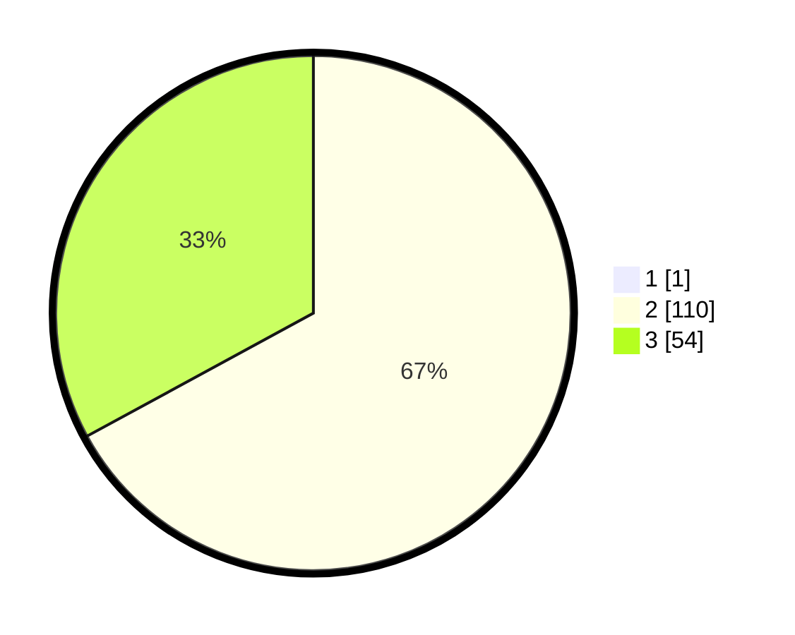

# Hasil

## Grafik

## Tabel

| No. | Nama Paslon    | Suara | Suara (raw) | Persentase |
|:--- |:-------------- | -----:| -----------:| ----------:|
| 1   | ANIES MUHAIMIN | 1     | [1][p-1]    | 0,61       |
| 2   | PRABOWO GIBRAN | 110   | [110][p-2]  | 66,67      |
| 3   | GANJAR MAHFUD  | 54    | [54][p-3]   | 32,73      |

[p-1]: https://github.com/gigit-pemilu/pemilu-2024-51-bali/blob/main/pilpres/hitung-suara/sub/51-bali/sub/08-buleleng/sub/04-banjar/sub/2004-banyuatis/sub/008-tps/sub/paslon-1.txt
[p-2]: https://github.com/gigit-pemilu/pemilu-2024-51-bali/blob/main/pilpres/hitung-suara/sub/51-bali/sub/08-buleleng/sub/04-banjar/sub/2004-banyuatis/sub/008-tps/sub/paslon-2.txt
[p-3]: https://github.com/gigit-pemilu/pemilu-2024-51-bali/blob/main/pilpres/hitung-suara/sub/51-bali/sub/08-buleleng/sub/04-banjar/sub/2004-banyuatis/sub/008-tps/sub/paslon-3.txt

## Foto C Plano

https://sirekap-obj-formc.kpu.go.id/0313/pemilu/ppwp/51/08/04/20/04/5108042004008-20240318-105620--3b2d3618-8ed2-45dd-b193-f374318b69d7.jpg

https://sirekap-obj-formc.kpu.go.id/0313/pemilu/ppwp/51/08/04/20/04/5108042004008-20240214-204236--56f04257-8e57-4bbb-9518-653f0c60f87a.jpg

https://sirekap-obj-formc.kpu.go.id/0313/pemilu/ppwp/51/08/04/20/04/5108042004008-20240214-204423--e081333e-7906-485a-b86e-111efe8439b6.jpg

## Metadata

| Key        | Value               |
| ---------- | ------------------- |
| Time Stamp | 2024-03-18 11:00:00 |

