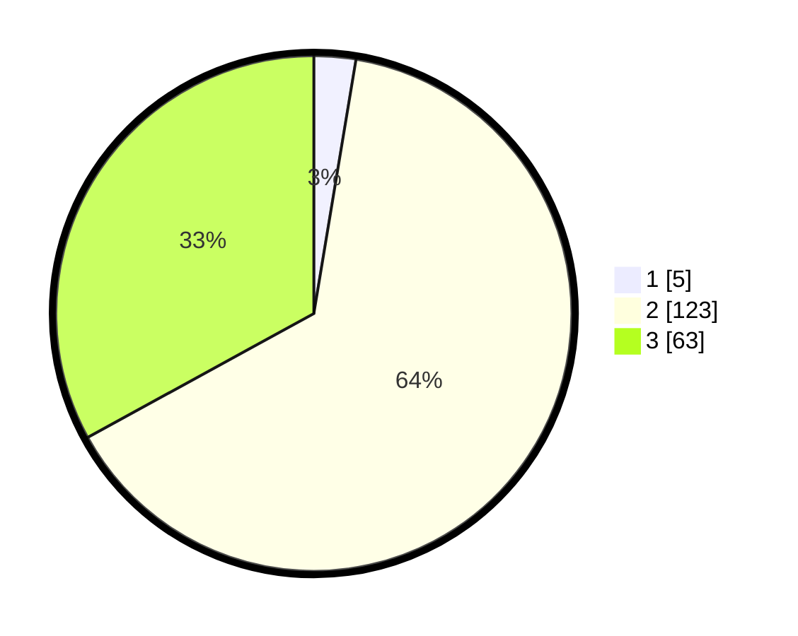

# Hasil

## Grafik

## Tabel

| No. | Nama Paslon    | Suara | Suara (raw) | Persentase |
|:--- |:-------------- | -----:| -----------:| ----------:|
| 1   | ANIES MUHAIMIN | 5     | [5][p-1]    | 2,62       |
| 2   | PRABOWO GIBRAN | 123   | [123][p-2]  | 64,40      |
| 3   | GANJAR MAHFUD  | 63    | [63][p-3]   | 32,98      |

[p-1]: https://github.com/gigit-pemilu/pemilu-2024-51-bali/blob/main/pilpres/hitung-suara/sub/51-bali/sub/08-buleleng/sub/04-banjar/sub/2005-gesing/sub/002-tps/sub/paslon-1.txt
[p-2]: https://github.com/gigit-pemilu/pemilu-2024-51-bali/blob/main/pilpres/hitung-suara/sub/51-bali/sub/08-buleleng/sub/04-banjar/sub/2005-gesing/sub/002-tps/sub/paslon-2.txt
[p-3]: https://github.com/gigit-pemilu/pemilu-2024-51-bali/blob/main/pilpres/hitung-suara/sub/51-bali/sub/08-buleleng/sub/04-banjar/sub/2005-gesing/sub/002-tps/sub/paslon-3.txt

## Foto C Plano

https://sirekap-obj-formc.kpu.go.id/034f/pemilu/ppwp/51/08/04/20/05/5108042005002-20240224-071345--3ac750ac-b77e-4d5a-a6a9-69f158000fd1.jpg

https://sirekap-obj-formc.kpu.go.id/034f/pemilu/ppwp/51/08/04/20/05/5108042005002-20240215-005807--451fce8e-445b-4dff-980e-a4af9f9746d4.jpg

https://sirekap-obj-formc.kpu.go.id/034f/pemilu/ppwp/51/08/04/20/05/5108042005002-20240224-071357--41f82402-725c-4609-a84a-226a32e2b34a.jpg

## Metadata

| Key        | Value               |
| ---------- | ------------------- |
| Time Stamp | 2024-02-24 22:31:28 |

